# Ingegneria del Software
## Informazione di base Ingegneria del Software
- **Processo**: Un particolare metodo per fare qualcosa costituito da una sequenza di passi che coinvolgono attività, vincoli e risorse
- **Sistemi software**:
    - **Upper-CASE**: Strumenti che supportano le attività delle fasi di analisi e specifica dei requisiti e progettazione di un processo software
    - **Lower-CASE**: Strumenti che supportano attività delle fasi finali del processo quali programming, testing e debugging
## Ciclo di vita del Software
- **Software life cycle**: Periodo di tempo che inizia quando un sotware viene concepito e termina quando non è più utilizzabile
- **Software Development cycle**: Periodo di tempo che inizia con la decisione di sviluppo del prodotto software e termina quando è consegnato
- **Modello ciclo di vita del Software(CVS)**: Rappresenta una caratterizzazione descrittiva o prescrittiva di come un sistema sotware viene o dovrebbe essere sviluppato. Esistono vari tipi di CVS
    - **Modelli a cascata**: rappresenta un modello sequenziale lineare senza fasi di riciclo. Viene organizzato in fasi caratterizzate dalle tasks, dalle attività e dai controlli, i prodotti di una fase non sono più modificabili
        - **Studio di fattibilità**: Stabilire se avviare il progetto individuando le scelte necessarie e dà in output il documento di fattibilità
        - **Analisi dei requisiti**: Descrivere le funzionalità e le caratteristica che l'applicazione deve avere e dà in output il documento di specifica dei requsiti
        - **Progettazione**: Definire una struttura opportuna per il sofotware e dà in output il documento di specifica del progetto
        - **Programmazione e test di unità**: Ogni modulo viene codificato nel linguaggio scelto e testato
        - **Integrazione e test di sistema**: Comporre moduli nel sistema globale, verificare il corretto funzionamento del sistema, α-test e β-test
        - **Deployment**: Distribuzione software
        - **Manutenzione**: Evoluzione del software
    
        Il modello a cascata è facilmente comprensibile e applicabile, ma ha un interazione con il committente solo a inizio e fine e il software è installabile sono quando è totalmente finito

    - **V&V e Retroazione(Feedback)**: 
        - **Verification**: si occupa di stabilire la corrispondenza fra un software e la sua specifica.
        - **Validation**: si occupa di stabilire l'appropriatezza di un prodotto software alla sua missione operativa
        - **Feedback**: possono essere inviate ad una qualsiasi delle fasi precedenti

        - Alcune fasi possono essere solo verificati solo attraverso la validation
    
    - **Modello a V**: Fasi a sinistra di sviluppo collegate a quelle a di test a destra, i test eseguiti a destra vengono pianificati a sinistra e se si trova un errore si rivedono le attività della fase a sinistra

    - **Trasformazioni formali**: Sequenza di passi che trasforma formalmente una specifica in una implementazione, tuttavia presente porblematiche relative ai costi elevati, competenze e skill specifici e il committente non è in grado di capire le specifiche formali

    - **Modelli a sviluppo di componenti**: Modello basato sul riuso di componenti

    - **Modelli basati su prototipo**: Utilizzo di un prototipo per accertarsi di aver compreso bene le sue richieste e per valutare la fattiblità, e in seguito alla fase di utilizzo del prototipo si passa alla produzione della versione definitiva, il prototipo deve essere **gettato**
        - **Mock-ups**: Produzione completa interfaccia utente
        - **Breadboards**: Produce feedback su come implementare le funzionalità, sottoinsiemi di funzionalità critiche per valutare vincoli pesanti come carichi elevati o tempi di risposta.
        - **Prototipazione "throw-away"**: Lo sviluppo si avvia con la parte dei requisiti meno compresa, serve a comprendere i requisiti e poi viene gettata
        - **Prototipazione "esplorativa"**: Lavorare a stretto contatto con il committente e avviando la svilluppo con la parte meglio compresa evolvendo nel prodotto
    
    - **Sviluppo evolutivo**: Utilizzato per sistemi con un ciclo di vita breve, hanno tuttavia delle problematiche relative alla perdità di visibilità del processo, richieste competenze specifiche nell'uso di linguaggi di prototipazione
        - **Sviluppo incrementale**: Il sistema viene decomposto in sottosistemi che vengono implementati, testati, rilasciati, installati e messi in manutenzione con priorità diverse.
        Permette di anticipare da subito delle funzionalità al committente in base alla priorità più alta e permette di eseguire un testing più esaustivo grazie ai prototipi che permettono di individuare i requisiti per i successivi incrementi con una maggiore copertura per i servizi con più alta priorità

        - **Sviluppo iterativo**: Presenta da subito tutte le funzionalità/sottosistemi ed in seguito vengono migliorate

        - **Extreme programming**: Partecipazione più attiva del committente al team di sviluppo e con un miglioramente costante e continuo del codice

        - **Modello a spirale**: Sfrutta il concetto di riciclo, il processo viene rappresentato come una spirale, rappresenta un meta-modello e non prevede un numero predefinito di fasi, in cui una fase è un giro della spirale

## Modeling with UML
- **Modeling**: Consiste nel costruire una astrazione della realtà in modo da ignorare irrelevanti dettagli
    - **Model**: Astrazione che descrive un sottoinsieme del sistema
    - **View**: Descrive selezionati aspetti della realtà
    - **Notation**: Insieme di regole grafiche o testuale per descrive le views
- **Phenomenon**: Un oggetto nel mondo del dominio come lo percepisce
- **Concept**: Descrive le proprietà del fenomeno che sono comuni
    - **Name**
    - **Purpose**
    - **Members**
- **Abstract data type**: Tipo speciale la cui implementazione rimane nascosta al resto del sistema
- **Class**: Una astrazione nel contesto dei linguaggi object-oriented
- **Application Domain**: Ambiente nel quale il sistema opera
- **Solution Domain**: Le tecnologie disponibile dalla build del sistema
- **UML(Unified Modeling Language)**: Uno standard per modellare software object-oriented
    - **Use case Diagrams**: Descrive il comportamento funzionale come viene visto dall'utente
        - **Actor**: Modella una esterna entità che comunica col sistema, e ha un nome unico e una descrizione opzionale
        - **Use Case**: Rappresenta una funzionalità di una classe provvista dal sistema come un flusso di eventi
        - **Extend**: Rappresenta un caso eccezionale
        - **Inlcudes**: Comportamento escluso dal caso d'uso
    - **Class diagrams**: Descrive la struttura statica del sistema
        - **Object**
        - **Attributes**
        - **Relations**
    - **Sequence diagrams**: Descrive il comportamento dianamico tra gli attori e il sistema attraverso gli oggetti del sistema
    - **Statechart diagrams**: Descrive il comportamento dinamico degli oggetti singoli
    - **Activity Diagrams**: Modella il comportamento dinamico del sistema
    - **Comventions**
        - Rettangoli sono classi o istanze
        - Ovali sono user cases o funzioni
        - Istanze denotate con un nome sottolineato
        - Tipi denotate con un nome non sottolineato
        - Diagrammi sono i grafi

## Requirements Elicitation
- **Software Lifecycle**: Insieme delle attività e delle relazioni al fine di sviluppare un prodotto software

- **Requirements Elicitation**: Definizione del sistema in termini comprensibili al cliente

- **Requirements Analysis**: Specifica tecnica del sistema in termini comprensibili dallo sviluppatore

- **Problem Statement**: Sviluppato dal cliente come una descrizione del problema da affrontare nel sistema
    - **Current situation**: Il problema da risolvere, un problema nel sistema corrente
        - **Cambio nel dominio dell'applicazione**
        - **Cambio nel dominio delle soluzioni**

    - **Descrizione di uno o più scenari**: Esempi di uso del sistema in termini di una serie di interazioni fra l'utente e il sistema, una descrizione testuale dell'uso del sistema
        - **As-is scenario**: L'utente descrive la situazione corrente
        - **Visionary scenario**: L'utente descrive il futuro sistema
        - **Evaluation scenario**: Attività dell'utente in base a quale il sistema deve essere valuatato
        - **Training scenario**: Istruzioni step-by-step che guidano un nuovo utente attraverso il sistema
        - **Scenario-Based Design**: Deve essere iterattivo e ciascuno scenario deve essere considerato come un documento di lavoro da migliorare e modificare quando cambiano i requisiti, i criteri del cliente o la situazione di distribuzione
    
    - **Use Cases**: Insieme di eventi del sistema, includendo interazioni con gli attori
        - **Graficamente**: Ovale
        - **Attori**: Descrivono attore coinvolto nel caso d'uso
        - **Entry condition**
        - **Flusso di eventi**
        - **Exit condition**
        - **Eccezioni**: Descrivono cosa succede se qualcosa va male
        - **Special Requirements**: Lista dei requisiti non funzionali e dei constraints
        - **Use case Relationships**:
            - **Dipendenze**:
                - **Include**: Un caso d'uso usato da un altro caso d'uso, descrive una funzione come aggregazioni di casi d'uso
                - **Extends**: Un caso d'uso esteso da un altro caso d'uso
            - **Generalization**: Un caso d'uso astratto con differente specializzazione, il figlio eredita il comportamento del padre e può aggiungere o sovrascrivere alcuni comportamenti
    - **Use Case Model**: Insieme di tutti i casi d'uso che specificano le funzioni del sistema

    - **Requirements**:
        - **Requisiti funzionali**: Descrivono le interazioni fra il sistema e l'ambiente indipendente dall'implementazione
        - **Requisiti non funzionali**: Aspetti visibili dal sistema non direttamente correlati al comportamento funzionale, con possibilità di test degli stessi
            - **FURPS+**: 
                - **Usability**: Facilità con cui l'utente può imparare a usare, preparare input e interpretare l'output del sistema o delle componenti
                - **Reliability**: Rappresenta la capacità del sistema o delle componenti di svolgere le funzioni richiesta in condizioni stabili per un periodo di tempo specificato
                - **Performance**: Requisiti riguardo tempo di risposta, disponibilità e accuratezza
                - **Supportability**: Facilità riguardo le modifiche al sistema, adattabilità e manutenibilità
        - **Constraints (pseudo requirements)**: Imposti dal cliente dell'ambiente nel quale il sistema opera
            - **FURPS+**:
                - **Implementation requirements**: Vincoli di implementazione del sistema come strumenti, linguaggi di programmazione
                - **Interface requirements**: Vincoli imposti da sistemi esterni
                - **Operation Requirements**: Vincoli all'amministratore o alla gestione del sistema
                - **Packaging requirements**: Vincoli sulla consegna effettiva del sistema
                - **Legal requirements**: Vincoli riguardo licenze, regolamenti e certificati
        - **Requirements validation criteria**:
            - **Correttezza**: Rappresenta il punto di vista del cliente
            - **Completezza**: Tutti i possibili scenari
            - **Consistenza**: Assenza contraddizione fra requisiti funzionali e non funzionali
            - **Realismo**: Requisiti possono essere implementati e consegnati
            - **Tracciablità**: Ogni funzione del sistema può essere tracciata in un insieme di requisiti funzionali
        - **Types of Requirements Elicitation**:
            - **Greenfield Engineering**: Lo sviluppo parte da zero, estraendo i requisiti dall'utente finale e dal cliente, attivato dall'esigenza dell'utente
            - **Re-engineering**: Re-design o reimplementare partendo da un sistema esistente, attivato da un technology enabler
            - **Interface Engineering**: Provvede i servizi di un sistema esistente in un nuovo ambiente, attivato da un technology enabler o esigenze di mercato
        - **Managing requirements elicitation**: 
            - Negoziare con il cliente (Joint Application Design -aka JAD)
            - Mantenere la tracciabilità
    - **Project Schedule**: Maggiori traguardi che implicano l'interazione con i clienti includendo deadline del sistema da consegnare

    - **Target environment**: Ambiente nel quale il sistema che viene consegnato deve compire una serie di test di sistema

    - **Client Acceptance Criteria**: Criteri per i test di sistema

## Project Organization and Communication
- **Soft skills**:
    - **Management**: Team meeting
    - **Presentation**: Un grande aspetto del tuo progetto nella fase di sviluppo
    - **Collaboration**: Negoziare requisiti con il cliente e con i membri del tuo team o di altri teams
    - **Technical writing**: Scrivere parte della documentazione del progetto

- **Project components**:
    - **Work product**: Qualsiasi oggetto prodotto dal progetto e vengono chiamati **deliverables**
    - **Schedule**: Specifica quando il lavoro sul progetto deve essere terminato
    - **Partecipant**: Qualsiasi persona che partecipa al progetto
    - **Task**: Lavoro che deve essere svolto da un partecipante del gruppo per creare un prodotto di lavoro

- **Project Communication**:
    - **Planned (schedules) communication**: Aiuta a diffondere informazione che i partecipanti si aspetti usano
        - **Problem inspection**
        - **Status meetings**
        - **Peer reviews**
        - **Client and project reviews**
        - **Release**
    
    - **Unplanned communication**: Aiuta a gestire le crisi e le necessità informative inaspettate
        - **Requests for clarification**
        - **Request for change**
        - **Issue resolution**
    
    - **Communication mode**: Tipi di informazione scambiate che definiscono un oggetto e il suo scope
    - **Communication mechanism**: Strumenti o procedure che possono essere usati per trasmettere informazioni

- **Project Start Phase**:
    - **Attend the kick-off meeting**: I partecipanti del progetto ascolatano i problemi da risolvere dal cliente e lo scope del sistema da sviluppare
    - **Join team**: I partecipanti sono assegnati al team in base alle loro skill e ai loro interessi
    - **Attend training session**: I partecipanti che non hanno le skill necessarie per la task ricevono un allenamento extra
    - **Join commmunication infrastructure**: Deve supportare si attività pianificate che non
    - **Extended communication infrastructure**: Addizionali bacheche e portali di gruppo vengono stabiliti per il progetto
    - **Attend first team status meeting**: Ai partecipanti del progetto viene insegnato a condurre status meeting, registrare informazioni di stato e diffonderlo agli altri membri
    - **Understand the review schedule**: Il programma di revisione contiene una serie di obiettivi per comunicare i risultati del progetto sotto forma di review al project manager e al cliente

- **Team organization**:
    - **Team**: Piccolo gruppo di partecipanti al progetto che svolgono la stessa task
    - **Group**: Un insieme di persone a cui è assegnata una task comune, ma lavorano in modo indipendente senza nessuna necessità di comunicazione per completare la propria parte
    - **Commitee**: Gruppo di persone che insieme recensiscono e criticano problematica e propongono azioni

- **Interaction Types**:
    - **Reporting**: Riportare informazioni sullo stato
    - **Decision**: Usato per promuovere iniziative
    - **Communication**: Usato per scambiare tutti gli altri tipi di informazioni necessarie per decisioni o status

- **Hierarchical Organization**: Status e decision sono unidirezionali
    - **Problem of Hierarchical Organization**: Molte decisioni tecniche hanno la necessità di essere svolte in locale, ma dipende dall'informazione di un altro sviluppatore in un altro team
        - **Solution**: Scambio di informazioni attraverso una struttura aggiuntiva di comunicazione
            - **Liaison**: Responsabile dello scambio di informazioni
            - **Peer-based**: Gli sviluppatori possono comunicare direttamente con gli altri
            - **Cross-functional team**: Non lavorano direttamente sul sottosistema

- **Roles**: Definisce una serire di task tecniche e di gestione che ci si aspetta vengano completate da un partecipante del team
    - **Management roles**: Si occupa di organizzare ed eseguire il progetto entro i vincoli richiesti
    - **Development roles**: Si occupa di specificare, disegnare e costruire il sottosistema
        - **Analista**
        - **Architetto del sistema**
        - **Object designer**
        - **Implementatore**
        - **Tester**
    - **Cross-functional roles(Liaison)**: Si occupa della coordinazione dei team
    - **Consultant roles**: Si occupa di dare temporaneo supporto in aree dove il progetto manca di esperti

- **Tasks and Work Products**:
    - **Task**: Un lavoro ben definito per un ruolo
        - Il project manager o il team leader assegna le task
        - I gruppi con task correlate sono detti **activities**
    - **Work product**: Oggetto risulato di una task
    - Tutti i work product che vengono consegnati al cliente vengono detti **deliverable**

- **Work Packages**: Presenta al suo interno la specifica da svolgere per completera un lavoro
    - **Nome della task e la sua descrizione**
    - **Risorse necessarie per la task**
    - **Dipendenze di input e output**

- **Schedule**: Mappa di task nel tempo, assegnando ad un ognuno inzio e fine
    - **Gantt**: Grafico a barre in cui l'asse orizzontale rappresenta il tempo e l'asse verticale la liste delle differenti task da fare
    - **PERT**: Grafo aciclico
        - Inizio e durata della task servono per calcolare il percorso critico
        - Percorso critico rappresenta la pianificazione più corta possiile 
        - Le task sul percorso critico sono le più importanti, potendo causare un ritardo dell'intero progetto
    - **Scheduled Communication Modes**:
        - **Problem definition**: Presentare obiettivi, requisiti e vincoli
        - **Project review**: Valutare lo stato e rivedere il modello del sistema, la decomposizione del sistema e l'interfaccia del sottosistema
        - **Client review**: Dialogo con il cliente, per accettare cambiamenti dei requisiti
        - **Peer Reviews**:
            - **Walkthrough(Informal)**: Incrementare la qualità del sottosistema
            - **Inspection(Formal)**: Si occupa di verificare la conformità dei requisiti
        - **Status Review**: Trova deviazioni dalla pianificazione e le corregge o identifica i problemi
        - **Brainstorming**: Generare e valutare un grande numero di soluzioni al problema
        - **Release**: Baseline dei risultati di ogni activity software sviluppata
            - **Software Project Management Plan (SPMP)**
            - **Requirements Analysis Document (RAD)**
            - **System Design Document (SDD)**
            - **Object Design Document (ODD)**
            - **Test Manual (TM)**
            - **User Manual (UM)**
        - **Postmortem review**: Descrivere le lezioni apprese
- **Modalità di comunicazione basata su eventi**
    - **Richiesta di chiarimenti**
    - **Richiesta di cambiamento riguardo un problema con annessa soluzione**
    **Risoluzione problematiche**
- **Meccanismi di comunicazine sincroni**
    - **Hallway conversetion**: Conversazione non pianificata, richiesta di chiarimenti o di cambi
        - **Pro**: Poco costosa ed efficace
        - **Contro**: Si possono perdere informazioni essenziali, e possono esserci problemi di non comprensione
    - **Meeting**: Conversazioni pianificate, revisione del cliente, del progetto, status, peer, postmortem, brainstorming, e risoluzione problematiche
        - **Pro**: Efficace meccanismo per la risoluzione dei problemi
        - **Contro**: Costi alti e difficoltà di gestione e di ottenere un reale risultato efficace
        - **Roles**
            - **Primary facilitator**: Responsabile dell'organizzazione del meeting e della guida dell'esecuzione
                - Scrive l'agenda descrittiva degli oggetti e dello scope del meeting
                - Distribuisce l'agenda agli altri partecipanti
            - **Minute Taker**: Responsabile di registrare il meeting, identificare gli action item e le problematiche e le rilascia ai partecipanti
            - **Time keeper**: Responsabile di tenere traccia del tempo
    - **Questionari e intervista strutturate**: Definizione del problema e revisione postmortem
        - **Pro**: Capace di chiarire problemi durante la raccolta dei requisiti ad un costo basso per l'utente
        - **Contro**: Difficile da progettare
    - **Groupware sincrono**: Conversazioni non pianificate, revisione del cliente, del progetto, status, peer, postmortem, brainstorming, e risoluzione problematiche
        - **Pro**: Le persone comunicano nello stesso momento in luoghi differenti
        - **Contro**: Difficoltà di coordinazione
- **Meccanismi di comunicazione asincroni**
    - **E-mail**: Release, cambio richiesta, brainstorming
        - **Pro**: Ideale per comunicazioni o annunci basati su eventi
        - **Contro**: Il contesto dell'email può essere frainteso, non letto o perso
    - **Newsgroups**: Release, cambio richiesta, brainstorming
        - **Pro**: Adatto a notificare e discutere con le persone che condividono un interesse comune
        - **Contro**: Primitvo accesso di controllo
    - **World Wide Web**: Release, cambio richiesta, inspection
        - **Pro**: Fornisce all'utente un ipertesto
        - **Contro**: Non supporta facilemente documenti che si evolvono rapidamente
    - **Lotus Notes**: Gli utenti collaborano creando, condividendo e modificando documenti in uno spazio simile ad un database
        - **Pro**: Provvede un eccellente controllo sul meccanismo di controllo e replica del database
        - **Contro**: Costoso e formato proprietario
## Configuration Management
- **Software Cofiguration Management**: Comprende le discipline e le tecniche di inizializzazione, valutazione e controllo del cambiamento del prodotto software durante e dopo il processo di software engineering
- **Activities**
    - **Configuration item identification**
    - **Promotion management**
    - **Release management**
    - **Change management**
    - **Branch management**
    - **Variant management**
- **Configuration Item**: Segmenti di codice del programma, ma anche tutti i documenti coinvolti nello svilluppo
    - **Requirements Analysis Document(RAD)**
    - **System Design Document (SDD)**
    - **Object Design Document (ODD)**
    - **Unit test**
    - **Source code**
    - **Input data and databases**
    - **Test data**
    - **Support software**
- **Version**: Stato del configuration item, differenti versioni hanno differenti funzionalità
- **Revision**: Corregge errori in una versione, ma non conivolge le funzionalità
- **Release**: Una versione resa disponibile esternamente
- **Baseline**: Una specifica o un prodotto che è stato approvato formalmente e che potrà servire per sviluppi futuri e può essere cambiato solo attraverso procedure formali
    - **Developmental baseline**: Coordina le engineering activities
    - **Fuctional baseline**: Ottiene le esperienze dei clienti con un sistema funzionale
    - **Product baseline**: Coordina le vendite e il supporto clienti
- **Change management**: Un cambio di una richiesta crea una nuova release
    - Cambio richiesto
    - Cambio richiesto viene valutato in base agli obiettivi del progetto
    - Dopo la revisione viene accettato o rifiutato
    - Se accettato, viene assegnato ad uno sviluppatore e implementato
    - La modifica viene verificata
- **Controlling Changes**
    - **Promotion**: Lo stato di sviluppo interno al software viene modificato
    - **Release**: Un cambiamento software viene reso visibile fuori dallo sviluppo dell'organizzazione
- **SCM Directories**
    - **Programmer's Directory**: Libreria per contenere entità software appena create o modificate
    - **Master Directory**: Si occupa di gestire la corrente baseline e di controllare i cambiamenti fatti ad essa, i cambiamenti devono essere autorizzati
    - **Software Repository**: Archivio delle varie baseline rilasciate per uso generale
- **Typical Configuration Management Roles**
    - **Configuration Manager**: Responsabile di identificare i configuration item, definire procedure di creazione promozione e rilascio
    - **Change control board member**: Responsabile di approvare o rfiutare un cambio di richiesta
    - **Developer**: Crea promozioni causata da un cambio i richiesta o dalla normale attività di sviluppo
    - **Auditor**: Responsabile di selezionare e valutare la promozioni di rilascio e di garantire completezza e consistenza del rilascio

- **Branch management**: Identifica uno percorso di sviluppo indipendente richiedendo una configuration management indipendente
- **Variant management**: Versioni destinate ad esistere
    - **Redundant teams**:
        - Un team viene assegnato ad ogni variante
        - Ad ogni team vengono forniti gli stessi requisiti e la responsabilità di completare design, implementazione e test delle varianti
    - **Single project**: Progettare una decomposizione del sottosistema al fine di massimizzare il codice condiviso fra le varianti

## Object Modeling
- **Model**: Astrazione dei dettagli della realtà, in modo da permettere degli step più facili nel model per rappresentare i complessi elementi reali
- **Activities during Object Modeling**
    - **Class Identification**: Identifica i confini del sistema, le entità principali
        - **Application domain approach**: Si chiede agli esperti del dominio dell'applicazione di identificare le astrazioni
        - **Syntatic approach**: Inzia con i casi d'uso, estrae gli oggetti partecipanti dal flusso di eventi e usa analisi sostantivo-verbo per identificare i componenti
        - **Design patterns approach**: Usa un design pattern riutilizzabile
        - **Component-based approach**: Identifica le soluzioni di classe esistenti
    - **Finding Object**
        - **Application knowledge**: Confronto con gli utenti finali e gli esperti per determinare l'astrazione del dominio dell'applicazione
        - **Design knowledge**: Riutilizzabile astrazione nella soluzione del dominio
        - **General world knowledge**
        - **Formulazione di scenari e casi d'uso**
    - **Finding Partecipant Objects**: Prendi uno scenario e guarda il suo flusso di eventi
- **Object vs Class**
    - **Class**: Descrive un gruppo di oggetti con proprietà simili
    - **Object diagram**: Un notazione grafica per modellare oggetti, classi e relazioni
        - **Class diagram**: Template per descrivere molte istanze di un dato
            - Descrizione statica delle proprietà del sistema
            - Usato dagli esperti dell'application domain e dagli sviluppatori
                - **Application domain**: Problema del dominio
                - **Application domain class**: Un astrazione del application domain
                - **Solution domain**: Domini che aiutano nella soluzione del problema
                - **Solution domain class**: Una astrazione introdotta per ragioni tecniche al fine di aiutare nella soluzione del problema 
        - **Instance diagram**: Un particolare set di oggetti che si relazionano fra loro

- **Object Types**
    - **Entity Objects**: Rappresentano l'informazione persistente tracciata dal sistema
    - **Boundary Objects**: Rappresentano l'interazione fra utente e sistema
    - **Control Objects**: Rappresentano le attvità di controllo eseguita dal sistema
- **Order of activities in modeling**
    1. Class identification
    2. Identification of attributes and operations
    3. Identification of associations between classes
    4. Identification of multiplicities
    5. Identification of roles
    6. Identification of constaints

- **Analyst**: Interessato alle application classes, le associazioni fra le classi sono relazioni fra le astrazioni del dominio
    - **Tassonomia**: Gerarchia di associazioni
- **Designer**: Si concentra sulla soluzione del problema, descrive l'interfaccia delle classi e del sottosistema, favorendo usabilità e riusabilità dell'interfaccia
- **Implementors**
    - **Class implementor**: Implementa la classe, sceglie appropriate strutture dari e algoritmi e realizza l'interfaccia di classe in un linguaggio di programmazione
    - **Class extender**: Estende le classi in sottoclassi, necessarie per nuovi problemi o per nuovi application domain
    - **Class-user(Client)**: Il programmatore che usa classi esistenti, interessato solo nelle operazioni della classe e nelle sue precondizioni
- **Operation**: Una funzione o una trasformazione applicata all'oggetto della classe
- **Signature**: Numero e tipo di argomenti, tipo di risultato
- **Method**: Implementazione di una operazione per la classe

- **Analysis model**: Costruito durante la fase di analisi, contiene solo application domain class
    - Comunicazione fra analisti, esperti del dominio dell'applicazione e utenti finali
- **Object model**: Creato durante la fase di object design, contiene application solution e domain classes
    - Comunicazione fra designers e implementatori

## Dinamic Modeling
- **Dynamic Diagrams**
    - **Interaction**: Descrive il comportamento dinamico fra gli oggetti
        - **Sequence Diagram**: Comportamento dinamico si una serie di oggetti distribuiti in una sequenza temporale
            - Un diagramma di sequenza che rappresenta una descrizione grafica di oggetti che partecipano in un caso d'uso o in uno scenario usando una annotazione DAG(direct acyclic graph)
            - Gli oggetti sono identificati come risultato di un modello dinamico
            - **Heuristic**: Un evento ha sempre un mandate e un ricevitore
                - La rappresentazione di un evento viene chiamata messaggio
                - **Layout**
                    - **1st Column**: Corrisponde all'attore che inizia il caso d'uso
                    - **2nd Column**: Corrisponde ad un boundary object
                    - **3rd Column**: Corrisponde ad un control object che gestisce il resto del caso d'uso
                - **Creation**
                    - I control object sono creati all'inizializzazione del caso d'uso
                    - I boundary object sono creati dal control object
                - **Access**
                    - I boundary object accedono agli entity object
                    - Gli entity object non devono mai chiamare boundary o control object
                        - Facilità di condivisione fra i casi d'uso
                        - Entity object resiliente ai cambi indotti dalla tecnologia nei boundary object
            - Derivati dal caso d'uso
            - Due tipi di casi d'uso
                - **Fork**: La maggior parte del comportamento dinamico è concentrato in un singolo oggetto, spesso un control object
                    - Tutti gli altri object lo chiamano per domande o comandi diretti 
                    - Operazioni possono cambiare ordine
                    - Nuove operazioni possono essere inserite come risultato di nuovi requisiti
                - **Stair Diagrams**: Comportamento dinamico distribuito
                    - Ogni oggetti delega alcune responsabbilità agli altri oggetti
                    - Ogni oggetto conosce solo pochi altri oggetti e sa quali oggetti possono aiutare con un comportamento specifico
                    - Forte connessione fra le operazioni
                    - Le operazioni verranno sempre eseguite nello stesso ordine
        - **Collaboration Diagram**: Relazioni fra gli oggetti, non mostra il tempo
    - **Statechart**: Descrive il comportamento dinamico dei singoli oggetti
        - Descrive la risposta di un oggetto quando riceve uno stimolo esterno
        - Grafo i cui nodi sono gli stati e i suoi archi diretti sono transizioni etichettate con nomi di eventi
            - **Activity**: Operazioni che richiedono tempo per essere completate 
                - Associate con stati
            - **Action**: Operazioni istantanee
                - Associate con eventi
                - Associate con stati: Entry, Exit, Iternal Action
        - Si riferisce agli eventi e allo stato di una classe
            - Un object model con più oggetti richede più state diagrams
        - **State**: Astrazione dell'aggregazione degli attributi della classe
            - Rappresenta una classe di equivalenza di tutti gli attributi e link che non hanno bisogno di essere distinti per quanto riguarda la struttura di controllo del sistema
            - Hanno una durata
        - **Nested State Diagram**: Le attivity in stato sono composte da item denotati nello state diagrams di lower-level
            - Il lower-level state diagram corrsisponde ad una sequenza di stati lower-state e eventi che sono invisibili nel diagramma higher-level
            - Un insieme di nested state diagram denotano un superstate che è racchiuso in un box, chiamato contour
                - **Superstates**: Evitare spaghetti model
                    - Ridurre il numero di linee nello state diagram
                    - Transizioni da altri stati al superstato entrano nel primo sottostrato del superstato
                    - Transizioni verso altri stati da un superstato sono ereditati da tutti i sottostati (state inheritence)
                        - Tranne nel caso delle transizioni che devono essere eseguite alla fine delle attività associate con lo stato
                - **Modeling Concurrency**
                    - **System concurrency**: Stato generale del sistema come aggregato di state diagrams, uno per ogni oggetto
                        - Ogni state diagramm è eseguito in maniere concorrente con gli altri
                    - **Object concurrency**: Un oggetto può essere partizionato in sottoinsieme di stati come se ciascuno di essi ha il suo sotto diagramma
                        - Lo stato di un oggetto consiste in una serie di stati
                            - Uno stato di ogni sottodiagramma
                        - Gli state diagram sono divisi in sottodiagrammi attraverso linee tratteggiate
        - **State Chart Diagram vs Sequence Diagram**
            - **State Chart Diagrams**: Aiuta a identificare i cambiamenti di oggetti individuali nel tempo
            - **Sequence Diagrams**: Aiuta a identificare le relazioni temporali fra gli oggetti nel tempo
                - Aiuta ad identificare la sequenza di operazioni come risposta a uno o più eventi
        - **Activity Diagram**: Tutti gli stati sono action state
- **Dynamic Modeling**: Una collezione di statechart diagram, uno statechart diagram per ogni classe con un comportamento dinamico importante
- **Event**: Un qualcosa che accade in un certo periodo di tempo
    - **Causally related**: Prima o dopo
    - **Causally unrelated**: Concorrentemente
    - Manda informazioni da un oggetto ad un altro
    - Posso essere raggruppati in una struttura gerarchica
    - **Dynamic Modeling of User Interfaces**
        - **Statechart diagrams**: Possono essere usata per il design della user interface (Navigation Path)
        - **States**: Nomi degli screen
            - Layout grafici cdegli screen associati con stati che aiuta quando si presenta il modello dinamico della user interface
        - **Activities/Action**: Vengono mostrati come punti sotto il nome dello screen
            - Spesso solo la exit action è mostrata
        - **State Transition**: Risultato di una exit action
            - Bottone cliccato
            -  Menu selzionato
            - Cursore mosso
        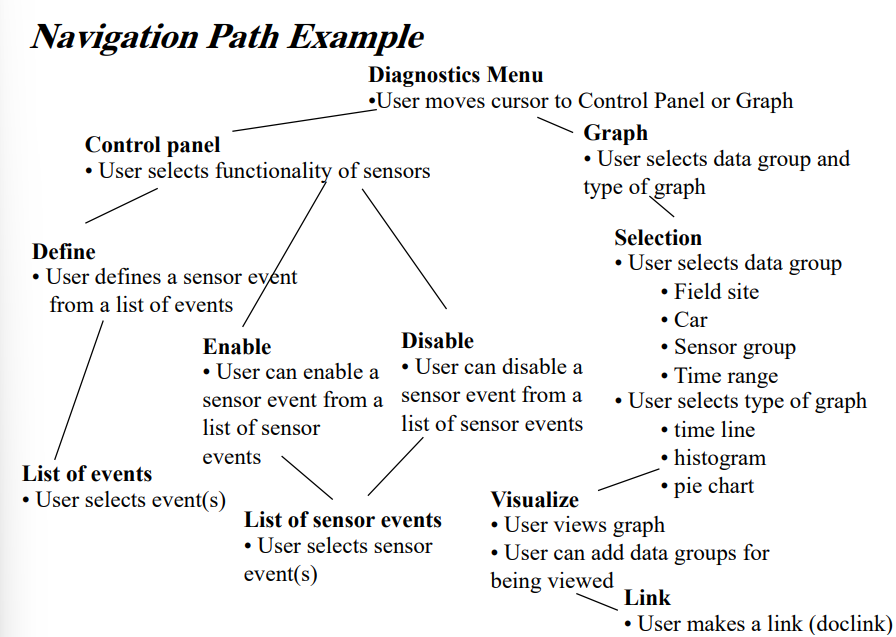
        - **Tips**
            - Costruire modelli dinamici solo per le classi che hanno un significativo comportamento dinamico
            - Considerare solo gli attributi rilevanti, usando astrazioni se necessario
            - Considerare la graularità dell'applicazione quando decidi action e activities
            - Ridurre il disordine notazionale
                - Provare a mettere action negli state boxes
- **Model dominant**
    - **Object model**: Il sistema ha oggetti in uno stato non banale
    - **Dynamic model**: Il modello ha diversi tipi di eventi: Input, output, exception, errors
    - **Functional model**: Il modello esegue trasformazioni complicate
- **Dominance of models**
    - **Compiler**: Modello funzionale più importante
        - Il modello dinamico è banale perchè c'è solo un tipo di input e solo pochi tipi di output
    - **Database systems**: L'object model più importante
        - Il functional model è banale, perchè lo scopo della funzione è di solito salvare, organizzare o recuperare i dati
    - **Spreadsheet program**: Modello funzionale più importante
        - Il dynamic model è interessato se il programma autorizza la computazione di una cella
        - L'object model è banale, perchè il valore dello spreadsheet sono banali e non possono essere strutturate ancora
            - L'unico oggetto interessante è la cella
- **Verification and Validation of models**
    
    - **Correctess, Completeness and Consistency**
        - **Verification**: Controllo di equivalenza fra le trasformazioni di due model
        - **Validation**: Comparazione di un model con la realtà
            - Requisiti devono essere validati con il client e l'user
            - **Techiques**: Formali e informali reviews
        - **Requirements validation** invoca:
            - **Correttezza**: Corretto se rappresenta il punto di vista del cliente
                - Tutto ciò che viene modellato rappresenta un aspetto della realtà
            - **Consistenza**: Identificazione di collegamenti fra le classi
                - Denominazione di classi, attributi e metodi
            - **Completezza**: Identificazione di associazioni sospese
                - Identificazione del classi definite due volte
                - Identificazione delle classi mancanti
            - **Ambiguità**: Misspelling dei nomi
                - Classi con lo stesso nome, ma differente significato
            - **Realismo**: Il modello può essere implementato senza difficoltà
- **Diagram Checklist for the RAD**
    - Descrivere il modello del sistema con differenti viste
        - Class diagram
        - Use Case
        - Sequence diagram
        - State chart diagram
    - Controllare l'equivalenza delle viewa
    - Controllo sintattico
        - Controllo per la consistenza dei nomi delle classi, attribuiti e metodi nei differenti sottosistemi
        - Identificazione di associazioni sospese
        - Identificazione del classi definite due volte
        - Identificazione delle classi mancanti
        - Classi con lo stesso nome, ma differente significato
- **Project Agreement**: Rappresenta l'accettazione del modello di analisi da parte del cliente
    - Cliente e sviluppatore convergono in una singola idea e concordano sulle funzionalità e le features che il sistema deve avere
        - Lista dei requisiti prioritari
            - **High priority(Core requirements)**: Affrontati durante l'analisi, il design e l'implementazione
                - Dimostrata con successo durante l'accettazione del cliente
            - **Medium priority(Optional requirements)**: Affrontati durante l'analisi, il design
                - Di solito implementati e sviluppati durante la seconda fase dello sviluppo del sistema
            - **Low priority(Fancy requirements)**: Affrontati durante l'analisi
                - Illustra come il sistema dei funzionare nel futuro se non sono ancora disponibili le tecnologie richieste
        - Processo di revisione
        - Lista dei criteri che bisogna usare per accettare o rifiutare il sistema
        - Programma e budget
## Modeling with UML
- **Modeling**: Astrazione della realtà
- **System**: Una astrazione che descrive un sottoinsieme del sistema
- **View**: Raffigura aspetti selezionati di un modello
- **Notation**: Un insieme di regole grafiche e testuali per rappresentare una view
- **Phenomenon**: Un oggetto nel mondo del dominio come lo percepisci
- **Concept**: Descrive le proprietà comuni del fenomeno
    - **Name**: Per distinguerlo dagli altri concetti
    - **Purpose**: Proprietà che determinano se un fenomeno è membro di un concetto
    - **Members**: Insieme dei fenomeni che fanno parte di un concetto
- **Abstract Data Types & Classes**
    - **Abstract Data Types**: Tipo speciale la cui implementazione è nascosta dal resto del sistema
    - **Class**: Un astrazione nel contesto dei linguaggio object-oriented
- **Application Domain**: Ambiente nel quale il sistema opera
- **Solution Domain**: Le tecnologie disponibili per costruire il sistema
- **UML(Unifed Modeling Language)**:  Uno standard per modellare software object-oriented. Per immagini vedere pdf UML
    - **Use Case Diagrams**: Descrive il comportamento funzionale del sistema come visto dall'utente
        - **Actor**: Rappresentano il ruolo, ovvero un tipo di utente del sistema
            - Modella un entità esterna che comunica col sistema
            - Ha un nome unico e una descrizione opzionale
        - **Use Cases**: Rappresenta una sequenza di interazioni per un tipo di funzionalità
            - Rappresenta una classe di funzionalità fornita dal sistema come flussi di eventi
            - Nome unico
            - Attori partecipanti
            - Entry condition
            - Flussi di eventi
            - Exit condition
            - Requisiti speciali
        - **<< Extends >> Relationship**: Rappresenta casi eccezionali o raramente invocati
            - I casi d'uso che rappresentano flussi eccezionali possono estendere più di un caso d'uso
            - Direzione verso l'extended caso d'uso 
        - **<< Include >> Relationship**: Comportamento escluso dal caso d'uso a fine di riutilizzo
            - Verso il caso d'uso
    - **Class Diagrams**: Descrive la struttura statica del sistema: Object, Attributes, Relations
        - Usato per :
            - Analisi Requisiti per modellare concetti del problema del dominio
            - System Design per modellare un sottosistema e le interfacce
            - Object Design per modellare le classi
        - **Classes**: Rappresenta un concetto
            - **Attributi**: Stato
                - Hanno un tipo
            - **Operazioni**: Comportamenti 
                - Hanno una signature
        
        - **Instances**: Rappresenta un fenomeno
            - Nome sottolineato e può contenere l'istanza della classe
            - Rappresentati con il loro valore

        - **Actor vs Instances**
            - **Actor**: Un entità esterna al sistema che deve essere modellata, e deve interagire col sistema
            - **Class**: Una astrazione che modella un entità nel dominio del problema, deve essere modellata all'interno del sistema
            - **Object**: Una specifica istanza di una classe
        - **Associations**: Relazione fra classi
            - Mapping bidirezionale
                - Per renderla monodirezionale, la freccia deve puntare verso il server role
            - One-toone, many-to-many, one-to-many
            - Descrive una serie di link
            - **Associations Classes**: Associazioni che possono avere attribuiti ed operazioni attaccate a loro
                - Può essere trasformata in una classe e semplici associazioni
        - **Link**: Connesione fra due istanze di un oggetto
            - Il link è una istanza di una associazione
        - **Roles**: Il nome che identifica univocamente un estremità di una associazione
            - Necessarie per associazioni fra due oggetti della stessa classe
            - **Client Role**: Un oggetto che può operare su altri oggetti ma non può essere mai operato da altri oggetti
            - **Server Role**: Un oggetto che non opera mai con altri oggetti, ma è sempre operato da altri oggetti
            - **Agent Role**: Unn oggetto che può operare ed essere operato
                - Spesso creato per svolgere un lavoro per conto di un attore o di un altro agente
        - **Aggregation**: Speciale associozione che denota una gerarchia
            - **Aggregate**: Padre
            - **Componets**: Figli
            - **Coposition**: Denotato da un diamante solido che indica che i components non posso esistere senza gli aggregati
        - **Qualification**: Migliora le informazioni riguardo la multiplicità delle associazioni fra le classi, permettendo di ridurre 1-to-many a 1-1
        - **Inheritance**: Le classi figlio ereditano gli attribuiti e le operazioni della classe padre
        - **Package**: Meccanismo per organizzare elementi in gruppi
            - Un sistema complesso può essere decomposto in sottosistemi, dove ogni sottosistema è modellato come un pacchetto
    - **Sequence Diagrams**: Descrive il comportamento dinamico fra gli attori e il sistema e fra gli oggetti e il sistema
        - Classi rappresentate come colonne
        - Messaggi raprresentati come frecce
        - Activations rappresentati come rettangoli stretti
        - Lifelines rappresentate come linee tratteggiate
          
        - **Nested messages**: Freccia indica l'activation a cui è inviato il messaggio
        - **DataFlow**: Frecce tratteggiate indicano il dataflow
        - **Lifelines**: Indicato da frecce tratteggiate verticali
        - **Iteration**: Denotato da * prima del messaggio
        - **Condition**: Denotato dall'espressione booleana in [] prima del nome del messaggio
        - **Creation**: Denotato da una freccia che punta all'oggetto
        - **Destruction**: Denotato da una X alla fine della activation
    - **Statechart Diagrams**: Descrive il comportamento dinamico di un oggetto individuale
    - **Activity Diagrams**: modella il comportamento dinamico del sistema ,in particolare il workflow
        - **Action state**: Non può essere decomposto
        - **Activity state**: Può essere decomposto
            - L'activity viene modellata da un altro activity diagram
        - **Modeling Concurrency**: Sincronizzazione delle activity multiple
        - **Swimlanes**: Divisione per denotare l'oggetto o il sottosistema che implementa l'azione
    - **Implementation Diagrams**
    - **Object Constraint Language**
      
    - **Conventions**
        - Rettangoli per classi e istanze
        - Ovali per funzioni e casi d'uso
        - Istanze denotate con un nome sottolineato
        - Tipi denotati con nome non sottolineato
        - Diagrammi sono grafi
            - Nodi sono le entità
            - Archi sono le relazioni fra le entità
## System Design
### Decomposing the System
- **Design window**: Tempo nel quale le decisioni di design devono essere fatte
- Unire le distanze fra il sistema desiderato e quello esistente in modo gestibile
- Modelliamo il sistema al fine di essere sviluppato come una serie di sottosistemi
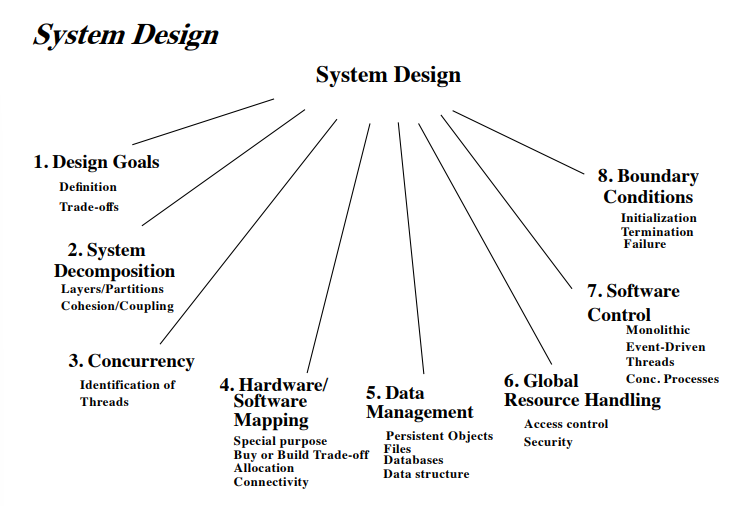

- **Subsystem (UML: Package)**: Collezione di classi, associazioni, operazioni, eventi e vincoli che sono interrelati
- **(Subsystem) Service**: Insieme di operazioni previste dal sottosistema che hanno uno scopo comune
    - **Seed per i service**: Casi d'uso del sottosistema
- **Subsystem interface**: Specifica il flusso di interazione e informazione dai/ai limiti del sottosistema, ma non nel sottosistema
    - Deve essere ben definita è piccola
    - Insieme di operazioni comuni tipate
    - Definita nel Object Design
    - Chiamata anche API

#### Choosing Subsystem 
- Per quanto riguarda il criterio di selezione del sottosistema, si preferisce che la maggior parte delle interazioni siano all'interno dei sottosistemi e non nei confini degli stessi

- **Subsystem Interface Object**: Fornisce un servizio
    - Un insieme di metodi pubblici forniti dal sottosistema
    - Tutti i suoi metodi sono descritti nel **Subsystem interface**
    - Usa un **Faced pattern**
#### Coupling and Cohesion
- Riduzione della complessità durante il cambiamento
- **Coesion**: Misura le dipendenze fra le classi
    - **High cohesion**: Le classi nel sottosistema svolgono task simili e sono collegate fra di loro via associazione
    - **Low cohesion**: Molte classi varie e ausiliari, senza associazioni
- **Coupling**: Misura le dipendenze fra i sottosistemi
    - **High coupling**: Cambiamenti in un sottosistema ha un grande impatto negli altri sottosistemi
    - **Low coupling**: Un cambiamento in un sottosistema non ha un impatto sugli altri sottosistemi
- Un sottosistema deve avere massima coesione e minimo accoppiamento

#### Partitions and Layers
- Servono per ottenere un basso valore di accopiamento
- **Partitions**: Divide il sistema in una serie di indipendenti sottisistemi che forniscono servizi sullo stesso livello di astrazione
- **Layer**: Un sottosistema che fornisce un servizio a un layer superiore
    - Dipende solo da layer di livelli inferiori
    - Non ha conoscenza dei layer superiori
##### **Heuristic**
    - Non più di 7+/-2 sottosistemi
    - Non più di 4+/-2 layer

##### Relationship between Subsystem
- **Layer relationship**: Layer A chiama il/dipende dal Layer B
    - Chiama -> runtime
    - Dipende -> tempo di compilazione
- **Partition relationship**: I sottosistemi hanno una conoscenza, ma non approfondita degli altri sottosistemi

#### How to use the result from the RAD
- **Requisiti non funzionali** -> **Design Goal Defination**
- **Functional model** -> **Decomposizione del sistema**
- **Object model** -> **Hardware/Software mapping** e **Persistent data management**
- **Dynamic model** -> **Concurrency**, **Global resource handling** e **Software control**
- **Decomposition** -> **Boundary conditions**

- I requisiti non funzionali danno delle indicazioni per quanto riguarda l'uso dei Design Pattern

#### List of Design Goal and Relationship
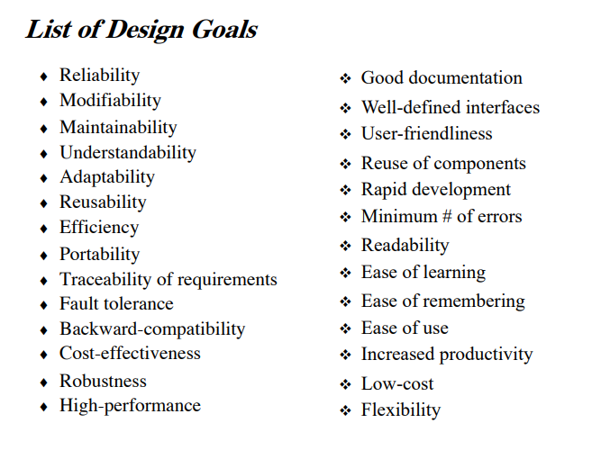
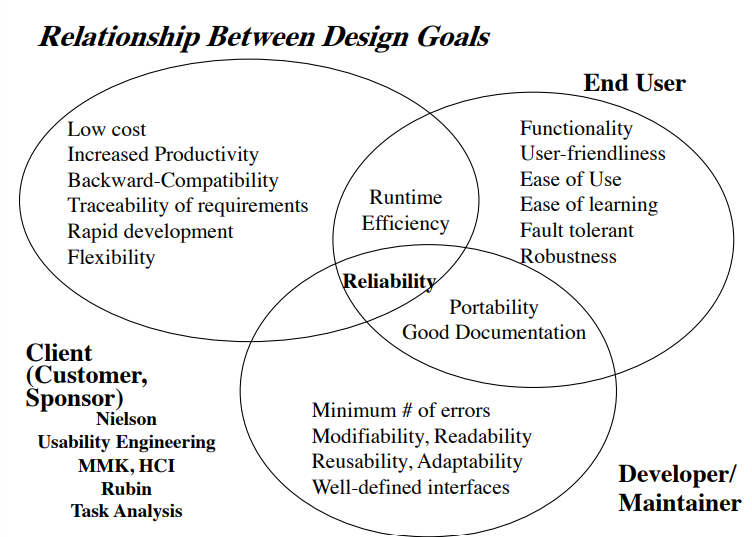

#### Virtual Machine
- Un sistema deve essere sviluppato come una serie ordinata di macchine virtuali, ognuna costruita sulla base di quella sottostante

- Astrazione che fornisce una serie di attributi e operazioni
- Sottosistema che connette i livelli superiori e inferiori delle macchine virtuali attrverso delle relazioni per fornire servizi

- Possono implementare due tipi di architettura software
    - Aperta
    - Chiusa

##### Closed Architecture (Opaque Layering)
- Tutti i layer possono solo invocare operazioni dei layer immediatamente sottostanti
- Alta mnutenibilità e flessibilità

##### Open Architecture (Transparent Layering)
- Tutti i layer possono invocare operazioni da i layer sottostanti
- Efficenza Runtime

#### Properties of Layered System
- Gerarchici, al fine di ridurre la complessità
- Chiuso più portabile
- Aperti più efficiente
- Se un sottosistema è un layer, è chiamato virtuale machine

#### Patterns for software architecture
##### Client/Server
- Uno o più server forniscono servizi per instanziare sottosistemi, chiamati client
- Client conoscono le interfacce del server
- Server non necessita di conoscere l'interfaccia del client
- Risposte immediate
- Gli utenti interagiscono con il client
- Spesso usati nel sistema database
- Funzioni performata dal client:
    - Personalizzare l'interfaccia utente
    - Processamento dei dati front-end
    - Avvio di chiamate remote dal server
    - Accesso al server databbase nella netowrk
- Funzioni performate dal database server:
    - Gestione dati centralizzata
    - Integrità dei dati e consistenza del database
    - Sicurezza del database
    - Operazioni concorrenti
    - Processi centralizzati

- **Service Portability**: Server può essere installato su varie macchine e sistemi operativi e funziona in vari ambienti network
- **Trasparency, Location-Trasparency**: Il server può essere distribuito, ma deve fornire un singolo servizio logico all'utente
- **Perfomance**
    - **Client**: Deve essere personalizzabile per attività interattive che richiedono un'intensa visualizzazione
    - **Server**: Deve fornire operazioni di CPU intense
- **Scalability**: Il server deve avere capacità di riserva per gestire un grande numero di client
- **Flexibility**: Il sistema deve essere usabile per una varietà di interfacce utente e device
- **Reliability**: Il sistema deve sopravvivere al problemi sui i link di comunicazione e sui 

- **Problem**
    - Non forniscono comunicazione peer-to-peer

##### Peer-to-Peer
- Generalizzazione del Client/Server
- I client possono essere server e i server possono essere client
- Più difficoltà a causa della possibilità del deadlock

##### OSI model Packages and their Responsability
- **Physical layer**: Rappresenta l'interfaccia hardware al network
    - Ti permettono di mandare e ricevere bit su un canale
- **Datalink layer**: Permettono di mandare e ricevere frame senza errori usando il servizio di un layer fisico
- **Network**: Responsabile della trasmissione e dell'instradamento dei dati nella network
- **Transport**: Responsabile della trasmissione affidabile da un capo all'altro
- **Session**: Responsabile per l'inizializzazione di una connessione
- **Presentation**: Esegue servizi di trasformazione dei dati
- **Application**: Il sistema che stai progettando

##### Repository Architectural Style
- Sottosistema accede e modifica dati da una singolo struttura dati
- Sottosistema sono debolemente accoppiate
- Il flusso di controllo è dettato dalla repository centrale o dal sottosistema

##### Model/View/Controller
- **Model**: Responsabile della conoscenza dell'applicazione del domani
- **View**: Responsabile di mostrare gli oggetti dell'applicazione del dominio all'utente
- **Controller**: Responsabile della sequenza di interazioni con l'utente e notificare la visualizzazione delle modifiche nel model
- Sottosistema model implementa la struttura dati centrale, il sottosistema controller detta esplicitamente il controllo di flusso

### Addressing Design Goal
#### Concurrency
- Identificare thread concorrenti e problemati di indirizzo concorrente
- Tempo di risposta e performance come design goal
- **Thread**: Un thread di controllo è un insieme di diagrammi di stato nel quale un singolo oggetto è attivato alla volta
    - Un thread rimane nello state diagram fino a quando un oggetto manda un evento ad un altro oggetto e aspetta per un altro evento
    - **Splitting**: Un oggetto esegue un invio non bloccante di un evento
- Due oggetti sono concorrenti se ricevono eventi nello stesso momento senza interazione
- Oggetti concorrenti devono essere assegnati a differenti thread di controllo
- Oggetti con mutua esclusione devono essere inseriti in un singolo thread di controllo
- La concorrenza può essere implementata
    - Fisica concorrenza
    - Logica concorrenza

#### Hardware Software Mapping
##### Mapping the Objects
- **Processor issues**
- **Memory issues**:
- **I/O issues**

##### Mapping the Subsystem Associations
- **Physical connectivity**: Descrive la connettività fisica del hardware
- **Logical connectivity**: Descrive la connettività logica, identificando associazioni che non sono direttamente collegate con una connessione fisica

##### Questions
- Connettività fra le unità fisiche: Alberi, star, matrici e ring
- Appropriato protocollo di comunicazione fra i sottosistemi deve essere in funzione della larghezza di banda, latenza e all'affidabilità richiesta

##### Connectivity in Distributed System
- Se l'architettura è distribuita dobbiamo descrive l'architettura network
    - Mezzo trasmissivo
    - Qualità del servizio e protocollo usato
    - Interazioni asincrono, sincrone o bloccanti
    - Larghezza di banda richiesta

##### Drawing Subsystem in UML
- Il system design deve modellare strutture statiche e dinamiche
###### Component Diagram
- Un grafo di componenti connesse da un relazione di dipendenza
- Mostra dipendeza fra componenti software
    - Codice sorgente
    - Librerie
    - File eseguibile
- Le dipendenze sono mostrate con una linea tratteggiata dal componente client al componente fornitore

- Uso di linee tratteggiate alla corrispondente UML interface

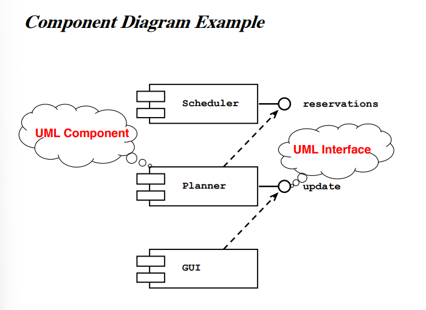

###### Deployment Diagram
- Utilizzato per mostrare un system design dopo le scelte di decomposizione del sottosistema, Concorrenza e Mapping Hardware/Software

- Grafo di nodi connessi da associazioni di comunicazione
    - Nodi mostrati come 3-D box
    - Nodi possono contenere istanze di componenti
    - Componenti possono contenere oggetti
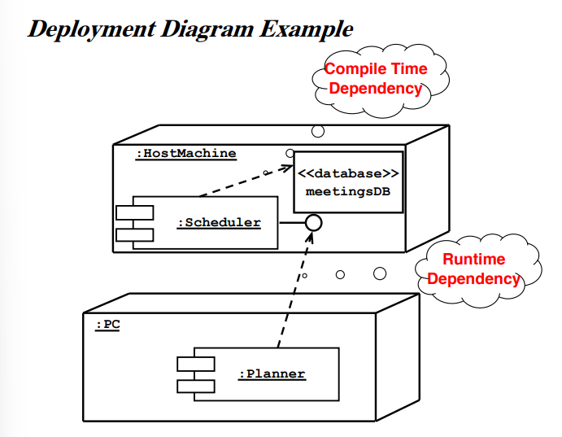

#### Data Management
- Alcuni oggetti necessitano di essere persistenti
    - Fornisce dei punti di separazione fra i sottosistemi con delle interfacce ben definite
- Un oggetto persistente può essere realizzato attraverso
    - **Data Structure**: Può essere volatile
    - **Files**: Poco costoso, semplice e permenente nello spazio di archiviazione
        - Basso livello per lettura e scrittura
        - Applicazioni devono aggiungere codice per fornire un giusto livello di astrazione
    - **Database**: Potente e facile da portare
        - Supporta scrittura e lettura multipla
##### Database Management System
- Contiene meccanismi per descrivere dati, gestire archivi persistenti e fornisce meccanismi di backup
- Permette accesso concorrente
- Contiene informazioni sui meta-data
###### Issue
- Spazio di archivio maggiore rispetto allo spazio per i dati effettivi
- Tempo di risposta influenzato dal tempo di CPU, locking contention e ritardi dovuti alla frequenza di aggiornamento dello schermo
- Locking modes:
    - **Pessimist locking**: Lock prima di accedere ad un oggetto e rilasciato quando accesso è completo
    - **Optimistic locking**: Lettura e scrittura possono avvenire liberamente, se quando l'activity è completata il database ha trovato una contesa annulla l'operazione fatta
- Administration: Grandi database richiedono un team di supporto allenato per impostare policies di sicurezza, gestire lo spazio del disco, fare backup, monitorare le performance e regolare il tuning

###### Object-Oriented Databases
- Supporta i fondamentali concetti di modellazione degli oggetti
    - Classi, attributi, metodi. associazioni, ereditarietà
- Per mappare i modelli ad oggeti bisogna
    - Determinare quali oggetti sono persistenti
    - Eseguire analisi dei requisiti e object design
    - Creare indici singoli di attributi per evitare un riduzione di performance dovuto al problema del collo di bottiglia
    - Fare mapping

###### Relational Databases
- Basato sull'algebra relazionale
- Le tabelle hanno un numero specificato di colonne e un numero arbitrario di righe
    - **Primary key**: Combinazione di attributi che identificano univocamente un riga di una tabella
    - **Foreign key**: Riferimento ad una chiave primaria di un altra tabella
- SQL linguaggio per definire e manipolare tabelle
- Supporto di vincoli
    - **Integrità referenziale**: Riferimento alle voci in altre tabelle esistono realmente

#### Global Rsources Handling and Security
##### Defining Access Control
- In un sistema multi-utente diversi attori hanno accesso a differenti funzionalità e dati
- Durante l'analisi modelliamo questi differenti accessi associando differenti casi d'uso a differenti attori
- Durante la fase di system design modelliamo i differenti accessi esaminando il modello a oggetti determinando quale oggetti sono condivisi fra i vari attori
    - Possiamo definire anche quali attori devono essere autenticati e quali dati devono essere cryptati

##### Access Matrix
- Modelliamo l'accesso alle classi con una matrice di classi
    - Riga rappresenta l'attore del sistema
    - Colonna rappresenta la classe di cui vogliamo controllare l'accesso
- **Access Right**: Una voce della matrice degli accessi
    - Lista di operazioni che possono essere svolte sull'istanza della classe da un attore

###### Access Matrix Implementations
- **Access globale alla tabella**: Rappresenta esplicitamente ogni cella della matrice come una tupla
    - Per determinare se un attore ha accesso ad un oggetto bisogna trovare la tupla, se non presente l'acceso è negato
- L'elenco di controllo degli accessi associa un elenco di coppie alla classe con la quale bisogna accedere
    - Ogni volta che un oggetto è acceduto, la sua lista di accesso è spuntata per il corrispondente attore e operazione
- Un capacità associa un coppia a un attore
    - Permette all'attore di ottenere il controllo di accesso ad un oggetto della classe descritta nella capacità

#### Decide on Software Control
- Controllo implicito
    - Rule-base system
    - Logic programming
- Controllo esplicito
    - Centralizzato
        - **Procedure-Driven Control**: Controllo risiede nel codice del programma
            - Semplice, facile da costruire, difficile da mantenere
            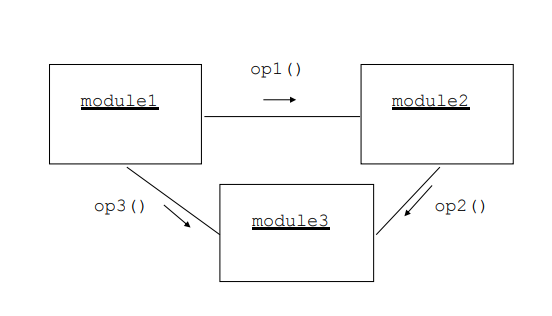

        - **Event-Driven control**: Controllo risiede nel dispatcher che chiama le funzioni via callback
            - Flessibile, buono per il design delle interfacce grafiche, facile da estendere
            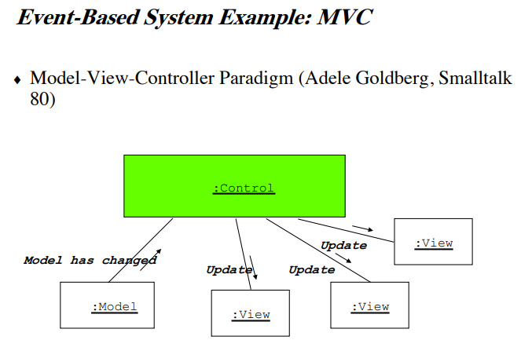

    - Decentralizzato: Controllo risiede in una serie di oggetti indipendeti
        - Possibile speedup attraverso la paralellizazione, incrementando overhead della comunicazione
##### Centralized vs. Decentralized Designs
- Controlla i sequence diagram e i control object
    - Se il diagramma sembra una fork -> Centralized
    - Se il diagramma sembra una stair -> Decentralized
- **Centralized Design**: Un control object o sottosistema controlla tutto
    - Cambio struttura controllo facile
    - Problema tappo di bottiglia
- **Decentralized Design**: Controllo distribuito
     - Responsabilità divisa
     - Rientra perfettamente in uno sviluppo object-oriented

#### Boundary Conditions
- Affronta la configurazione del sistema
    - **Configuration**: Per ogni oggetto persistente identificare in quale caso d'uso è creato o distrutto
        - Per gli oggetti non creati o distrutti in nessun caso d'uso, aggiungi casi d'uso invocato dall'amministratore del sistema
    - **Inizializzazione**: Descrive come il sistema o le componenti passano da uno stato di non inizializzato a uno stato di ready-state
    - **Termination**: Descrive quali risorse devono essere rimosse e quali sistemi vengono avvisati alla terminazione del sistema o del componente
    - **Failure**: Bugs, errori, problemi esterni
        - Deve prevedere errori fatali
        - Casi d'uso eccezionali estendono i comuni casi d'uso

### Distributed System Architectures
#### Centralised System
- Applicazione viene eseguita su un singolo processo o su un singolo computer che costituisce l'unica componente autonoma del sistema
    - Condiviso fra diversi utenti
    - Tutte le risorse del componente sono sempre accessibili
    - Singolo punto di controllo, singolo punto di fallimento
    - Sistema dei mainframe

#### Distributed System
- L'elaborazione delle informazioni è distribuita su una serie di computer
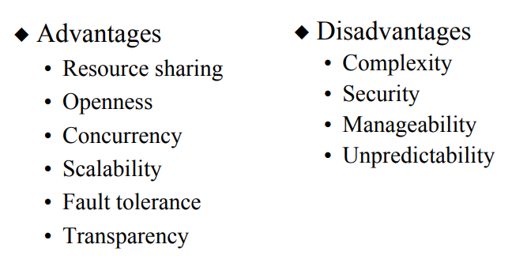

##### Distribbuted System Architectures
- **Client-server architectures**: Servizi distribuiti chiamati dai client
    - Server che forniscono servizi trattati in maniera diversa dai client che usano i servizi
    - Client conoscono una serie di server, ma i server non hanno bisogno di conoscere i client
    - Client e server sono processi logici

- **Distributed object architectures**: Nessuna distinzione fra client e server
    - Tutti gli oggetti possono fornire e richiedere servizi
    - La comunicazionne fra gli oggetti avviene tramite un sistema middleware chiamato broker di richieste di oggetti
    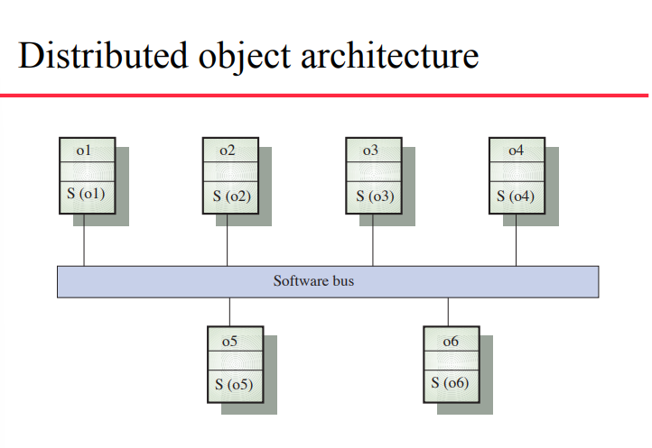

    - **Vantaggi**
        - Ritardare la decisione di dove e come i servizi devono essere forniti
        - Sistema aperto che permette di aggiungere nuove richieste quando necessarie
        - Flessibile e scalabile
        - Possibilità di riconfigurare il sistema dinamicamente con la migrazione degli oggetti attraverso il network
    - **Usi**
        - Come modello logico permette di strutturare e organizzare il sistema
            - Si pensa solo a come fornire funzionalità all'applicazione in termini di servizi e combinazioni di servizi
        - Come approccio flessibile per l'implementazione di un client-server system
            - Sia il client che il server sono realizzati come oggetti distribuiti che comunicano attraverso un software bus

##### Middleware
- Software che gestisce e supporta i differenti componenti del sistema distribuito
- Solitamente software standard

##### Layered application architecture
- **Presentation layer**: Presentazione dei risultati della computazione al sistema dell'utente e collezione degli input dell'utente
- **Application processing layer**: Fornisce funzionalità specifiche all'applicazione
- **Data management layer**: Gestire il database del sistema

##### Application layers and client server systems
- **Thin-client model**: Tutti processi dell'applicazione e la gestione dei dati è gestita dal server
    - Client si occupa di eseguire il software di presentazione
    - Usato quandp il sistema legacy migra su un architettura client server
        - Il sistema legacy agisce come server con una interfaccia grafica implementata su client
        - Grande carico di elaborazione sul server e sulla network
- **Fat-client model**: Il server è solo responsabile della gestione dei dati
    - Software del client implementa la logica dell'applicazione e le interazione con il sistema dell'utente
    - Grand parte dei processi sono delegati al client che li esegue in locale
    - Complesso soprattutto per la gestione
    - Nuove versioni devono essere installate su tutti i client

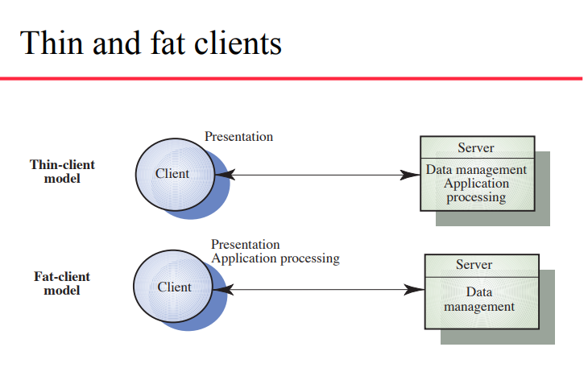
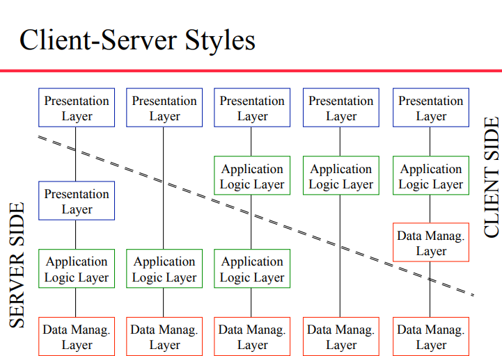

##### Three-tier architectures
- Ogni layer dell'architettura dell'applicazione deve essere eseguito su un processore separato
- Migliore performance di un thin client e semplice gestione rispetto a un fat client
- Scalabile 
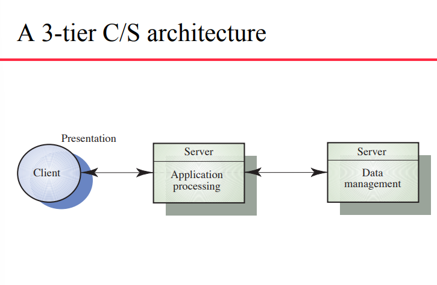

### Documentation, Review, and Management

#### Reviewing System Design
- Non c'è un agente esterno, come il client
- Alcune activity nel system design triggerano la revisione del modello di analisi
- Il client e l'utente sono riportati nel processo come la revisione

#### Correctness and Completeness
- Corretto se l'analisi del modello può essere mappato al modello di system design
- Completo se ogni requisito e ogni problematica del system design sono stati affrontati

#### Consistence, Realism, and Readability
- Consistente se non contiene contraddizione
- Realistico se il corrispondente sistema può essere implementato
- Leggibile se lo sviluppatore non coinvolto nel system design può capire il modello

#### Documenting System Design
- SDD è usato per definire interfacce fra team di sviluppatori e serve come riferimento quando una decisione di livello architettura deve essere rivisitata
- Deve includere:
    - Gestione del progetto
    - Architetti del sistema
    - Sviluppatori che fanno design e implementano ogni sottosistema

#### Assigning Responsibilities
- Il design del sistema nei sistemi complessi è centrato attorno architecture team
    - Questo team cross-funzionale fatto di architetti che definiscono la decomposizione del sottosistema e selezionati sviluppatori che implementeranno il sottosistema
    - Inizia a lavorare dal momento in cui l'analisi del modello e stabile fino alla fine della fase di integrazione
        - Incentivo per anticipare problemi incotrati durante la fase di integrazione
    - Numero di sottosistemi determina il numero di architecture team
        - Per sistemi complessi, un architecture team è introdotto per ogni livello di astrazione
        - In tutti i casi, dovrebbe esserci un ruolo di integrazione nel team per assicurare consistenza e comprensione dell'architettura da parte di un singolo individuo

#### Main Roles
- **Architetto**: Assicura consistenza nelle decisioni di design e stile di interfaccia
    - Assicura la consistenza del design nella gestione della configurazione e testing team, in particolare nella formazione della policy configuration management e la strategia di integrazione del sistema
    - Leader del cross-functional architecture team
    - **Architecture Liaisons**: Membri del team di architettura
        - Rappresentanti del team dei sottosistemi
        - Trasmettono informazione da a il loro team e negoziano il cambiamento di interfaccia
        - Si concentrano nei servizi del sottosistema, durante la fase di implementazione, si concentrano sulla consistenza delle API

#### Communicating about system design
- **Size**: Il numero di problemi aumenta man mano che gli sviluppatori inziano a progettare
    - Il numero di item che lo sviluppatore manipola incrementa, ogni pezzo funzionale richiede molte operazioni o molti oggetti
    - Gli sviluppatori approfondiscono multipli design e multiple implementazioni tecnologiche
- **Change**: La decomposizione del sottosistema e l'interfaccia del sottosistema sono in costante flusso
    - I termini usati dagli sviluppatori per nominare differenti parti del sistema evolvono constantemente
    - Se il cambiamento è rapido, gli sviluppatori non devono discutere la stessa versione del sottosistema, per evitare troppa confusione
- **Level of abstraction**: Discussione sui requisiti possono diventare concreti usando interfacce mock-ups e analogie sul sistema esistente
    - Discussione sull'implementazione possono essere resi concreti quando integrazione e i risultati del test sono disponibili
    - Discussioni di system design sono raramente concrete, si sentono dopo durante l'implementazione e il testing
- **Reluctance to confront problems**: Il livello di astrazione può rendere facile la risoluzione di problematiche
    - Qualsiasi decisione che ha un impatto sul sottosistema o sulle interfacce del sottosistema non può essere ritardato
- **Conflicting goals and criteria**: Sviluppatori individuali spesso ottimizzano differenti criteri
    - Sviluppatori esperti nel design si occuperanno dell'ottimizzazione del tempo di risposta
    - Sviluppatori esperti nei database si occuperanno di ottimizzare la produttività

#### Effective communication techniques
- **Identificare e dare priorità agli obiettivi di progettazione del sistema e renderli espliciti**: Se gli sviluppatori coinvolti nella progettazione del sistema contribuiscono a questo processo, saranno più facili da raggiungere
    - Gli obiettivi di progettazione forniscono anche un quadro oggettivo in base al quale le decisioni possono essere valutate.

- **Rendere disponibile la versione corrente della scomposizione del sistema a tutti gli interessati**: Un documento live distribuito via Internet è un modo per ottenere una rapida distribuzione
    - L'utilizzo di uno strumento di gestione della configurazione per gestire i documenti di progettazione del sistema aiuta gli sviluppatori a identificare le modifiche recenti.

- **Mantenere un glossario aggiornato**: Come nell'analisi, definire i termini in modo esplicito riduce i malintesi
    - Quando si identificano e si modellano i sottosistemi, fornire definizioni oltre ai nomi
    - Un diagramma UML con solo i nomi dei sottosistemi non è sufficiente per supportare una comunicazione efficace
    - Una definizione breve e sostanziale dovrebbe accompagnare ogni nome di sottosistema e classe

- **Confronto sui problemi dei design**: Ritardare le decisioni di progettazione può essere utile quando sono necessarie più informazioni prima di impegnarsi nella decisione di progettazione
    - Questo approccio, tuttavia, può prevenire il confronto con difficili problemi di progettazione
    - Prima di presentare una questione, è necessario esplorare e  descrivere diverse possibili alternative e giustificare il ritardo   
        - Questo garantisce che le questioni possano essere ritardate senza gravi ripercussioni sulla decomposizione del sistema

- **Iterazione**: Interventi mirati nella fase di implementazione possono migliorare la progettazione del sistema
    - Le decisioni importanti nelle fasi iniziali della progettazione del sistema influenzano la decomposizione del sottosistema quando vengono avviate ciascuna delle diverse attività di progettazione del sistema
    - Le revisioni delle interfacce dei sottosistemi avvengono quando vengono creati prototipi di valutazione per valutare problemi specifici
    - Errori e sviste scoperti in ritardo innescano modifiche alle interfacce del sottosistema e talvolta alla decomposizione del sistema stesso
    - **Major decisions iterations**
        - Gestite meglio nelle sessione di brainstorming
        - Massimizzazione della comunicazione
        - Spesso la decomposizione del sistema è progettata prima della fine dell'analisi
    
    - **Revisions to the interfaces of subsystems iterations**
        - Mira a risovere problemi specifici
        - Decomposizione è stabile e mira a identificare se uno specifico pacchetto è appropriato per il sistema
            - Durante questo periodo gli sviluppatori possono creare prototipi verticali per casi d'uso critici per testare l'appropriatezza della decomposizione
            - Ciò consente di individuare e risolvere tempestivamente i problemi di flusso di controllo
            - Non necessario un cambio di processo formale
    - **Errors and oversight iterations**
        - Risolve i problemi di progettazione scoperti in una fase avanzata del processo
        - Sebbene gli sviluppatori preferiscano di gran lunga evitare queste iterazioni, poiché tendono a essere costose e a introdurre molti nuovi bug nel sistema, dovrebbero prevedere modifiche in una fase avanzata dello sviluppo
        - Anticipare le iterazioni tardive include la documentazione delle dipendenze tra i sottosistemi, la logica di progettazione delle interfacce dei sottosistemi e qualsiasi soluzione alternativa che potrebbe fallire in caso di modifica
        - Il cambiamento dovrebbe essere gestito con attenzione e dovrebbe essere implementato un processo di cambiamento simile a quello che monitora le modifiche dei requisiti

#### How much effort should I put into system design
- Quando le nuove informazioni diventano disponibile, si tende a effettuare dei cambi nel SDD prima dell'integrazione del sistema

#### Design Windows
- Possiamo ottenere la stabilizzazione progressiva della decomposizione del sottosistema utilizzando il concetto di finestra di progettazione
    - Per incoraggiare il cambiamento e controllarlo, le questioni critiche vengono lasciate aperte solo per un periodo di tempo specificato
    - Le strutture dati e gli algoritmi interni, tuttavia, possono essere lasciati aperti fino a dopo l'integrazione, consentendo agli sviluppatori di rivederli in base ai test delle prestazioni
    - Una volta chiusa la finestra di progettazione, il problema deve essere risolto e può essere riaperto solo in un'iterazione successiva
- Con l'accelerazione dell'innovazione tecnologica, molti cambiamenti possono essere previsti quando una parte dedicata dell'organizzazione è responsabile della gestione della tecnologia
    - I responsabili tecnologici analizzano le nuove tecnologie, le valutano e accumulano conoscenze che vengono utilizzate durante la selezione dei componenti
    - Spesso il cambiamento avviene così rapidamente che le aziende non sono consapevoli di quali tecnologie forniscono

### Rationale Management
- **Rationale**: Ragionamento che ha portato il sistema
    - Questioni da affrontare
    - Alternative che consideriamo
    - Decisioni usate per risolvere le problematiche affrontate
    - Criterio usati per la guida delle decisioni
    - Dibattito che gli sviluppatori hanno affrontato per raggiungere una decisione

#### Rationale in Software Engineering
- **Migliorare il supporto alla progettazione**: Evitare la valutazione duplicata di alternative scadenti
    - Rendere consistenti e impliciti i trade-offs
- **Migliorare il supporto alla documentazione**: Rendere più facile ai non sviluppatori rivedere il design
- **Migliorare il supporto alla manutenzione**: Fornisce ai manutentori il contesto di design
- **Migliorare l'apprendimento**: Nuovi membri dello staff posso imparare il design ripetendo le decisioni che lo hanno prodotto

- **Rappresentazione**
    - Argomentazione è l'approccio più promettente
        - Più informazioni dei documenti, come trade-offs e alternative scartate
        - Meno disordinato dei registri di comunicazione, che contengono tutto
    
    - **Issue model**: Rappresenta argomenti in una forma semi-strutturata
        - Nodi rappresentano i passi dell'argomento
        - Link rappresentano le relazioni

#### Centralized Traffic Control
- Abilita il dispatcher a monitorare e controllare trains da remoto
- Permette di pianificare il percorso e ripianificarlo in caso di problemi

- Ideali esempi di cattura della logica
- Sistemi a lunga vita
    - Tempo di vito legato alla manutenzione esteso
- Costoso
    - Bassa tolleranza ai guasti
    - Transizione verso una tecnologia matura

#### Issues
- Problemi concreti che non hanno una unica e corretta soluzione
- Sono formulati come domande

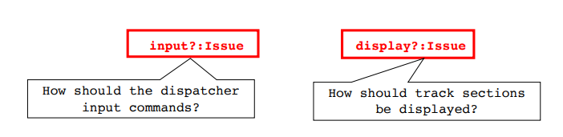

#### Proposals
- Possibili alterative alle issues
- Una proposal può essere condivisa da multiple issues

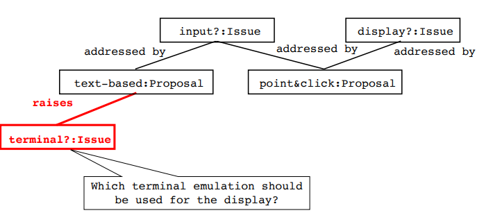

#### Consequent issue
- Issues sollevate dal'introduzione di una proposal

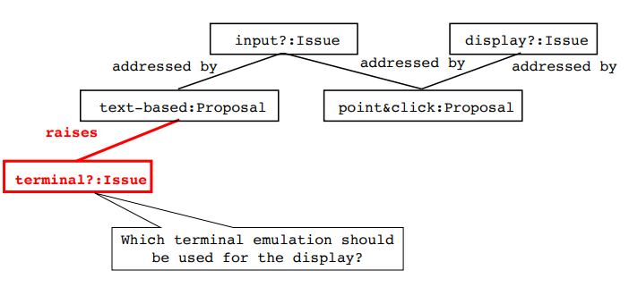

#### Criteria
- Misura di bontà
- Sono spesso design goal o requisiti non funzionali

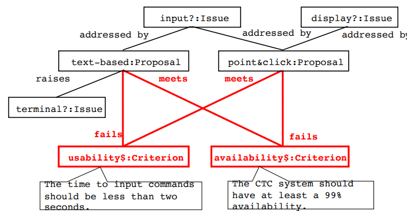

#### Arguments
- Rappresenta il dibattito che gli sviluppatori hanno dovuto affrontare per risolvere un problema
- Possono supportare o opporsi a qualsiasi fase del rationale

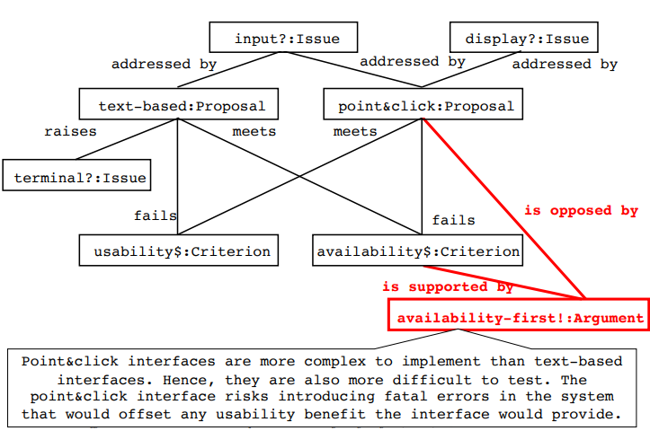

#### Resolutions
- Rappresentano decisioni
- Riassume la scelta delle alternative e l'argomentazione a sostegno
- Un problema risolto viene chiamato chiuso
- Un problema risolto può essere riaperto se necessario, risoluzione è declassata

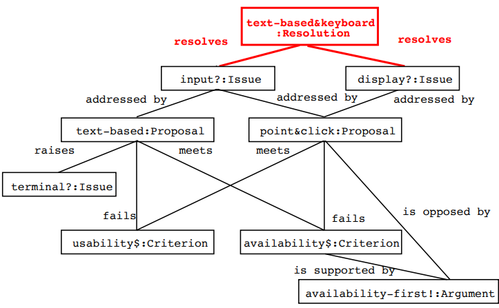

## Object Design
- Processo che permette di aggiungere dettagli all'analisi dei requisiti e fare delle decisioni di implementazione
- **Object Desing**: Base dell'implementazione
    - Iterazione su dove mettere le operazioni nel object model

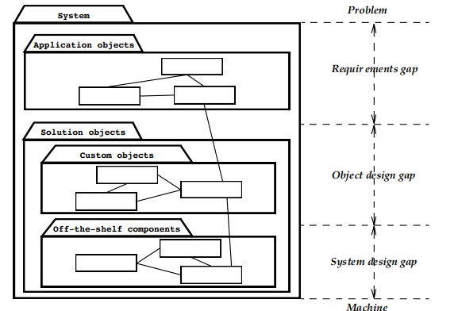

### Reusing Pattern Solution
#### Activities
- **Metodologie Object-Oriented**
    - **System Design**: Decomposizione in sottosistemi
    - **Object Design**: Implementazione nel linguaggio scelto
        - Strutture dati e algoritmi scelti

- **SA/SD**
    - **Preliminary Design**: Decomposizione in sottosistemi
        - Strutture date scelte
    - **Detailed Design**: Algoritmi scelti
        - Strutture dati ridefinite
        - Implementazione nel linguaggio scelto
        - Spesso in parallelo con il design preliminare

#### Techniques for Finding Objects
- **Analisi Requisiti**: Con i casi d'uso individuazione degli oggetti partecipanti
    - Analisi testuale del flusso di eventi
    - Estrazione degli oggetti del dominio dell'applicazione attraverso interazione con il cliente
    - Trovare oggetti usando la conoscenza generale

- **System Design**: Decomposizione in sottosistemi
    - Idetificazione di layer e partizioni

- **Object Design**: Trovare nuovi oggetti applicando la conoscenza sull'implementazione del dominio

#### Application Domain vs Solution Domain Objects
- Gli oggetti dell'applicazione sono spesso chiamati domain object e rappresentano il concetto di dominio rilevante per il sistema
    - Rilevati dagli specialisti del dominio dell'applicazione e dagli utenti finali

- Gli oggetti del dominio delle soluzioni rappresentano concetti che non hanno contro parti nel dominio dell'applicazione
    - Identificati dagli sviluppatori

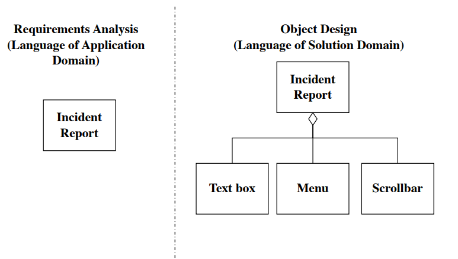

#### Design Pattern
- Necessità di riutilizzabili e flessibili design
- Descrive il problema che occore spesso nel tuo ambiente, e descrive il cuore della soluzione al problema, al fine di riutilizzarlo senza rifarlo

##### Composite Pattern
- Oggetti composti in una struttura ad albero per rappresentare la gerarchia
- Permette di trattare oggetti individuali e composizione di essi in modo uniforme

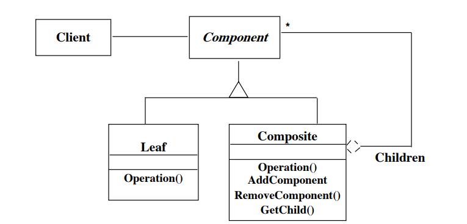

#### Modeling Software Development with Composite Patterns
- **Ciclo di vita del software**: Consiste in una serie di sviluppi di attvità che sono altre attvità o collezioni di task
    - **Composite**: Activity
    - **Leaf node**: Task
    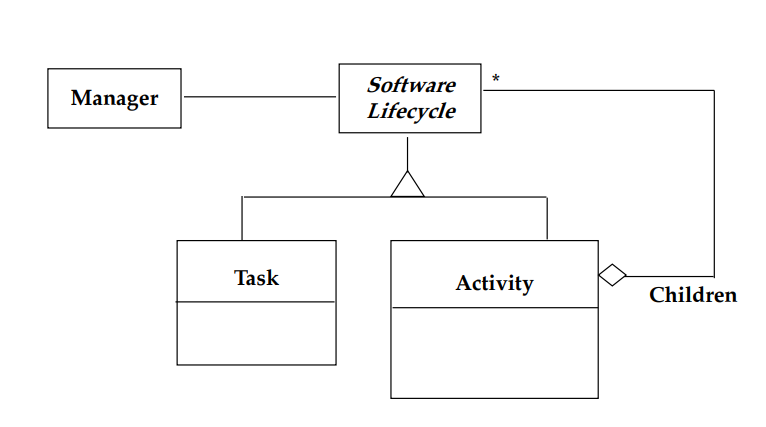

- **Sistema software**: Consiste in una serie di sottosistemi che sono altri sottosistemi o collezioni di classi
    - **Composite**: Sottosistemi
    - **Leaf node**: Classi
    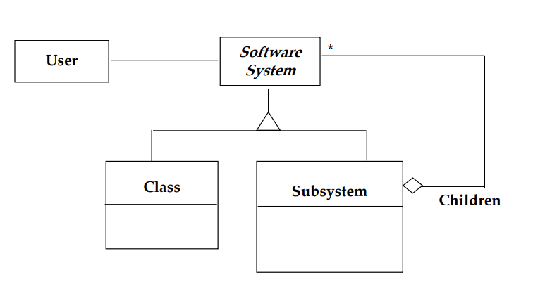

#### Ideal Structure of a Subsystem: Façade, Adapter, Bridge
- Un sottosistema consiste in:
    - Oggetto interfaccia
    - Una serie di oggetti del dominio dell'applicazione che modellano entità reali o esistenti nel sistema
        - Alcune sono interfacce per sistemi esterni
    - Uno o più control object

##### Facade Pattern
- Un interfaccia unica per una serie di oggetti del sottosistema
- Interfaccia di alto livello che rende il sottosistema facile da usare
- Fornisce unn architettura chiusa

- **Architettura Aperta**: Tutti i client possono il veicolo sottosistema e chiamare qualsiasi componente o operazioni della classe a piacimento
    - Efficiente
    - Non ci si può aspettare che il chiamante capisca come il sottosistema lavaro o le complesse relazioni del sottosistema
    - Codice non portabile
    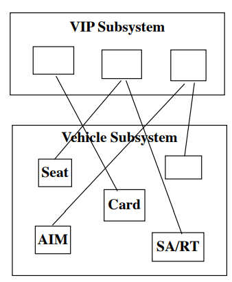

- **Architettura chiusa con Facade**
    - Sottosistema decide come accedere
    - Nessun uso improprio dai chiamanti
    - Può essere usato nella fase iniziale di integrazione del test
    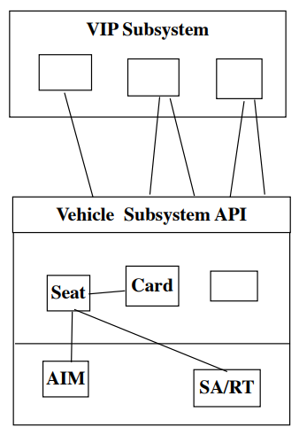

#### UML Notation for subsystems: Package
- **Package**: Collezioni di classi che sono raggruppate insieme
**Notazione**: Box con una tab, che indica il nome del pacchetto

#### Additional Definitions
##### Use of inheritance
- Due obiettivi
    - Descrivere Taxonomia
    - Specifica dell'interfaccia

- **Identificazione della taxonomia**: Identifica gli oggetti del dominio dell'applicazione che sono gerarchicamente collegati
    - Goal: Rendere analisi dei modelli più comprensibile

- **Service Specification**: Incrementa il riuso, migliora la modificabilità e il riuso

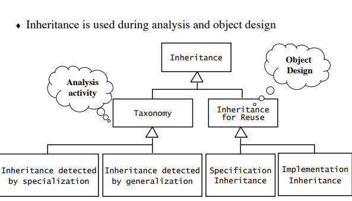

##### Reuse
- Riutilizzare le conoscenze di una precedente esperienza del problema corrente
- Riutilizzare funzionalità già disponibili

- **Composition**: Ottenuto dall'aggregazione
    - Un nuovo oggetto con nuove funzionalità ottenuto con aggregazioni di oggetti esistenti

- **Ereditarietà**: Nuove funzionalità ottenute con l'ereditarietà

- Tre modi per ottenere nuove funzionalità
    - **Implementazione di ereditarietà**: Anche chiamata ereditarietà
        - Goal: Estende una funzionalità di un applicazione usando le funzionalità della classe padre
        - Eredita da un classe esistente con alcune o tutte le operazioni implementate 
        - Possono mostrare comportamenti indesiderati
    - **Ereditarietà dell'interfaccia**: Anche chiamata subtyping
        - Eredita da una classe astratta le operazioni specificate, ma non implementate
    - **Delegazione**: Due oggeti sono coinvolti nella gestione di una richiesta
        - Un oggetto ricevente delegate le operazioni al suo delegato
        - Lo sviluppatore si assicura che l'oggetto ricevente non permetta al client di non utilizzare in modo improprio il client
        - Cattura un operazione e la manda ad un altro oggetto, a differenza della ereditarietà che estende una classe di base con una nuova operazione o con un overwriting di una operazione

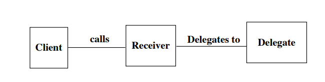

##### Comparison: Delegation vs Implementation Inheritance
- **Delegation**
    - **Pro**: Flessibilità, ogno oggetto può essere rimpiazzatp a runtime da un altro oggetto
    - **Contro**: Inefficienza, oggetti sono incapsulati

- **Ereditarietà**
    - **Pro**: Facile da usare
        - Supportato da molti linguaggi di programmazione
        - Facile da implementare nuove funzionalità
    - **Contro**: Espone la sottoclasse ai dettagli della classe padre
        - Ogni cambiamento nella implementazione della classe padre forza il cambiamento della sottoclasse

##### Design Heuristic
- Non usare mai implementazione di ereditarietà, ma sempre ereditarietà dell'interfaccia
- Una sottoclasse non deve mai nascondere operazioni implementate nella superclasse
- Molti design pattern usano una combinazione di ereditarietà e delegazione

#### Adapter Pattern
- Usato per fornire una nuova interfaccia a componenti che già esistono e che senza di esso non potrebbero comunicare a causa della loro incompatibilità
- Chiamato con wrapper
- **Class Adapter**: Usa ereditarietà multipla per adattare un interfaccia ad un altra
- **Object Adapter**: Usa ereditarietà singola e delegazione

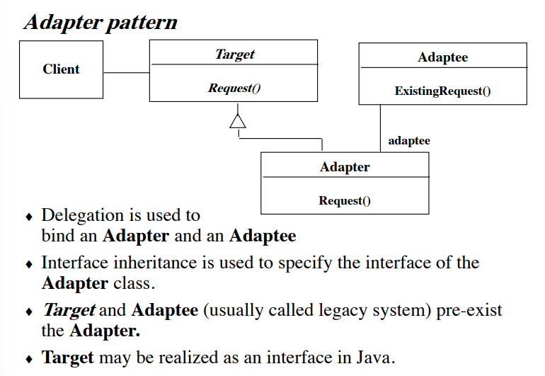

#### Bridge Pattern
- Usa un ponte per decomporre un'astrazione dalla sua implementazione in modo che le due possano variare in modo indipendente

- Chimato Handle/Body pattern

- Consente di decidere dinamicamente differenti implementazioni di un'interfaccia

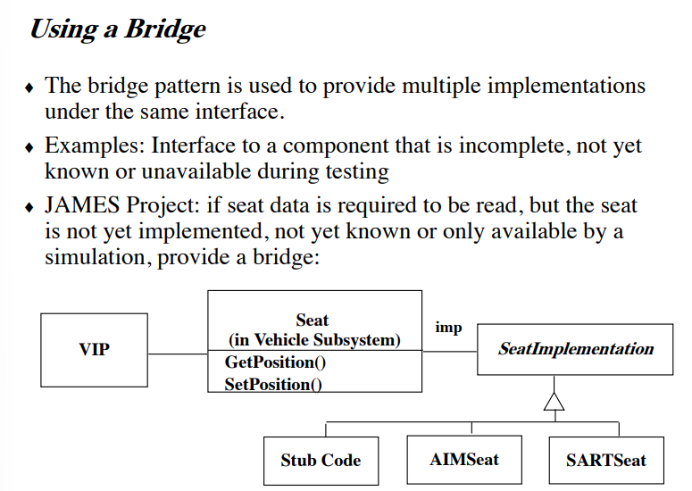

#### Adapter Vs Bridge
- **Somiglianze**: Usate per nascondere dettagli dell'implementazione sottostante
- **Differenze**
    - Il pattern adapter fa funzionare insieme componenti non correlate fra loro
        - Applicato a sistemi dopo che sono stati progettati

    - Il bridge pattern è usato all'inizio della progettazione per permettere varie indipendenti implementazioni e astrazioni
        - Green field engineering

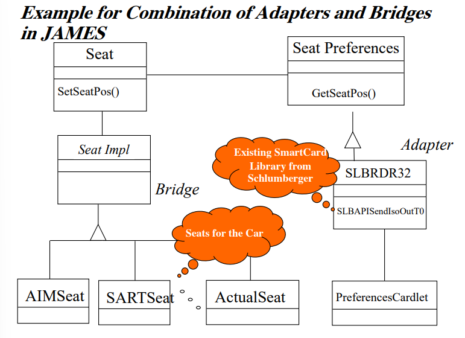

#### A Pattern Taxonomy

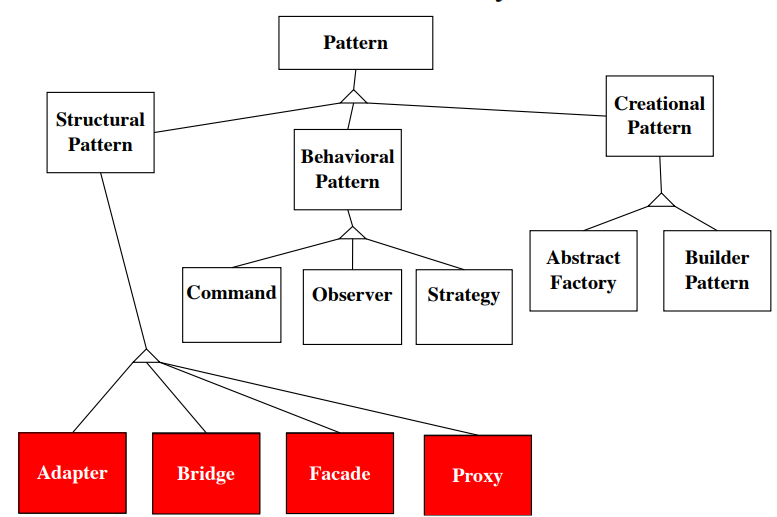

#### Proxy Pattern
- Costoso
    - Creazione di Object 
    - Inizializzazione Object 
- Obiettivo è ritadare la creazione e inizializzazione di un oggetto al momento in cui si ha bisogno di esso

- **Proxy Pattern**: Riduce il costo di accesso all'oggetto
    - Usa un altro oggetto detto proxy che funge da sostituto dell'oggetto reale
    - Crea l'oggetto reale sono se l'utente ne necessita
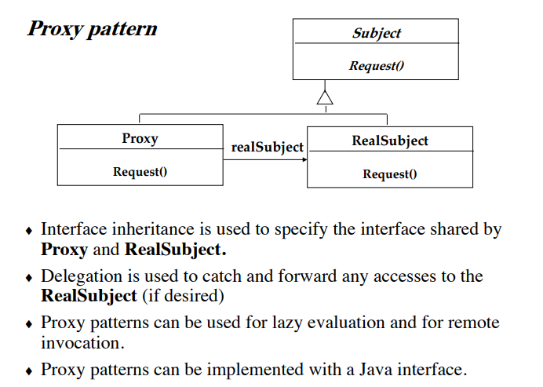

##### Proxy Applicability
- **Remote Proxy**: Rappresentazione di un oggetto locale in uno spazio di indirizzamento diverso
    - **Cattura dell'informazione**: Utile se l'informazione non cambia spesso

- **Virtual Proxy**: L'oggetto è troppo costoso da creare e scaricare
    - Il proxy è un sostituto

- **Protection Proxy**: Il proxy fornisce accesso controllato all'oggetto reale
    - Utile quando diversi oggetti devono avere accesso e visualizzazione diverse per lo stesso documento

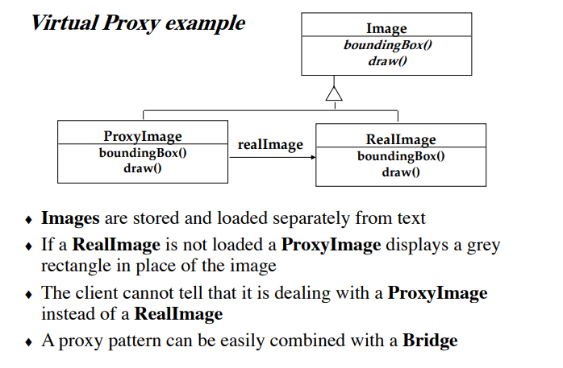

#### Command Pattern
- **Motivation**
    - Costruire unn interfaccia utente
    - Fornire un menu
    - Vuoi rendere l'interfaccia utente riutilizzabile fra diverse applicazioni
        - Non è possibile codificare in modo rigido i significati dei menu delle varie applicazioni
        - L'applicazione conosce solo cosa deve essere fatto quando un menu viene selezionato

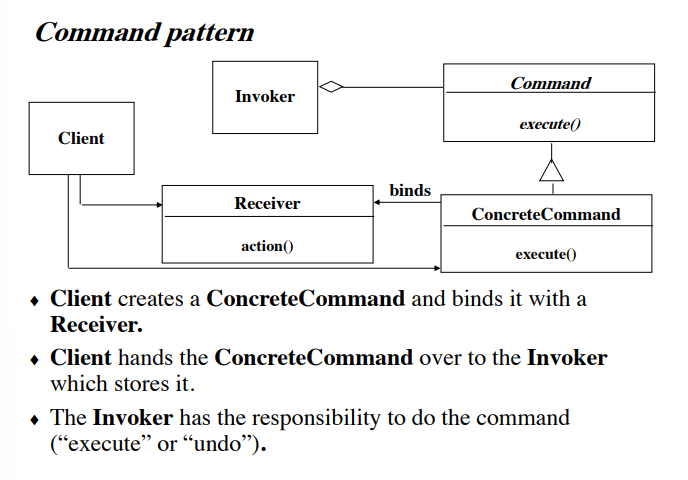

- **Applicability**: Incapsulare una richiesta come un oggetto
    - Parametrizzare il client con diverse richiesta
    - Code o log per le richieste
    - Supoorto di operazione annnullabili

    - **Usi**: Annullamento code
        - Buffering di transazione del database

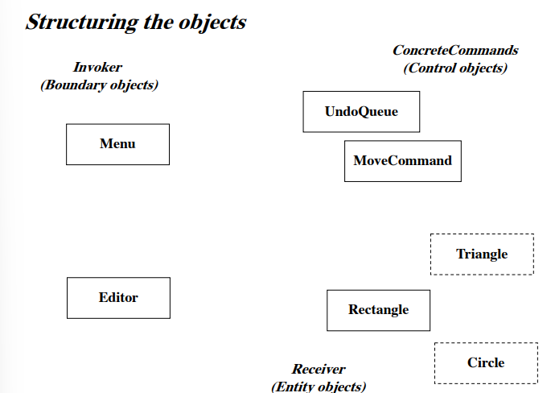

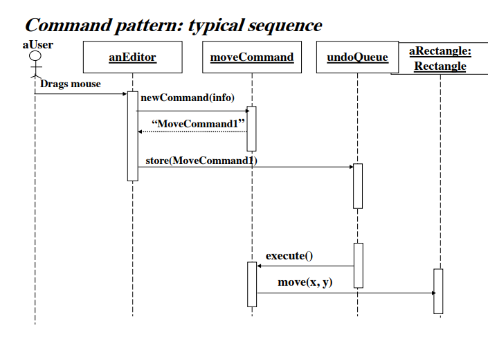

#### Observer Pattern
- Definisce una dipendenza una-a-molti fra oggetti in modo che quando un oggetto cambia stato, tutte le sue dipendenze sono notificate e aggiornate in automatico
- Publish and Subscribe

- **Usi**
    - Mantiene consistenza fra stati ridondanti
    - Ottimizza il cambiamento delle batch per mantenere consistenza

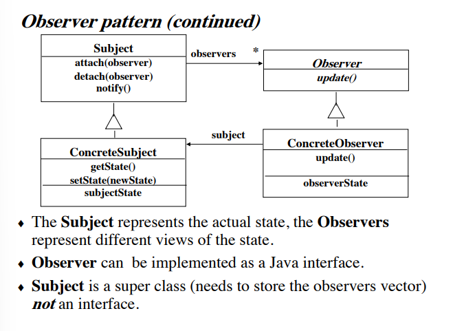
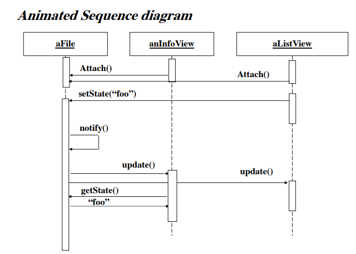

#### Strategy Pattern
- Molti algoritmi esistono per stessa task

- I differenti algoritmi saranno appropriati in tempo diversi

- Non vogliamo supportare tutti gli algoritmiin tempi diversi
    - Se necessitiamo di un nuovo algoritmo , lo vogliamo aggiungere facilmente senza disturbare l'applicazione

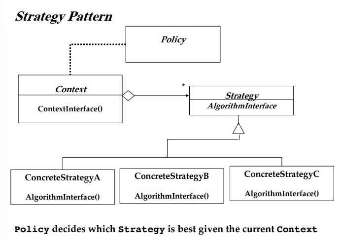
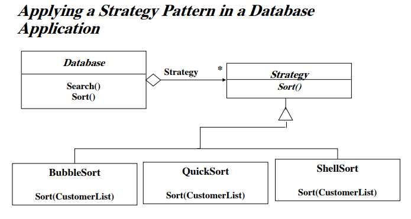

- **Applicabilità**: Molte classi collegate fra loro differiscono solo per un comportamento
    - Strategy permette di configurare una singola classe con molti comportamenti
- Sono necessarie diverse varianti di un algoritmo che bilanciano spazio e tempo
    - Tutte queste varianti possono essere implementate come una gerarchia di classi di algoritmi

#### Abstract Factory Motivation
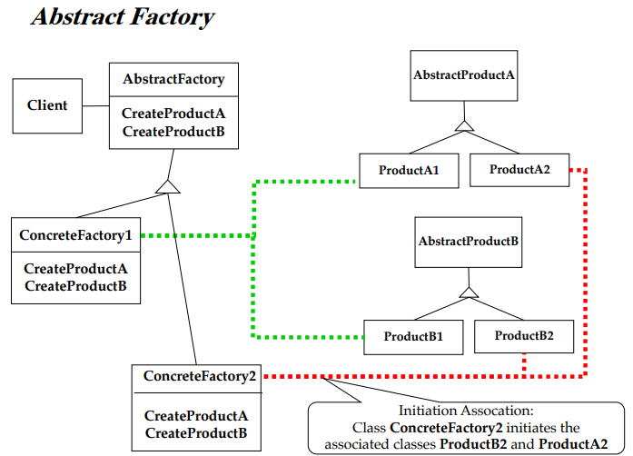

- **Applicabilità**
    - **Indipendenza fra inizializzazione o rappresentazione**:  Il sistema deve essere indipendente da come i suoi prodotti sono creati, composti o rappresentati

    - **Indipendenze del produttore**: Un sistema deve essere configurato con una delle multiple famiglie di produttori
        - Procurare una libreria di classe per un customer, ma non vuoi rivelare quale particolare produttore stai usando
    
    - **Vinvoli relativi ai prodotti**: Una famiglia di prodotti correlati è progettata per essere usata insieme e necessita di rinforzare i vincoli

    - **Affrontare il cambiamento imminente**: Puoi usare un particolare prodotto di una famiglia, ma devi aspettarti che la tecnologia sottostante cambia velocemente, e nuovi prodotti appariranno sul mercato

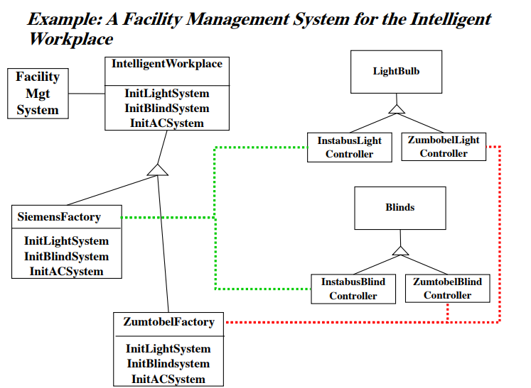

#### Builder Pattern Motivation
- Le compagnie di software fanno soldi introducendo nuovi formati, forzando l'utente a fare aggiornamenti
    - Utilizzo di un oggetto builder che si specializza nella conversione in qualsiasi formato noto e facilmente estendibile per gestire qualsiasi nuovo formato disponibile sul mercato

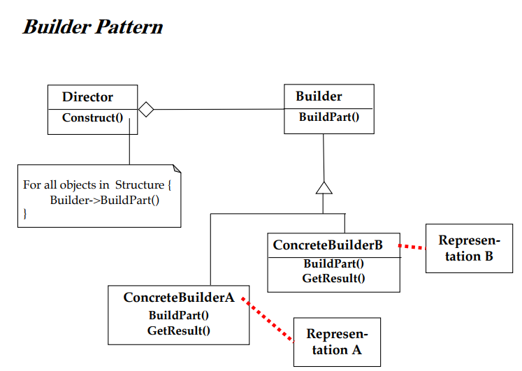

##### Quando usare un Builder Pattern
- La creazione di un prodotto complesso deve essere indipendente dalla particolare parte che compone il prodotto
    - In particolare il processo di creazione non deve essere conosciuto dal processo di assemblamento

- Il processo di creazione deve permettere differenti rappresentazioni per l'oggetto che si sta costruendo

#### Abstract Factory Vs Builder
- **Abstract Factory**: Si focalizza nei prodotti della famiglia
    - Il prodotto può essere semplice o complesso
    - Non nasconde il processo di creazione
        - Prodotto viene restituito immediatamente

- **Builder**: Il prodotto sottostante necessitano di essere costruiti come parte del sistema ma aumenta la complessità
    - La costruzione del prodotto complesso cambia di volta in volta
    - Il builder pattern nasconde il complesso processo di creazione dall'utente
        - Il prodotto è returned dopo la creazione come step finale

- Lavorano insieme per una famiglia di multipli prodotti complessi

### Specifying Interfaces
#### Developers play different Role
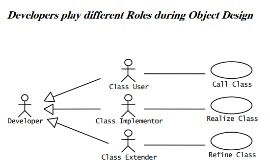

#### Class Implementor, Class Extender, and Class User
- **Class Implementor**: Responsabili della realizzazione della classe
    - Progetta la struttura dati interna
    - Definisce l'interfaccia delle operazioni e implementa il codice

- **Class User**: Invoca operazioni fornite dalla classe durante la realizzazione di un'altra classe
    - L'interfaccia specifica il confine della classe in termini di servizi che offre che fornisce

- **Class Extender**: Sviluppa specializzazione della classe
    - La specifica dell'interfaccia specifica il comportamento corrente della classe e i vincoli sui servizi forniti dalla classe specializzata

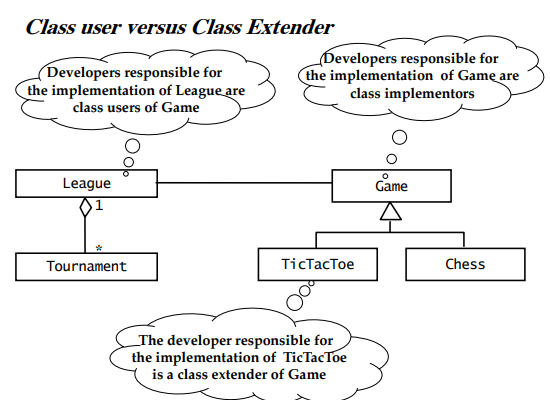

#### Specifying Interfaces
- Analisi dei requisiti delle activities
    - Identificare attributi e operazioni senza specificare il loro tipo o i loro parametri

- **Object Design: Tre attività**
    - **Aggiungi informazione di visibilità**
        - **Private (Classe implementatore)**
            - Inserisci - prima dei membri della classe
            - Un attributo privato può essere accessibile solo dalla classe nel quale è definito
            - Un operazione privata può essere invocato solo dalla classe ella quale è definita
            - Attributi e operazioni private non possono essere accessibili dalle sottoclassi o altre classi
        - **Protected (Classe extender)**
            - Inserisci # prima dei membri della classe
            - Un operazione o un attributo protetto possono essere accessibili dalla classe nel quale è definito o in uno dei discendenti della classe
        - **Public (Classe Utente)**
            - Inserisci + prima dei membri della classe
            - Un attributo o un operazione può essere accessibile da qualsiasi classe
        
        - **Information Hiding Heuristic**
            - Costruisci firewall attorno alle classi
            - Solo se qualcosa necessita di accedere alle informazioni, rendilo pubblico, spesso vuoi conoscere l'accesso
            - Meno operazioni conosce, meno sarà affetta da qualsiasi cambiamento
            - Meno operazioni conosce, più facilmente la classe può essere cambiata
            - Accedere ad un attributo privato è più lento
        
        - **Information Hiding Design Principles**
            - Solo le operazione della classe sono autorizzate a manipolare i suoi attributi
            - Nascondi oggetti esterni al confine del sottosistema
                - Definisce interfacce di classe astratte che mediano fra il sistema e il mondo esterno e anche fra i sottosistema
            - Non applicare un operazione al risultato di un'altra operazione
    - **Aggiungi informazioni sulla firma del tipo**
        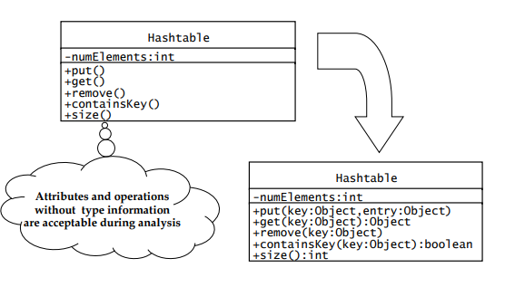

    - **Aggiungi contratti**
        - Contratti sulla classe abilita il caller e il callee a condividere le stesse ipotesi sulla classe
            - **Invariante**: Un predicato che è sempre vero per tutte le istanze della classe
                - Vincoli associato con classi o interfacce
                - Usati per specificare in maniera cosistente vincoli fra gli attributi della classe
            
            - **Precondizione**: Un predicato che deve essere vero prima dell'invocazione dell'operazione
                - Associate con specifiche operazioni
                - Usate per specificare vincoli che un chiamante deve soddisfare prima di chiamare un operazione
            
            - **PostCondizione**: Un predicato deve essere vero dopo che un operazione è invocata
                - Associata con specifiche operazione
                - Usate per specificare vincoli che l'oggetto deve assicurare dopo l'invocazione dell'operazione

##### Expressing Constraints In UML
- **OCL (Object Constrait Language)**
    - Permettono vincoli di essere formalmente specificati su un singolo elemento del modello o su un gruppo di elementi del model
    - Un vincolo espresso con un espressione OCL ritorna il valore vero o falso
        - OCL non è un linguaggio procedurale
    - Può essere mostrato come nota in UML attacata all'elemento UML attraverso una relazione di indipendenza

##### Ereditarietà di contratti
- Un utente della classe si aspetta che un contratto che vale per la superclasse sia valido anche per la sottoclasse

- I contratti possono essere ereditati
    - **Precondizioni**: Un metodo della sottoclasse è autorizzato a indebolire la precondizione del metodo se si effettua l'ovveride
    - **Postcondizione**: Metodo nella sottoclasse devono assicurare la stessa postcondizione come nella superclasse
    - **Invariante**: Una sottoclasse deve rispettare tutte le invarianti della sua superclasse
        - Una sottoclasse può rafforzare l'eredirarietà delle ivarianti

##### JavaDoc
- Aggiunge la documentazione al codice sorgente
- Un commento doc consiste in una serie di caratteri fra /** e /*

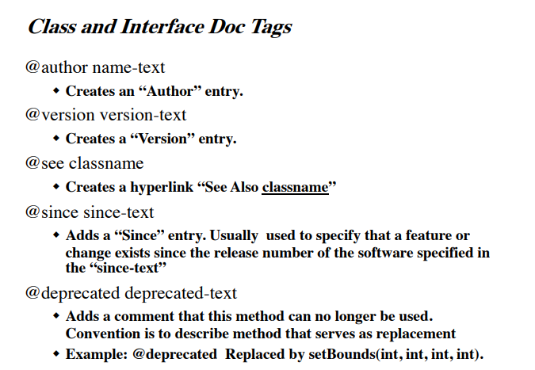

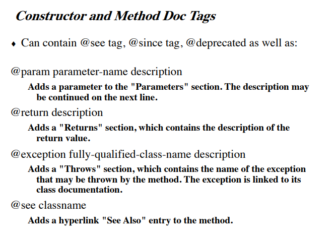

#### Package it all up
- Impacchetta il design in una unità fisica che può essere modificata, compilata, linkata e riutilizzata
- **Costruire Moduli Fisici**: Idealmente usa un pacchetto per ogni sottosistema
    - La decomposizione del sottosistema potrebbe non essere adatta all'implementazione

- **Minimize Coupling**: Le classi nelle relazioni cliente-fornitore sono tipicamente debolmente accoppiate
    - Un grande numero di parametri in un metodo indica forte accoppiamento
    - Evita dati globali
- **Maximize Cohesiveness**: Classi strattamente connesse da un associazione stanno nello stesso pacchetto

#### Package Heuristic
- Ogni servizio del sottosistema è reso disponibile da uno o più oggetti interfaccia all'interno del pacchetto
- Inizia con un oggetto interfaccia per ogni servizio del sottosistema
    - Limita il numero di operazioni dell'interfaccia a 7+/-2
- **Interface Object**: Usato durante l'analisi dei requisiti, system design e object design
    - Denota un servizio come una API

- **Java Interface**: Usato durante l'implementazione in Java

### Object Constraint Language (OCL)
- **OCL (Object Constraint Language)**: Permette ai vincoli di essere formalmente specificati su un singolo elemento del model o su un gruppo di elementi del modello
    - Non è un linguaggio procedurale

- **OCL and UML**: Linguaggio che permette di esprimere vincoli su un modello UML
    - Ritorna un valore vero o false
    - Può essere rappresentato come una nota allegata ai modelli UML vincolato da una relazione di dipendenza

- **Contratti**: I vincoli sulla classe che consentono agli utenti della classe, implementatori e extender di condividere le stesse assunzioni sulla classe
    - Invariante
    - Precondizione
    - Postcondizione

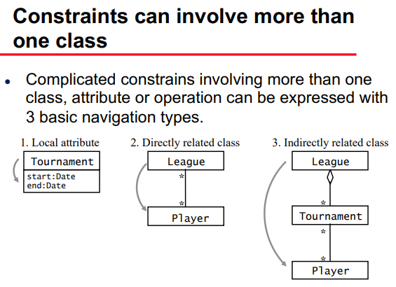

#### UML Istance Diagram
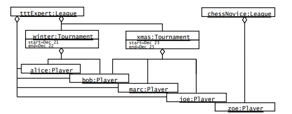

#### Model Constraints
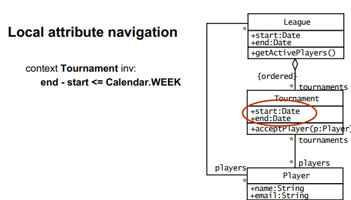
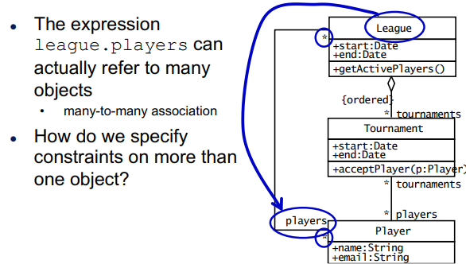
.png)
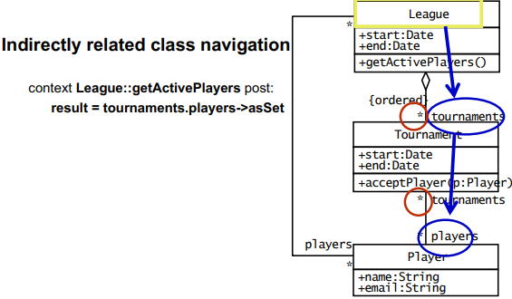
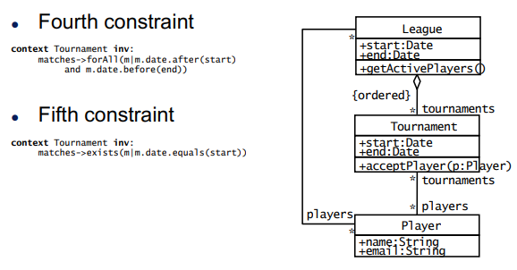

#### OCL Collections: Definition
- **OCL Set**: Usato durante la navigazione di una singola associazione
- **OCL Sequences**: Usato durante la navigazione di una singola ordinata associazione
- **OCL Bags**: Può contenere lo stesso oggetto multiple volte
    - Multiset
    - Usato per accumulare oggetti quando accedi ad associazioni indirette

- **OCL Operations**
    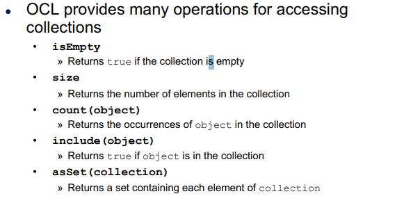
    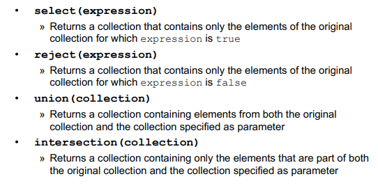

- **OCL Qualifier**
- Operazioni che permettono di iterare sulle collection e testare le espressioni di ogni elemento
    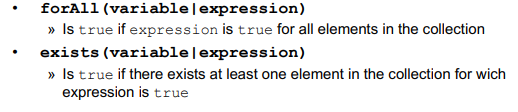

### Mapping Models to Code

#### Attività dell'Object Design
- **Selezione delle componenti e riutilizzo**: Identificare componenti standard, oggetti di soluzione aggiuntivi, e design pattern
- **Service Specificazione**: Descrive precisamente ogni interfaccia della classe
- **Mapping Models to Code**: Trasforma il modello di progettazione degli oggetti in base ai criteri di prestazione, migliora la comprensibilità e lo mappa al codice sorgente e agli schemi di archiviazione

#### Transformation and Mapping Activities
##### Ottimizzazione
- Questa attività affronta i requisiti della prestazioni del modello di sistema

- **Ottimizzazione del design**
    - **Ottimizzazione dei percorsi di accesso**
        - Aggiunta di associazioni ridondanti al fine di ridurre il costo di accesso delle associazioni trasversali ripetute
        - Ridurre le associazioni "many" ad associazioni "one" usando associazioni qualified
        - Eliminare percorsi morti il prima possibile
        - Controllare se l'ordine di esecuzione del ciclo deve essere invertito
        - Muovi gli attributi invocati solo con metodi getter e setter nella classe chiamante
    - **Collassare oggetti: Trasformare oggetti in attributo**
        - Implementare Entity come attributi embedded
        - Oppure implementare Entity come classi separate con associazioni con altre classi
        - Collassare oggetti nel modello potrebbe essere intervallato da operazioni di refactoring sul codice
    - **Memorizza gli attributi derivati per salvare tempo di compilazione**
        - Gli attributi derivati devono essere modificati quando il valore di base cambia
            - **Explicit Code**: Implementatori determinano gli attributi derivati interessati
            - **Periodic Computation**: Ricompilazione degli attributi derivati occasionalmente
            - **Active Value**: Un attributo può designare un insieme di valori dipendenti che vengono aggiornati automaticamente quando il valore attivo viene modificato
    - **Ritardare le computazioni costose**
    - Bilanciare fra efficienze e chiarezza
##### Realizing Associations
- Associazioni mappate ai costrutti del codice sorgente, come riferimenti o collezioni di riferimenti
- Associazioni uniformi e decisioni individuali per ogni associazione
    - 1-to-1
        - Nome dei ruoli trattati come attributi e tradotti in riferimenti
        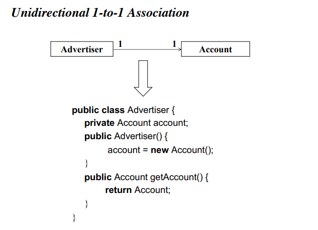
        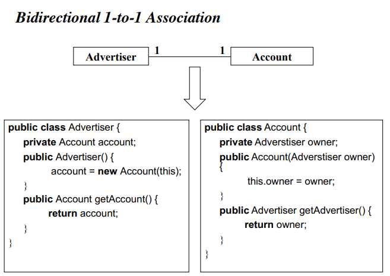
    - 1-to-many
        - Tradotti in set
        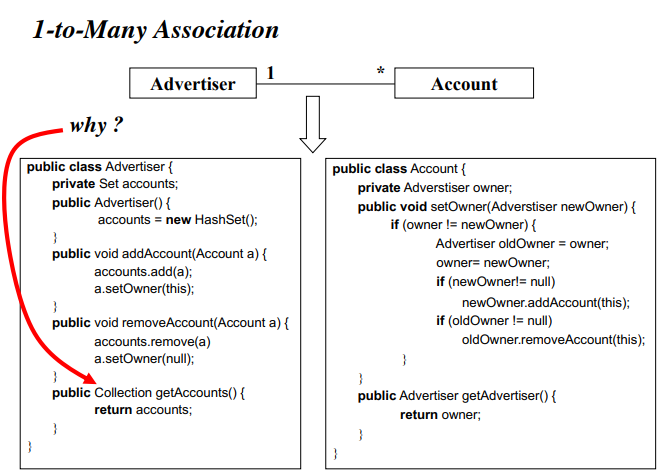
        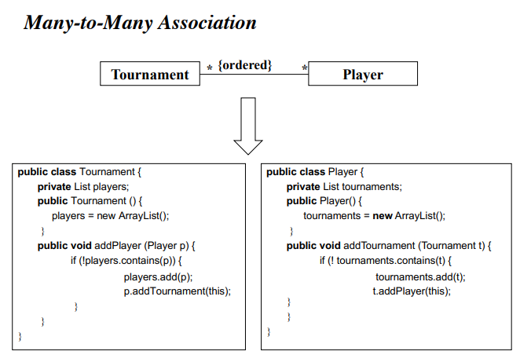
    - Qualified
        - Tradotti in Hash Map
        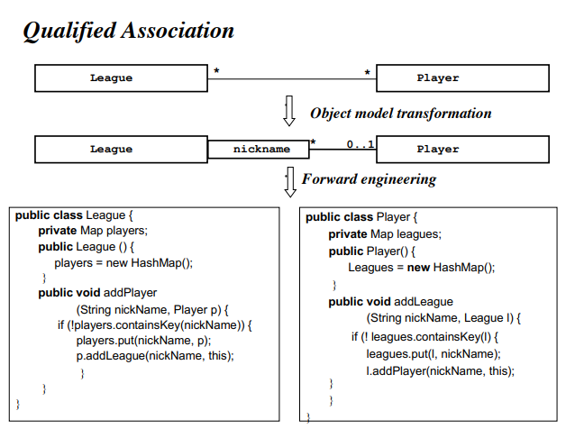

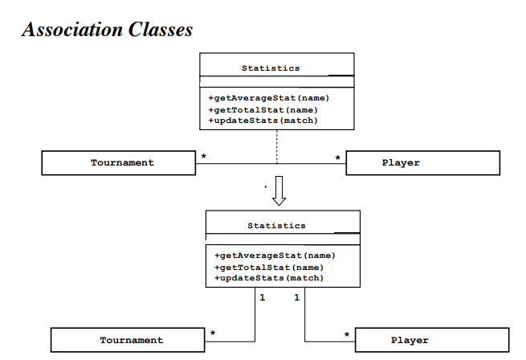
##### Mapping Contracts to Exceptions
- Descriviamo il comportamento delle operazioni quando i contratti non sono funzionanti
- Lancio di eccezione se il linguaggio ne è fornito
- **Implementazione di un contratto**
    - Controllare la precondizione con un test prima di iniziare il metodo e lancio eccezione se precondizione è violata
    - Controllare la postcondizione alla fine del metodo e lancio di eccezzione se il contratto è violato
    - Controllare l'invariante durante il controllo della postcondizione
    - Gestire l'ereditarietà incapsulando il controllo del codice per precondizione e postcondizione in metodo separati che possono essere chiamati dalle sottoclassi
    - Questo approccio non è del tutto realistico per un numero di ragioni

- **Heuristic**
    - Omettere il controllo del codice per postcondizione e invarianti
        - Possibile controllo atraverso il testing, e non identifica molti bug a meno che non sia stato scritto da un altro sviluppatore
    
    - Focalizzarsi sulle interfacce del sottosistema e omissioni del controllo di metodi privati e protette

    - Focalizzarsi sui contratti delle componenti con il più lungo ciclo di vita degli oggetti entità
    - Riutilizzo di vincoli per il controllo del codice
        - Incampsulamento in metodi che possono essere invocati facilmente e condividono le stesse classi delle eccezioni

##### Mapping Class Models to a Storage Schema
- Durante il sistem design selezioniamo le strategie di archiviazione
    - Ora mappiamo gli object model allo schema di archiviazione
- I linguaggi Object-Oriented non fornisco di solito un metodo efficiente di archiviazione degli oggetti persistenti
    - Mappare questi oggetti in una struttura dati
- **Relational Databases**: Basati sull'algebra relazionale
    - Dati rappresentati in una tabella bidimensionale con un numero specificato di colonne e non specificato numero di righe
        - **Chiave Primaria**: Combinazione di attributi che identificano univocamente una riga di una tabella
        - **Chiave Esterna**: Riferimento ad una chiave primaria in un'altra tabella
        - **Integrità Referenziale**: Riferimenti alle entry delle altre tabelle esiste realmente

- Gli Object Model può essere mappato in database relazione
    - Ogni classe è mappata in una tabella
    - Ogni attributo è mappata in una colonna della tabella
    - Associazione uno-a-molti implementata come una chiave esterna nascosta
    - Associazione molti-a-molti è mappato nella sua tabella
    - Metodi non sono mappati

    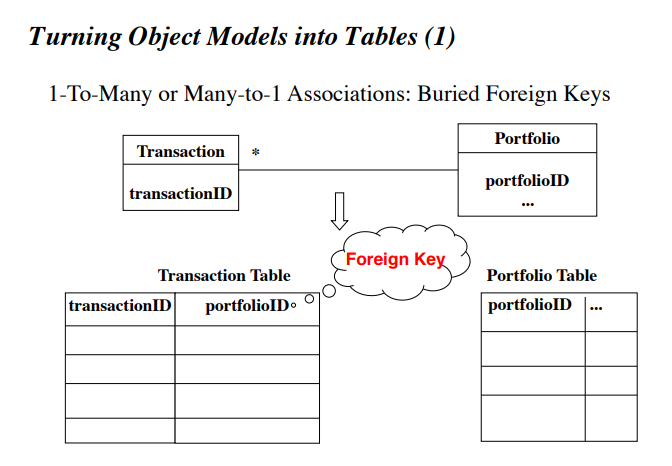
    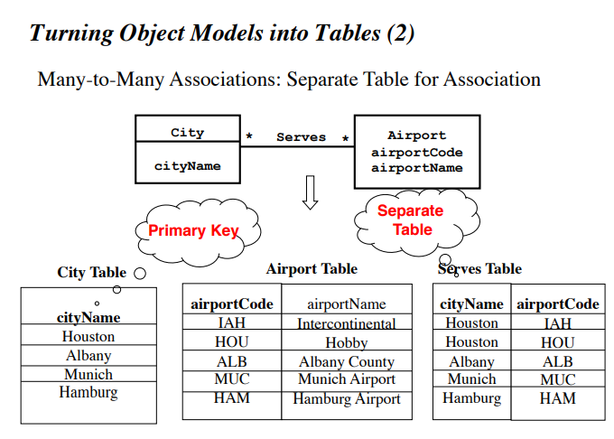
    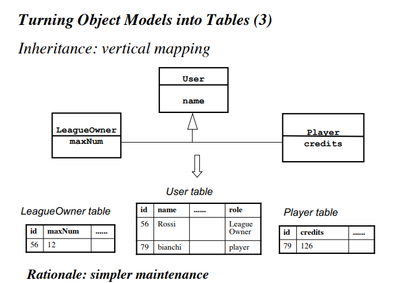
    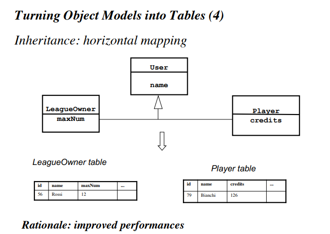

- **Gestire Implementazione**: Necessità di documentare le trasformazioni per mantenere la coerenza tra i modelli di oggetti e il codice sorgente e per mantenere aggiornati
- **Responsabilità**: L'architetto principale prende decisioni di design e selezione delle trasformazioni da applicare
    - L'architettura del liason è responsabile per la documentazione dei contratti di associati alle interfacce del sottosistema e notificare i cambiamenti alla classe utente
    - Lo sviluppatore è responsabile di seguire le decisione dell'architetto principale, applicare le trasformazioni, mappare object model a un codice sorgente e mantenendo aggiornati i commenti del codice sorgente tutti i documenti interessati
#### Object Model Transformations
- Trasformazioni sono applicate ad un model object per ottenere un altro model object
    - **Goal**: Semplificare, ottimizzare, rendere il modello più conforme alle specifiche
    - Ristrutturare la gerarchia delle classe per aumentare l'ereditarietà
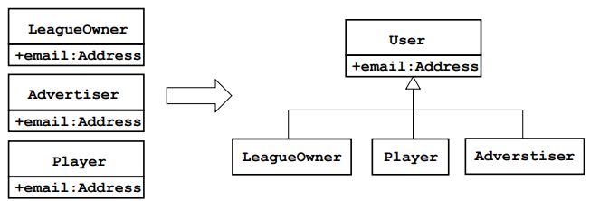

#### Incrementa l'Ereditarietà
- Comportamenti astratti comuni da gruppi di classi
    - Se una serie di operazioni o attributi sono ripetuti in 2 classi, le classi possono essere istanze di una classe generale

#### Building a Super Class from Several Classes
- Tutte le operazioni devono avere la stessa firma, ma spesso la firma non corrisponde
    - Alcune operazioni hanno meno argomenti dell'altre
    - Attributi simili nelle classi hanno diversi nomi
        - Rinomina attributi e cambiamenti di tutte le operazioni
    - Operazioni definite in una classe ma non in altre
        - Usa funzioni virtuali ed overriding delle funzioni della classe

- Astrai il comportamento comune e crea una superclasse da esso
- Le superclassi sono desiderabili
    - Incrementa la modularità, estensibilità e riutilizzabilità
    - Incrementa la gestione della configurazione

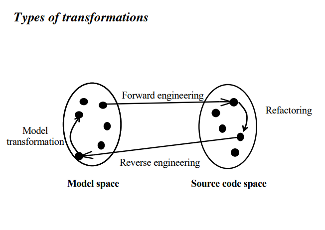

#### Refactoring Vs Model Transformations
- Una trasformazione di un object model può essere mappato in una serie di step di refactoring
    - **Pull-up Campo**: Muove gli attributi da una sottoclasse alla classe padre
    - **Pull-up Corpo del Costruttore**: Muove il codice di inizializzazione dalla sottoclasse alla superclasse
    - **Pull-up Metodo**: Muove i metodi che manipolano gli attributi dalla sottoclasse alla superclasse
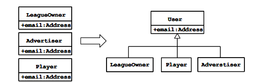

#### Transformation Principles
- Ogni trasformazione deve affrontare un singolo criterio o un obiettivo di design
- Ogni trasformazione deve essere locale
    - Cambiamento di pochi metodi o classi alla volta
- Ogni trasformazione deve essere applicata in modo isolato dagli altri cambiamenti
    - Facilita i test e riduce la possibilità di introduzione di errori
- Ogni trasformazione deve essere seguita da un passo di validazione
    - Convalidare la trasformazione in base agli altri documenti di specifica di design, con annessa modifica dei documenti nei quali il cambiamento impatta

### Modellare Applicazione Web Tramite UML
- Pagina server contiene metodi e variabili relativi allo scripting server-side
- Pagina client contiene elementi relativi alla formattazione, allo scripting client side

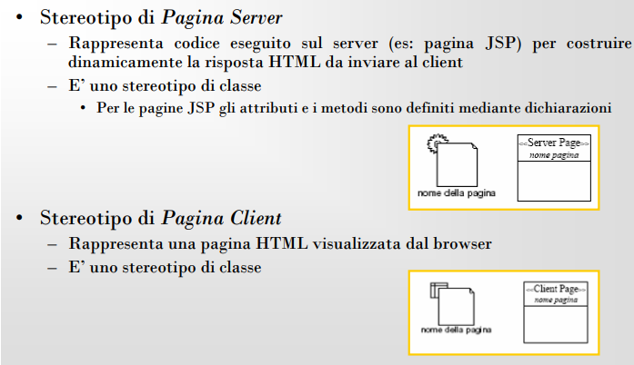
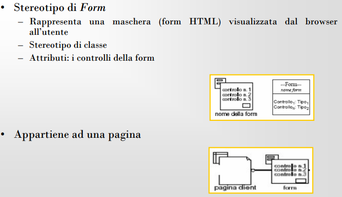

#### Stereotipo di Associazione
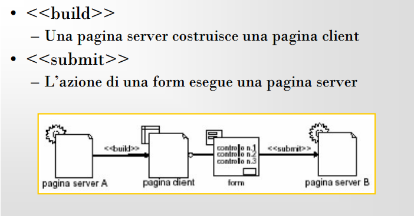
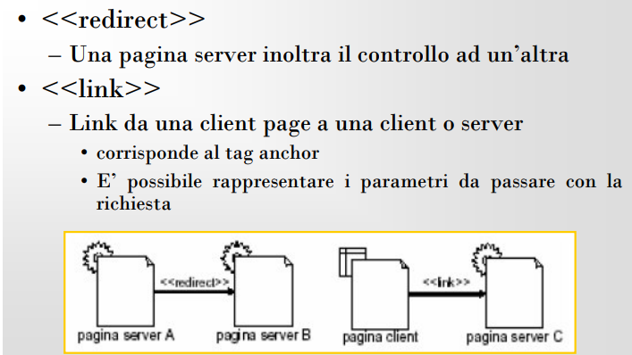

#### Streotipo lato client attraverso script
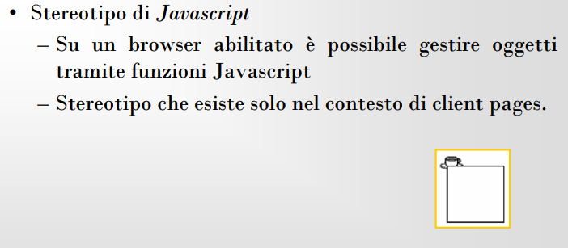

#### Diagramma delle Pagine
- Diagramma delle classi che descrive la relazione fra codice sul server e schermi prodotti sul client

#### Altri stereotipi
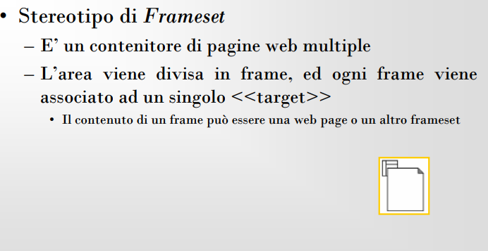
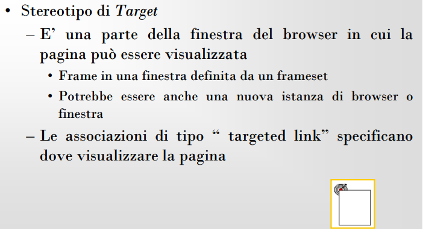

## Testing
### Testing Introduction
#### Terminologia
- **Affidabilità**: Misura il successo con il quale il comportamento osservato del sistema conferma alcune specifiche del suo comportamento
- **Fallimento**: Qualsiasi deviazione del comportamento osservato rispetto al comportamento specificato
- **Stato Errato**: Il sistema è in uno stato che con i processi futuri porterà ad un fallimento
- **Fault (Bugs)**: La causa meccanica o algortimica che causa uno stato errato

#### How to Deal with Error
- **Prevenzione dell'Errore**: Prima del rilascio del sistema
    - Uso di metodologie di programmazione per ridurre la complessità
    - Uso di una versione di controllo per prevenire inconsistenze nel sistema
    - Applica verifica per prevenire bug legati all'algoritmo
- **Rilevamento degli Errori**: Mentre il sistema è in esecuzione
    - **Testing**: Crea fallimenti in maniera pianificata
    - **Debugging**: Inizia con un fallimento non pianificato
    - **Monitoring**: Invia informazioni riguardo lo stato
        - Trova bug legati alla performance
- **Recupero dagli Errori**: Recupero da un fallimento una volta che il sistema è rilasciato
    - Sistemi database
    - Ridondanza modulare
    - Recupero da blocchi

#### Basic Testing Definitions
- **Errori**: Le persone commettono errori
- **Fault**: Risultato diun errore nella documentazione software, codice, ecc...
- **Fallimento**: Un fallimento avviene quando si esegue un fault
- **Incidente**: Conseguenza di un fallimento
    - Possono apparire e non all'utente
- **Testing**: Esercitare il software attraverso dei test case per trovare fallimenti o ottenere confidenza nel sistema
- **Test Case**: Insieme di dati di input e risultati attesi (Oracolo) che permettono di esercitare una componente conlo scopo di causare fallimenti
- **Test Suit**: Un insieme di test case

##### Test Stubs and Drivers
- **Component**: Una parte del sistema che può essere isolata e testata
- **Test Sub**: Implementazione parziale di un componente sul quale i componenti testati dipendono
- **Test Driver**: Implementazione parziale di un componente che dipende da una componente testata
- Test Stub e Driver possono essere interattivi o automatici
    - Permettono di ridurre il tempo di esecuzione del test
    - Richiedono grandi risorse

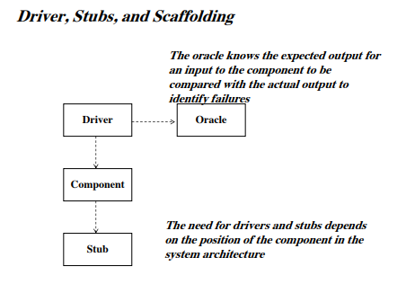

##### Correzione e Test di Regressione
- Una correzione è un cambiamento il cui scopo è risolvere il fault
    - Può introdurre nuovi fault
- Test di regressione necessita dirieseguire tutti test dopo il cambiamento
    - Necessita di mantenere i test case

- Impossibilità di testare ogni modulo o sistema sia dal punto di vista teorico (Problema di Arresto) che pratico (Proibitivo in termini di tempo e costo)
- Un test ha successo se porta ad un fallimento

- **Test Efficace**
    - Dettagli sul sistema sottostante
    - Conoscenza delle tecniche di testing
    - Test indipendenti sono meglio

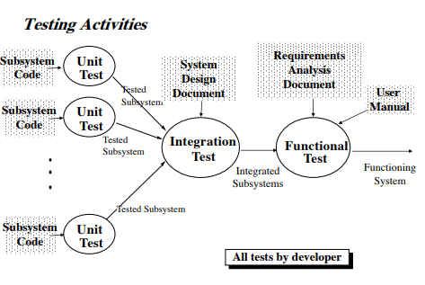
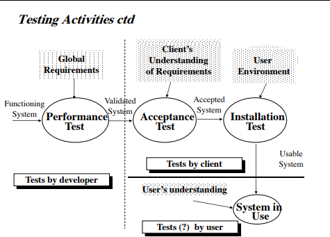
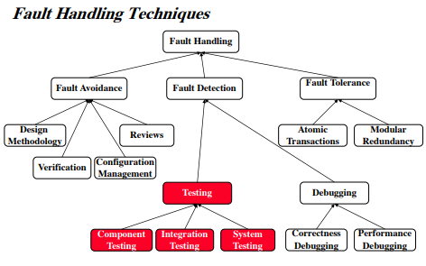
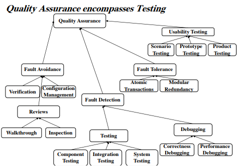

#### Component Testing
- **Test Unitari**
    - Sottosistemi individuali
    - Eseguito dagli sviluppatori
    - **Goal**: Confermare che il sottosistema è correttamente codificato e svolge la funzionalità prevista
- **Test d'Integrazione**
    - Gruppi di sottosistemi ed eventualmente l'intero sistema
    - Eseguito dagli sviluppatori
    - **Goal**: Testare l'interfaccia fra i sottosistemi

#### System Testing
- **Goal**: Determinare se i sistema soddisfa i requisiti
- **Test di Accettazione**: Valuta il sistema prodotto dagli sviluppatori
    - Eseguito dal cliente
    - **Goal**: Dimostrare che il sistema soddisfa i requisiti del cliente ed è pronto all'uso

#### Documenting testing: Planning
- **Test Plan**: Si focalizza sull'aspetto managerialedeltesting
    - Documenta lo scope, l'approccio, le risorse, e schedula le attività di testing
- **Test Case Specification**: Documenta ogni test
    - Questo documento contiene input, drivers, stubs, e output aspettato dai teste tutte le task performate
#### Documenting testing: Execution Documents
- **Test Execution Report**: Documenta ogni esecuzione
    - **Test Item Transmittal Report**: Documento di accompagnamento che contiene informazioni per identificare gli item del software
    - **Test Log**: I risultati del test
    - **Test Incident Report**: Descrive tutti gli incidenti scoperti durante il test che devono essere approfonditi
    - **Test Summary Report**: Un sommario di tutte le attività di testing, con una lista di attività risolte e da risolvere

### Test Selection Techniques
#### Tecniche di Verifica
- **Informali**: Codice incrementale
- **Analisi Statica**
    - **Hand execution**: Lettura del codice sorgente
    - **Walk-Through**: Presentazione informale
    - **Code Inspection**: Presentazione formale
    - Tool automatici per controllo di errori sintattici o semantici o deviazioneìi dagli standard di codifica
- **Dynamic Analysis**
    - **Black-box (Funzionale)**: Selezione del test basato sulla specifica
    - **White-box (Strutturale)**: Selezione del test basato sulla struttura logica interna del programma

#### Black-box Testing
- Partizionamento dello spazio di input in classe
- **Goal**: Riduce il numero dei test case attraverso partizionamento equivalente
    - Scleta dei test case per ogni classe diequivalenza
- Testa ogni classe e i confini fra le classi
    - Spesso i fallimenti si trovano ai confini
- **Selezione di classi di equivalenza**
    - Input valido per un intervallo di valori
    - Selezione i test case da 3 classi di equivalenza
        - Sotto il range
        - Interno al range
        - Sopra il range
    - Input valido se è un insieme discreto
    - Seleziona i test case in base a se il valore discreto è valido oppure no

#### Equivalence Class Testing
- **Motivation**: Testing completo e evitare ridondanza
- **Classi di equivalenza**: Partizionamento dell'input
- Intero input coperto
- **Disjoint classes**: Evitare la ridondanza
- **Test case**: Un elemento di ogni classe di equivalenza

#### Weak/Strong Equ. Class Testing
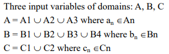

- **Weak Equivalence Class Testing**: Scegli un valore di una variabile per ogni classe di equivalenza
- **Strong Equivalence Class Testing**: Basato sul prodotto cartesiano AxBxC
    - Sottoinsieme di input disgiunto

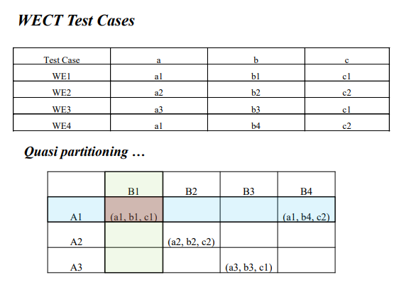
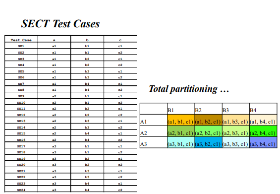

#### Discussione
- Se la condizione di errore è ad alta priorità, bisogna estendere il testing forte delle classi di equivalenza per includere le classi non valide
- ECT appropriato per dati di input definiti in termini di range e insiemi di valori discreti
- SECT fa l'assunzione che le variabili siano indipendenti, generando errore altrimenti

#### Boundary value testing
- Partizionamento dell'input in sottoclassi adeguate, assumendo che il comportamento del programma sia simile
- Maggior parte dei problemi si verificano ai confini

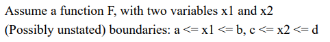

- L'errore tende a verificarsi agli estremi, quindi bisogna focaizzarsi sui confini dello spazio di input per identificare i casi di test
    - Il valore delle varibili deve essere al minimo, poco sopra il minimo, un valore nominale, poco sotto il massimo e al massimo
        - min, min+, nom, max-, max
        - Mantenere i valori di tutte le variabili tranne una ai loro valori nominali, lasciando che una variabile assuma il suo valore estremo

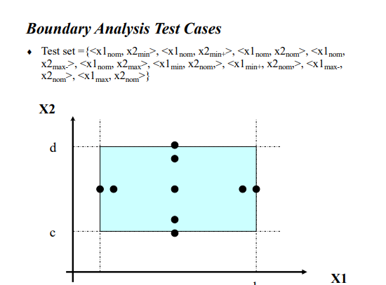

- **Casi generali e limitazioni**
    - Una funzione con n variabili richiede 4n + 1casi di test
    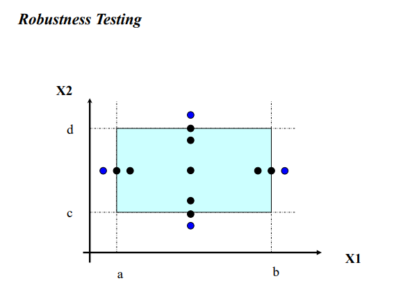

- **Worst Case Testing (WCT)**: I valori di confine fanno l'assunzione comune che i fallimenti derivino dai fault
    - Maggiore è l'analisi dei valori di confine, maggiori sono i costi
        - 5n

    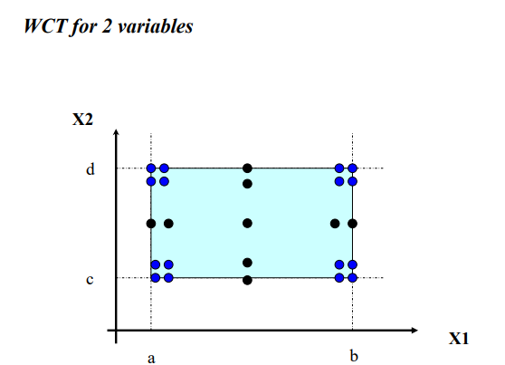
    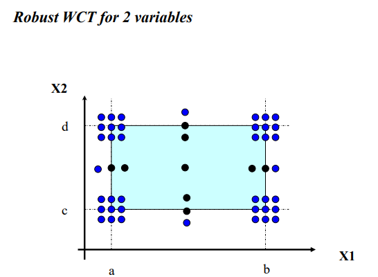

#### Category Partition: Steps
- Il sistema è diviso in funzioni individuali che possono essere testate in maniera indipendente
- Il metodo identifica il parametro per ogni funzione, e per ogni parametro identifica distinte categorie
- **Categorie**: Sono suddivise in scelte 
- Identificazione dei vincolifra le scelte
- Vengono generati frame di test costituiti dalle combinazioni consentite di scelte nelle categorie
- I test frame sono convertiti in test data

#### Constraints
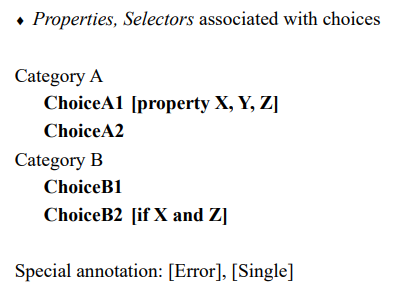

#### Test specification: categories and choices for the parameters
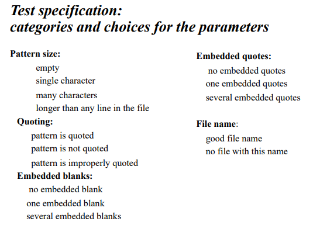
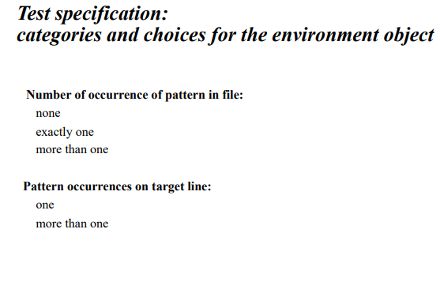

#### Property and selector expression
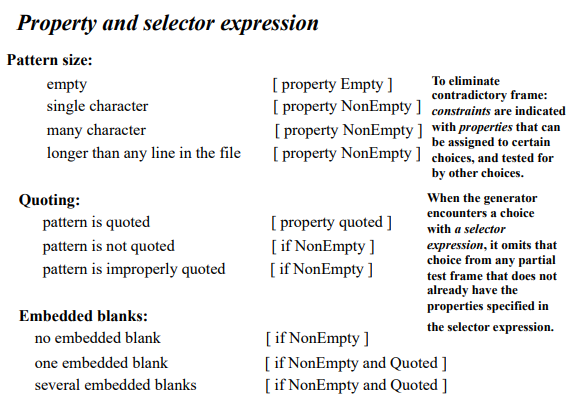

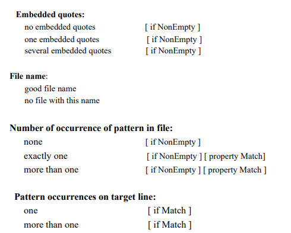

#### How many test frames after constraints?
- Il testo |Error| si occupano di testare una particolare feature la quale causa un'eccezione o uno stato di errore
- Una scelta marcata con |Error| non è combinato con le scelte nelle altre categorie per creare test frame

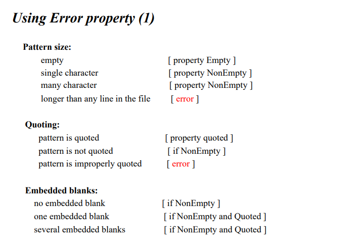
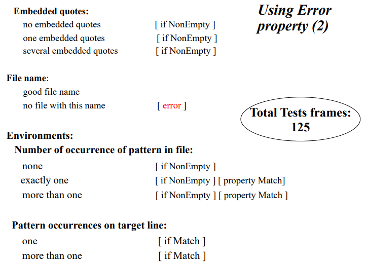

- Annotazione |single| descrive speciali, inusuali, o ridondanti condizioni che nondevono essere combinati con tutte le possibili scelte 
- Una scelta marcata con |single| non è combinato con le scelte nelle altre categorie per creare test frame

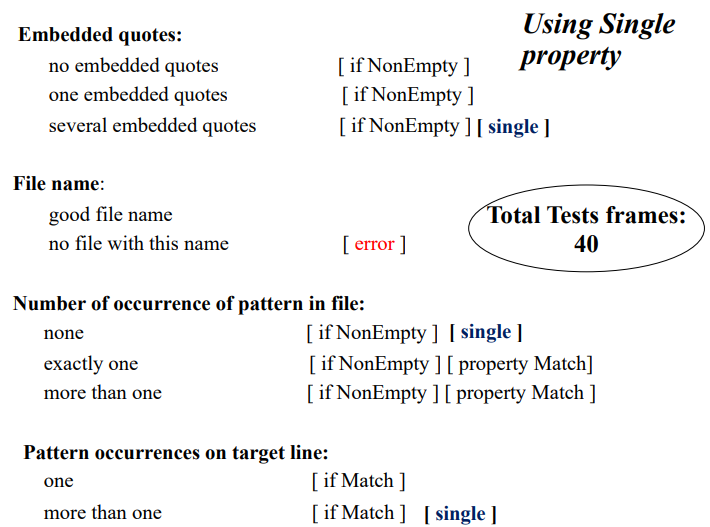

#### Category Partition
- Rende esplicite ledecisioni di test aperte alle recensioni

#### Parameters and environment objects
- **Parametri**: Pattern e filename
- **Oggetti di ambienti**: Il contestodel file filename
#### Systematic vs Random Testing
- **Random**: Distribuzione uniforme dello spazio di input
    - Tutti gli input hanno uguale importanza
- **Systematic**: Selezione degli input più importanti
    - Spazio di input partizionato in classi
    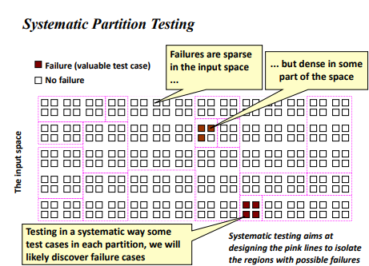

#### The Partition Principle
- Il test partizionato separa lo spazio di input in classi, ma causa overlap
- Nel caso desiderato ogni fault porta ad un fallimento che sono facili da trovare nella classi di input
    - Il campionamento di ogni classe nella quasi-partizione seleziona almeno un input che porta a un errore, rivelando l'errore
    - Raramente garantito dato che dipendiamo da esperienze basate sull'euristica
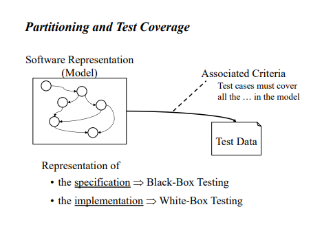

#### White-box Testing:  
- **Focus**: Accuratezza e copertura
- 4 Tipi di White-box Testing
    - **Statement Testing**: Testa singoli statements
    - **Loop Testing**: Permette che il ciclo venga skippato completamente, eseguito esattamente una volta ed eseguito più di una
    - **Path Testing**: Si assicura che ogni percorso del programma sia eseguito
    - **Branch Testing**: Si assicura che ogni possibile risulato di una condizione sia testato almeno una volta
- Non scalabile

#### Comparison of White & Black-box Testing
##### White-box Testing
- Potenzialmente un numero infinito di percorsi da testare
- Testa cosa è fatto e non cosa dovrebbe fare
- Non può trovare casi d'uso mancanti

##### Black-box Testing
- Potenziale combinatorio esplosivo dei test case
- Spesso non chiaro quando un test case selezionato copre un particolare errore
- Non scopre strani casi d'uso

##### White & Black-box Testing
- Entrambi necessari
- La scelta del caso di test si colloca nel mezzo
    - Numeri di possibili percorsi logici
    - Natura dei dati di input
    - Ammontare di computazioni
    - Complessità dell'algoritmo e della struttura dati

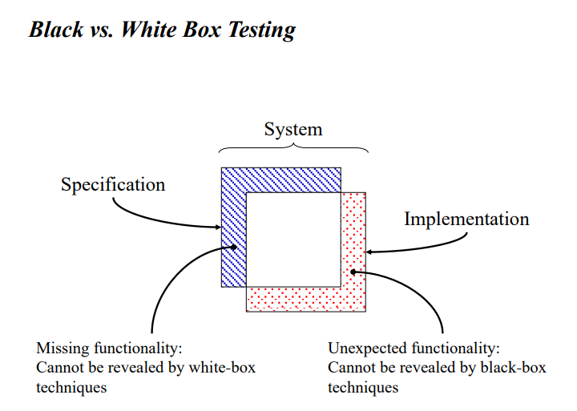

#### The 4 Testing Steps

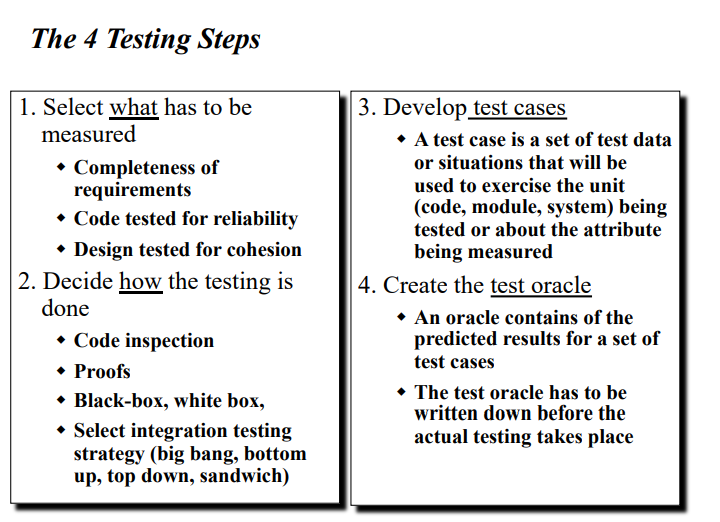
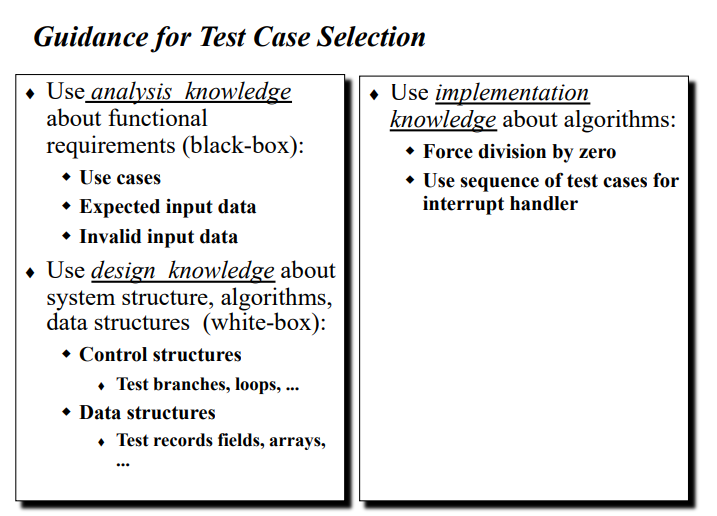

### Integration, System, and Acceptance Testing
#### Component-Based Testing Strategy
- Intero sistema è visto come una collezione di sottosistemi
- L'ordine con il quale il sottosistema sono selezionati dipende dalla strategia di testing
    - **Big bang integration (Non incrementale)**
    - **Bottom up integration**
    - **Top down integration**
    - **Sandwich testing**
    - **Variations of the above**

##### Using the Bridge Pattern to enable early Integration Testing
- Attraverso il brdge pattern forniscono implementazione multiple sotto la stessa interfaccia

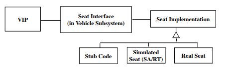

##### Integration Testing: Big-Bang Approach
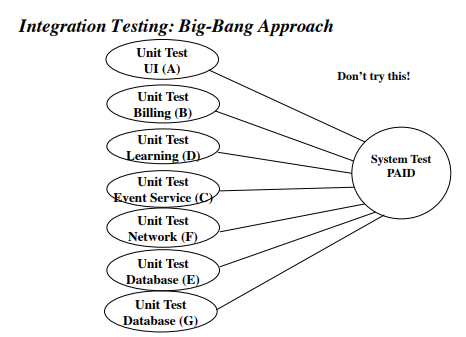

##### Bottom-up Testing Strategy
- Il sottosistemi nel layer inferiore della gerarchia sono testati in maniera individuale
- I sottosistemi successivi chiamano i sottosistemi inferiori già testati
- **Test Driver**: Speciale programma che necessita di essere testato
    - Una routine che chiama un particolare sottosistema e gli passa i test case
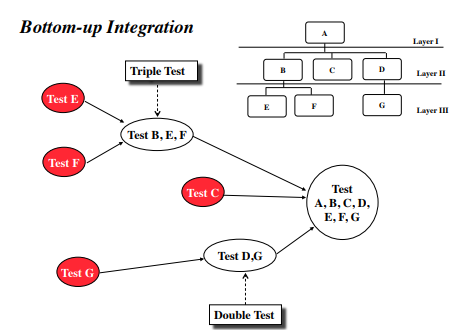

- **Pro**: Utile per i sistemi object-oriented
    - Sistemi real-time
    - Sistemi con strette necessità di performance
- **Contro**: Testa il più importante sottosistema per ultimo

##### Top-down Testing Strategy
- Test del layer superiore o controlla il sottosistema prima
- Quindi combina tutti i sottosistemi chiamati dai sottosistemi testati e testa la raccolta risultante di sottosistemi
- **Test Sub**: Speciale programma che necessita di essere testato
    - Un programma o metodo che simula l'attività di un mancante sottosistema rispondendo alla sequenza di chiamate del sottosistema chiamato e ritorna dati falsi

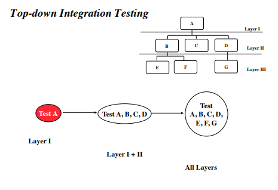

- **Pro**: I test case possono essere definiti in termini delle funzionalità del sottosistema
- **Contro**: Stubs possono essere difficili,dato che richiedono che tutte le possibili condizioni devono essere testate
    - Richiede ungrande numero di stub

##### Sandwich Testing Strategy
- Combina top-down e bottom-up
- Sistema è visto come un albero a 3 layer
    - Un layer target nel mezzo
    - Un layer sopra il target
    - Un layer sotto il target

- **Euristica**: Prova a minimizzare il numero di stub e driver
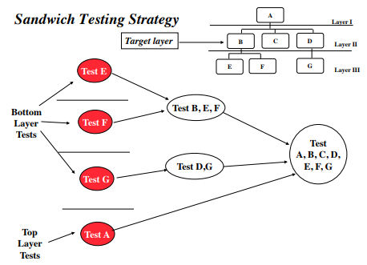

- **Pro**: Top e bottom layer test possono essere fatti in parallelo
- **Contro**: Non testa a fondo i singoli sottosistemi del livello di destinazione prima dell'integrazione

- **Modified Sandwich Testing Strategy**
    - Test in prallelo
        - Layer nel mezzo con stub e driver
        - Layer superiore con stub
        - Layer inferiore con driver
        - Il layer superiore accede il layer nel mezzo
        - Il layer inferiore accede il layer nel mezzo

    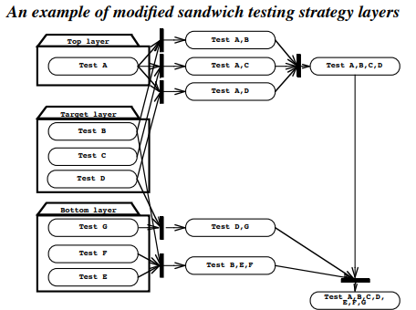
    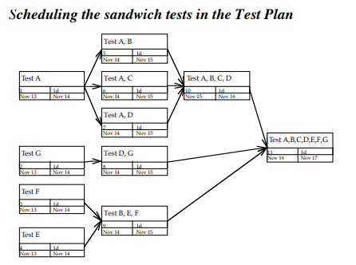
    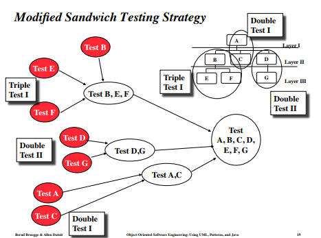

#### Steps in Component-Based Testing
    1. Basato sulla strategia di integrazione, seleziona un componente da testare
    2. Unisci le componenti selezionate, esegui i fix-up necessari per rendere operativo l'integrazione del test
    3. Esegui il test funzionale, definisci i test case che esercitano tutti i casi d'uso
    4. Esegui il testing strutturale, definisci i test case che esercitano il componente selezionato
    5. Esegui il test di performance
    6. Registra i test case e le attività di testing
    7. Ripeti gli step 1 e 7 fino a quando il sistema non è testato del tutto
    
#### Which Integration Strategy should you use?

- **Fattori da considerare**
    - Quantità del cablaggio di prova (stub e driver)
    - Luogo dei percorsi critici nel sistema
    - Disponibilità del hardware
    - Disponibilità dei componenti
    - Problemi di pianificazione

- **Approccio Bottom up**
    - Buono per oggetti orientati alle metodologie di design
    - Il testdriver deve corrispondere l'interfaccia delle componenti
    - Le componenti top-level non possono essere rimandate alla fine del testing
    - Rilevamento degli errori di progettazione posticipato alla fine del testing

- **Approccio Top-down**
    - I test case possono essere definiti in termini di funzioni esaminate
    - Necessità di mantenere la correttezza degli stub dei test
    - Scrivere stub può essere difficile

#### System Testing
- **Impatto dei requisiti sul testing del sistema**: Più espliciti sono i requisiti e più facilemente sono testabili
    - Qualità dei casi d'uso determina la failità del testing funzionale
    - Qualità della decomposizione del sottosistema determina la facilità della struttura del testing
    - Qualità dei requisiti non funzionali e dei vincoli determinano la facilità del test delle performance

##### Structure Testing
- **Goal**: Copre tutti i percorsi del sistem design
    - Esercita tutti gli input e tutti gli output dei parametri di ogni componenti
    - Esercita tutte le componenti e tutti le chiamate
    - Usa condizionale e iterazionale testing come un unità di testing

##### Functional Testing
- **Goal**: Testa le funzionalità del sistema
    - I test case sono progettati a partire dal documento di analisi dei requisiti e centrata attorno ai requisiti e le funzionalità chiave
        - Instanzia casi d'uso per derivare i test case
        - Differenti scenarii possono essere ottenuti applicando tecniche black-box ai dati di input
- Sistema trattato come una black-box
- Unit test case possono essere riutilizzati, ma anche per l'utente finale devono essere sviluppati nuovi casi di test

##### Performance Testing
- **Stress Testing**: Limite di stress del sistema
- **Volume Testing**: Testa cosa accade se si gestisce un grande numero di dati
- **Configuration Testing**: Testa vari software e la configurazione hardware
- **Compability Testing**: Testa la retrocompatibilità con il sistema esistente
- **Security Testing**: Prova a violare i requisiti di sicurezza
- **Timing Testing**: Valutare i tempi di risposta e il tempo necessario per eseguire una funzione
- **Environment Testing**: Testa la tolleranza per calore, umidità, movimento e portabilità
- **Quality Testing**: Testa la affidabilità, manutenibilità e disponibilità del sistema
- **Recovery Testing**: Verifica la risposta del sistema alla presenza di errori o alla perdita di dati
- **Human factors testing**: Testa l'interfaccia grafica dell'utente

##### Test Cases for Performance Testing
- Porta il sistema al suo limite
- **Goal**: Prova a rompere il sistema
- Testa il comportamento del sistema quando è sovraccarico, quando cambi l'ordine di esecuzione e a grandi volumi di dati

#### Acceptance Testing
- **Goal**: Dimostrare che il sistema è per l'uso
    - Scelta di test fatta da client/sponsor
    - Molti test possono essere presi dai test di integrazione
    - Test di accettamento fatti dal client
    - La maggior parte dei bug nel software viene tipicamente individuata dal cliente dopo che il sistema è in uso

- **Alpha Test**: Sponsor utilizza il software sul sito dello sviluppatore
    - Usato in un ambiente controllato, con lo sviluppatore pronto a risolvere bug
- **Beta Testing**: Condotto sul sito dello sponsor
    - Testato in modo realisitico nel ambiente di destinazione
    - Il potenziale cliente potrebbe scoraggiarsi

#### Testing has its own Life Cycle
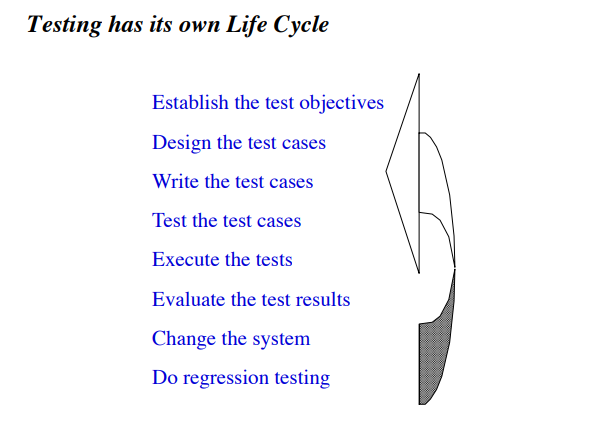

#### Test Team
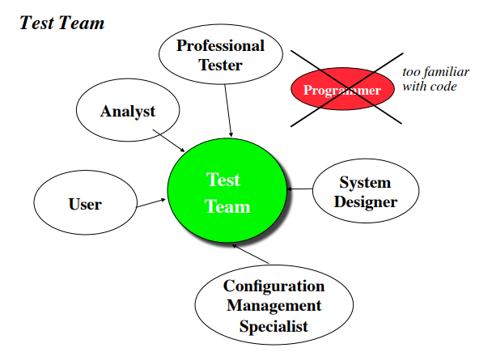

### Tecniche di Testing per Software Object Oriented
#### Caratteristiche Linguaggi OO
- Astrazione dei dati
- Ereditarietà
- Polimorfismo
- Binding dinamico
- Genericità
- Getione delle eccezioni
- Concorrenza

#### Stato e Information Hiding
- Correttezza legato anche allo stato definiti nella struttura dati

#### Scaffolding
- Infrastruttura deve settare lo stato per por eseguire i test (Driver)
- Esaminare lo stato per poter stabilire l'esito dei test (Oracolo)
**Approcci intrusivi**
    - Modifica del codice sorgente al finedi aggiungere testdriver
    - Usare i costrutti dl inguaggio

#### Stato e generazione dei casi di test
- Costruire una macchina a stati finiti
    - **Stati**: Insieme di stati della classe
    - **Transizioni**: Invocazioni dei metodi
- Percorrere la macchina a stati finiti per derivare i casi di test
- I cammini di una macchina a stadi finiti corrisponde ad una sequenza di operazioni
- **Casi di test**: Cammini della macchina a stadi finiti

#### Testing di integrazione per software OO
- **Big bang**: poco adatto
- **Top-down e Bottom-up**: Cambia il tipo di dipendenze fra i moduli
    - Uso di classi ed ereditarietà
- **Threads**: Un thread è identificato con una sequenza di messaggi

#### Grafo delle Dipendenze
- Se il grafo è aciclico esiste un ordinamento parziale sui suoi elementi
    - Possibilità di definire un ordinamento topologico totale
    - Ordine d'integrazione definito in base a questo ordinamento
- Se esistono dipendenze cicliche tra le classi è impossibile definire un ordinamento parziale
    - Ogni grafo orientato ciclico è riducibile a un grafo aciclico collassando i sottografi massimi fortemente connessi 

#### Problemi di Integrazione per software OO 
- Una volta definito l’ordine di integrazione si aggiungono le classi incrementalmente esercitandone le interazioni

#### Testing di integrazione basato su thread
- La generazione dei casi di test può essere effettuata a partire dai diagrammi di interazione (specifiche)
- Opportuno costruire threads anche dal codice e verificare la corrispondenza con le specifiche 

#### Problemi di Integrazione: Ereditarietà
- Linguaggi procedurali classici: Il codice è strutturato in procedure e una volta eseguito il test di un modulo di una procedura non è necessario rieseguirlo
- Linguaggio orientati agli oggetti: Il codice èstrutturato in classi, nelle relazioni di ereditarietà alcune operazioni restano invariate altre vengono ridefinite e altre aggiunte
    - Necessità di identificare le proprietà che devo ritestare
    - Può essere necessario verificare la compatibilità di comportamento tra metodi omonimi in una relazione classe-sottoclasse 

#### Polimorfismo e binding dinamico
- Liguaggi procedurali classici: Le chiamate a procedura sono associate staticamente al codice corrispondente 
- Liguaggi orientati agli oggetti: Un riferimento (variabile) può denotare oggetti appartenenti a diverse classi in relazione tipo-sottotipo (polimorfismo)
    - Più implementazioni di una stessa operazione
    - Il codice effettivamente eseguito è identificato a run-time, in base alla classe di appartenenza dell’oggetto (binding dinamico)

#### Altri problemi: Genericità
- Le classi parametriche devono essere istanziate per poter essere testate

#### Altri problemi: Gestione delle eccezioni
- Le eccezioni modificano il flusso di controllo senza la presenza di un esplicito costrutto di tipo test and branch 
- **Copertura ottimale**: Sollevare tutte le possibili eccezioni in tutti i punti del codice in cui è possibile farlo (può non essere praticabile)
- **Copertura minima**: Sollevare almeno una volta ogni eccezione 

#### Altri problemi: Concorrenza
- Risulati ed eccezioni non-detrministici
- Casi di test composti da valori di input e output sono poco significativi 
- Casi di test composti da valori di input/output e da una sequenza di eventi di sincronizzazione

## appunti
non usare new dare un nome all'operazione
non aggiungere nel class diagram i boundary control

o propritari delle operazioni sono gli oggetti che ricevono i messaggi

fork unico control utile per in controllo delle informazioni

Stair passo il controllo ad un control man mano a quello successivo

slide 27 mancano condizioni tipo list empty or chnage >0 e anche per change per essere mutualmente esclusive data la mancanza di un evento

navigation path fatto a pezzi per semplicità per i vari casi d'uso con uno statechart diagram

attribuiti derivati in uml atrraverso /

cambiare casi d'uso
se necessario login allora non va nell'include

include indica che un caso d'uso include un flusso di eventi di un altro caso d'uso

## Appunti system design 
in persistent data management la progettazione degli schemi o del databse oin un file apparte o in direttamente in object design

al 99% non abbiamo nuovi casi d'uso nel system design

un sottosistema corrisponde ad un oggetto
tipi user registry

i servizi non sono le operazioni, ma un gruppo di operazioni coese
    il modulo che si occupa del catalogo del prodotto avrà modfica, inserimento cancellazioni come operazioni
        il servizio è la gestione del prodotto

    diverso + òa gestione degli utenti
    utente registrato vede logout
    mentre utente non registrati vedrà login e logout
    quindi 2 servizi diversi

    servizio di banning e unbanning offerto al moderatore, offerto dal servizio degli utenti

    servizio autenticazione ha login e logout

    recupera password si può fare con un fogglietto in sede fisica per evitare complicazioni di sviluppo

    hardware software appig vuole deployement diagram

    per OCL preferibile usare le operazioni e non gli attributi

    object design
    scegliamo cosa implementare un sottoinsieme
    facciamo dei componente diagram invece dei sequence diagram
    class oppure collaboration si possono usare anche per qualcuna delle funzionalità e casi d'uso

    progettazione del database SENZA er

    specifica interfaccie in termini di pre post condizione anche in java doc
    negli execption possiamo mettere la precondizione nel caso non si rispetta i parametri classe padre

    prima partizionamento e poi dividere nei layer

    per il progetto implemenatare sotto sistemi essenziali tipo login e gestione ordine

    non si controlla post condizione , dato che si fa  al fine di controllare post condizione e invariate

    documenti solo per il test di sistema
    per il test di uità juit o altro quindi senza documenti

    fare test funzionale

    per ogni caso d'uso da testare fare progettazione del test e lista dei casi di test in un documento a apparte
