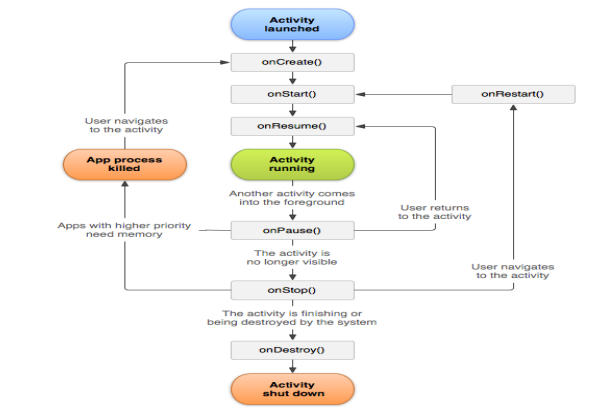

# Mobile Programming
## Piattaforma Android
- Il sistema software per mobile si compone di:
  - **Kernel Linux**: Fornisce i servizi di base del sistema operativo
  - **Hardware**: INterfacce standard per esporre le capacità hardware ai servizi di livello superiore
  - **Librerie e Android Runtime**: 
    - App Android sono scritte in Java e/o Kotlin
    -  Compilate in Java Bytecode
    -  Un tool DX che trasforma i file Bytecode in fle Dex Bytecode
    -  File classes.dex contiene anche tutti i file di dati necessari
    -  **ART Virtual Machine** esegue il file dex
       - Una Vm specifica per Android
       - Ahead-Of-Time commpilation
       - Garbage collection
       - Richiede meno memoria di Dalvik
       Consuma meno batteria di Dalvik
    - **Dalvik** Virtual machine per API level < 21
       - Just-In-Time compilation
       - Garbage collection
       - Richiede più memoria di ART
       - Consuma più batteria di ART
    - **Librerie native** sono neccessarie per molte componenti Android
  - **Application framework**: Funzionalità del SO esposte tramite API
  - **Applicazioni (App)**: Applicazioni già presenti nel sistema

## Android Developer Tools
- Gli oggetti della classe View hanno dei metodi listener
- **Edge-to-edge**: da API 35, con view a tutto schermo
- **Insets**: da API 35 fra le aree sovrapposte sono presenti la status bar, la navigation bar, menu laterali, tastiere soft
- **Activity**: è una classe base del pacchetto android.app, fornisce il ciclo di vita standard e la gestione base dell'UI, non include funzionalità di compabilità o supporto ai temi/material design
- **AppCompatActivity**: Estende FragmentActivity, definita in AndroidX, offre retrocompabilità

## Layouts
- Definiscono l'aspetto grafico dell'interfaccia utente
- Si possono definire in XML o in modo programmatico e si possono usare in sinergia
- **Programmatico**: dinamico, dobbiamo gestire il layout nel codice
- **XML**: facile da specificare e separe in modo netto UI dal codice, tuttavia presenta elementi statici
  - Testo inserito in un altro file resource per gestire meglio la stringa avendo più stringhe in modo da non poterla modificare dall'xml, permette di avere una versione di più lingue
- **ViewGroup**: gruppi di altri elementi
- **Attributi**: Specificano aspetto grafico, dove visualizzare l'elemento e forniscono informazioni
- **ID (Creazione)**: android:id=@+id/text, dopo la @ viene interpretato, il + specifica che stiamo creando un nuovo elemento di nome text
- **ID (Riferimento)**: android:id='@id/text'
- **View**: è un rettangolo la cui posizione è determinata dal layout
- **Misure pixel**:
    - **px**: pixel reali
    - **dp(dip)**: density independent pixels, calcolati sulla densità
    - **sp**: scale-independent pixels, scalato in base al font dell'utente
- **Linear Layout**: Posiziona gli elementi uno dopo l'altro, i cui i figli si dividono equamente lo spazio, non viene lasciato spazio vuoto
- **Relative Layout**: Posizione relativa al layout padre e agli altri elementi dell layout
- **ConstraintLayout**: Specifica la posizione attraverso vincolo, viene usata dall'editor grafico
- **TableLayout**: Organizza gli elementi in righe e colonne
- **GridView**: Visualizza un insieme di elementi e da un Adapter che fornisce gli elementi da inserire nel GridView
- **List View**: Visualizza un insieme di elementi organizzati in una lista e la Adpater fornisce gli elementi da inserire nel List View
  - Elementi memoriazzati in un array
  - **Adapter**: Fornisce gli elementi da visualizzare in base allo scorrimento effettuato dall'utente
  - **Semplice**: Ogni elemento è una stringa
  - **Personalizzato**: Ogni elemento ha un proprio layout con dei sottoelementi
  - **Personalizzato con click multiplo**: Si possono cliccare i singoli elementi
    - **Listener ad-hoc**: setTag e getTag

## Android Studio Debugger
  - Permette di eseguire l'app di debug

## Ciclo di vita
  - **Attività non esiste**:
    1. onCreate()
    2. onStart()
    3. onResume()
  - **Attività in esecuzione**:
    1. onPause()
    2. onStop()
    3. onDestroy(): Perdita dello stato
  - **Attività non esiste**
  

    
  

  - **Quando l'utente preme il pulsante "Home"**
    - onPause()
    - onStop()
  - **Quando si ritorna all'attività**
    - onRestart()
    - onStart()
    - onResume()
  - **Quando l'utente ruota il dispositivo**
    - onPause()
    - onStop()
    - onDestroy()
    - onCreate()
    - onStart()
    - onResume()

  - **Si salva lo stato in onSaveInstanceState()**
  - **Si recupera lo stato in onCreate()**

## Ciclo di vita e cambio di configurazione
  - **Configurazione device**
    - Screen orientation
    - Layout direction
    - Avaible width, height
    - Screen size
    - Roud screen
    - UI mode
    - Keyboard availability
  
  - **Cambio di configuarazione**: Il sistema operativo distrugge e ricrea le attività in esecuzione, per permettere all'app di adattarsi meglio alla nuova configurazione
    - **Per salvare lo stato**:
      - onSaveInstanceState()
      - ViewModel Class
        - Oggetti persistenti
    
    - **Gestione cambiamento**: Attraverso il manifesto, in modo da non far distruggere l'activity ma eseguire il metodo onConfigurationChanged()
  
## Backstack
  - Un attività può laciare più attività
  - Classe Itent, per passare i dati all'attività che si lancia
  - Task, insieme di attività con cui l'utente interagisce

  - Più attività possono coesistere, **backstack**
    - Se vengono lanciate nuove attività, l'attivita corrente viene messa nel backstack
  
  - Se un'attività può essere lanciata da più di un altra attività si possonno avere istanze multiple

## Intent
  - Permette di
    - startActivity
    - broadcastIntent
      - Spedire l'intent in broadcast
    - startService o bindService
  
  - **Composizione di un Intent**
    - **Action**: L'azione da svolgere
    - **Data**: I dati su cui operare espressi come URI
    - **Category**: Informazioni aggiuntive sull'azione da eseguire
    - **Type**: 

## Appunti lezione 7/10/25
Stato diverso dal metodo
se ruoti testo rimane nel widget, ma non rimane nelle variabili

## Appunti lezione 14/10
Intent-> oggetto astratto per lanciare activity

Android stesso sceglirà la activity attraverso un modo implicito

Extras parte di un activity composta da un bundle(coppia chiave valore)

?q query per ricercare

quiz per risolvere precedente se index=0 metti quesito corrente=num -1

## Appunti lezione 21/10
