# Programmazione Distribuita
## Sistema Distribuito
- Un sistema consiste in un insieme di macchine connesse attraverso una rete, ogni nodo esegue un insieme di componenti che comunicano e coordinano il proprio lavoro attraversi un software detto **middleware**, in maniera che lo utenta lo percepisca con un unico strato

- Allo scopo di facilitare lo sviluppo dei sistemi distribuiti e quindi creare una astrazione comune per i produttori in maniere indipendente dalla specifica ISO/IEC³ ha proposto il modello formale RM-ODP

- Il modello RM-ODP si basa ed integra il modello tradizionale di rete ISO/OSI, estendendolo per la comunicazione tra componenti eterogenee

### **Caratteristiche di un sistema distribuito**:
  - **Remoto**: Le componenti possono essere localizzate su macchine diverse

  - **Concorrenza**: Permette esecuzione di due o più istruzioni su macchine diverse

  - **Assenza di uno stato globale**: Non è possibile determinare lo stato globale di un sistema

  - **Malfunzionamenti parziali**: Malfunzionamento non deve inficiare le funzionalità nel sistema distribuito

  - **Eterogeneità**: Tecnologia diversia sia hardware che software

  - **Autonomia**: Collaborazione ottenuta mediante le richieste del sistema distribuito con quelle del sistema che gestisce ciascun nodo

  - **Evoluzione**: Il sistema distribuito può cambiare in maniera sostanziale durante la sua vita in base alla esigenze

  - **Mobilità**: Permette la mobilità di nodi e risorse all'interno del sistema

### **Requisiti non funzionali di un sistema distribuito**
- I requisiti non funzionali che indicano la qualità del sistema, sono globali e vanno considerati come fattori che hanno un impatto significativo sulla architettura
  - **Aperti**: Permetteno di supportare la portabilità di esecuzione e di interoperablità per poter far evolvere il sistema

  - **Integrati**: Permette di incorporare sistemi e risorse differenti senza usare strumenti ad-hoc

  - **Flessibili**: Legato al concetto di evoluzione al fine di permettere di integrare sistemi legacy

  - **Modulari**: Permette ad autonomia di ogni componente mantenedo un grado di interconnessione nel sistema

  - **Supporto federazione di sistema**: Permette di unire sistemi sia dal punto di vista architetturale che dal punto di vista amministrativo 

  - **Facilmente gestibili**: Permette il controllo e la gestione del sistema

  - **Fornire la qualità del servizio**: Poter fornire servizi con vincoli di tempo, disponibilità e affidabilità.
    La tolleranza ai malfunzionamenti è la principale richiesta di un sistema distribuito

  - **Scalabili**: Deve essere in grado di gestire picchi di carico non prevedibili

  - **Sicuri**: Evitare ad utenti non autorizzati di accedere
  - **Trasparenza**: Mascherare i dettagli e le differenze della architettura al fine di agevolare la progettazione e la implementazione. Esistono vari ripi di trasparenza tuttavia avendo un costo associato bisogna fare un accurata valutazione dei costi/benefici al fine di scegliere quelle necessarie<br><br>
    <br><br>
      - **Trasparenza di accesso**: Nasconde le differenze di rappresentazione e invocazione dei dati al fine di permettre ad un oggetto di essere facilmente spostato a run-time da un nodo ad un altro anche da remoto
      - **Trasparenza di locazione**: Fornisce una vista logica del sistema di naming, in modo da disaccoppiare il nome da un posizione nella rete, al fine di poter spostere un oggetto da un nodo ad un altro
      - **Trasparenza di migrazione**: Permette di nascondere la possibilità che il sistema faccia migrare un dato da un nodo ad un altro in modo da essere raggiungibile e utilizzabile da altri oggetti, permettendo il bilanciamento del carico
      - **Trasparenza di replica**: Il sistema maschera che una singola componente viene replicata un certo numero di volta e piazzata su altri nodi, il sistema si occupa di mantenere coerente lo stato delle repliche, permettendo la scalabilità e un miglioramento delle prestazioni
      - **Trasparenza alle transazioni**: Nasconde all'utente le attività di coordinamento che vengono svolte per assicurare la consistenza degli oggetti in presenza della concorrenza
      - **Trasparenza ai malfunzionamenti**: Nasconde ad un oggetto il malfunzionamento di oggetti con i quali sta interoperando, poggiandosi sulla trasparenza di replica e di transazione
      - **Trasparenza alla persistenza**: Scherma l'utente dalle operazioni che conmpie il sistema per rendere persistente, ovvere mettere in memoria secondaria, un oggetto durante la fase di non utilizzo, affidandosi alla trasparenza di locazione
      - **Trasparenza alla scalabilità**: Permette di poter servire carichi di lavoro via via crescenti senza dover modificare la propria architettura e la propria organizzazione
      - **Trasparenza alle prestazioni**: Assicura che il progettista sia ignaro dei mecccanismi che vengono utilizzati per le prestazioni del sistema

## **Middleware ad Oggetti Distribuiti** 
- Gli oggetti distribuiti hanno come obiettivo quello di realizzare servizi distribuiti, in modo da essere efficienti, flessibili, sicuri e robusti, basato su una architettura che utilizza come risorse nodi eterogenei, sia per hardware che per software.
- Il **middleware** ad oggetti distribuiti che risiede fra le applicazioni e lo strato del sistema operativo ha lo scopo di permettere la comunicazione e la cooperazioni fra le componenti di sistema, astraendo le operazioni di basso livello risolvendo i problemi eterogeneità.
Evita che il programmatore si occupa dei dettagli di comunicazione del livello di rete.
Poichè il middleware ad oggetti astrae significativamente la parte di servizio e di distribuzione delle applicazioni distribuite permettendo di utilizzare e riutilizzare framework
  - **Middleware di infrastruttura**: Si occupa delle comunicazioni fra sistemi operativi diversi e della gestione delle concorrenza
  - **Middleware di distribuzione**: Permette di richiedere un servizio ad un altro nodo potendo inviare parametri, utilizzare lo stesso canale di comunicazione per diverse richieste, utilizzare una singola macro-richiesta che ne include diverse, modificare la semantica delle operazioni di invocazioni unicast come l'invocazione multicast, riconoscimento e gestione del malfunzionamento della rete
  - **Middleware per i servizi comuni di supporto**: Fornisce i servizi comuni a tutte le applicazioni distribuiti come la persistenza degli oggetti, la sicurezza e la gestisce delle transazioni

### **Remote Procedure Call (RPC)**
- Un modello che permetteva ad una procedura in esecuzione su una macchina di invocarne un'altra che si trovasse si una macchina diversa rendendo possibile trasmettere i dati utilizzando uno stream di byte su socket e permettere che si superassero le differenze nella rappresentazione stessa dei dati da trasmettere.
Imponeva la sincronia delle invocazioni bloccando il client fino a quando il server non avesse risposto all'invocazione remota attraverso gli stub
### **Middleware ad Oggetti Distribuiti** 
- Estensione del modello RPC in modo da permettere l'invocazione di metodi oggetti remoti, alcuni esempi rappresentativi sono: **CORBA, Java RMI, .NET**
- **Middleware implicito**: Attraverso meccanismi di intercettazione delle richieste e delle interazioni tra gli oggetti, è in grado di fornire servizi comuni e trasversali ad ogni componente senza che essa debba esplicitamente richiederli
  - Il **Server** Fornisce i servizi in base alle richieste, in maniera trasparente allo sviluppatore software in modo da favorire una maggiore interoperabilità tra produttori di software diversi

- **Middleware esplicito**: Rappresenta quello che lo sviluppatore deve invocare direttamente all'interno del codice per accedere ai seervizi che offre, essendo di fatto meno trasparente ma al contempo più controllabile dallo sviluppatore


## Programmazione concorrente e  Thread in Java

- **Legge di Moore**: numero transistor raddopia ogni 2 anni 

- **Thermal Noise**: Effetto della termodinamica che disturba la crescita secondo la legge di Moore e conseguete difficoltà di raffreddamento dei troppi transistor

- **Accesso in memoria**
  - **SingleCore**: Un singolo thread accede alla memoria
  - **MultiCore**: Più thread accedono alla memoria causando problemi di **cache missing, page faults e Context-switch dallo scheduler**

- **Multithread**: Permette di eseguire più thread contemporaneamente

### **Thread**
- Si differenziano dai processi per la capacità di avere a disposizione e condividere gli stessi dati

  - **Thread in Java**: sono oggetti e quindi istanze di una classe Thread, esitono due metodi per istanziare un oggetto thread;
    - Extends Thread
    - Implements Runnable e uso del costruttore di Thread

    Altri metodi utili:
    - **Sleep**: Sospende il thread
    - **Interrupt**: Indicazione al fine di fermare il thread e far fare qualcosa altro e lancia l'eccezione **InterruptedException**
    - **Join**: Attende il completamento di un altro thread
  
  - **Comunicazione fra Thread**: Comunicano condividendo acceso ai campi che contengono riferimenti ad oggetti.
  Per risolvere il problema interferenza di thread e inconsistenza della memoria è necessaria la sincronizzazione

  - **Problema accesso concorrente**: La race condition dipende dall'ordine di esecuzione di diversi thread, tuttavia questi errori rendono difficile il debugging
    - **Errori di incosistenza**: Si verifica quando i thread hanno visioni diverse dei dati, l'happen-before è una garanzia che la memoria scritta da un thread è visibile da un altro thread
### **Informazioni utili**
  - Ogni thread viene mappato ad un core, thread vivono all'interno del processo che li sta usando
  - Ogni applicativo ha un main thread
  - JVM è un programma capace di eseguire altri programmi scritti in java, è una specifica che può essere implemantata in una macchina virtuale java
  - Java non ha riferimenti fisici, ma gestisce i riferimenti relativi alla posizione java

- **Legge di Amdahl**: Lo speedup che si ottiene eseguendo il programma <em>X</em> su <em>n</em> processori, dove <em>p</em> è la parte di <em>X</em> che si può parallelizzare è:

    $$S=\frac{1}{1-p+(p/n)}$$

- Per velocizzare un programma non basta investire sull'hardware ma è assolutamente necessario e molto più cost-effective impegnarsi a rendere la parte parallela predominante rispetto alla parte sequenziale
### **Sincronizzazione**
- Risolve il problema di interferenza fra thread e di incosistenza alla memoria
  - **Metodo synchronized**: Costrutto Java che evita che due esecuzioni dello stesso metodo sullo stesso oggetto siano interfogliate, sospendendo gli altri thread che invocano lo stesso metodo synchronnized, quando il thread esce dal metodo e si stabilisce una relazione di **happen-before**
  - **Lock intrinsichi**: entità associata ad ogni oggetto e garantisce sia accesso esclusivo sia accesso consistente
  - **Azioni Atomiche**: Azioni che non sono interrompibili e si completano del tutto
  - **Deadlock**: Si verifica quando due thread sono in attesa uno dell'altro
  - **Starvation**: Si verifica quando un thread non riesce a acquisire un accesso ad una risorsa condivisa
  - **Livelock**: I thread rispondono alle azione di un altro thread
  - **Thread-safe**: Un implementazione Java usabile su più thread

## Dai Socket agli Oggetti Remoti
- **Java** fornisce le API di programmazione di rete nel pacchetto **java.net** permettendo di definire classi per trattare gli indirizzi di rete
- La comunicazione sfrutta il protocollo **TCP/IP**
### **Socket TCP**
- Endpoint di comunicazione bidirezionale sulla rete che unisce due programmi
  - Combinazione di indirizzo IP e numero di porta
  - **Server**: Attende che qualche client richieda la connessione
    - Classe **ServerSocket**
  - **Client**: Conosce indirizzo macchina su cui è in esecuzione il server e il numero di porta e deve comunicare indirizzo e numero di porta locale sul quale ricererà i dati
    - Classe **Socket**
  
### **Stream**
- La comunicazione fra client e server avviene attraverso la scrittura e la lettura di stream associati con il socket
  - **ObjectInputStream**: Fornisce meccanismo di deserializzazione quando si riceve un oggetto precedentemente serializzato con **ObjectOutputStream**
    - Gli oggetti che possono essere trasmessi su questo stream devoo implementare interfaccia Serializable o Externalizable
  
 ### **Oggetto remoto**
 - Adottiamo il principio dell'astrazione introducedo uno **strato software** al fine di nascondere al programmatore il lavoro necessario all'invocazione di metodi remoti
    - **Strato software** composto da **stub** e **skeleton**
    - **Stub**: Oggetto che si trova sul client e rappresenta l'oggetto server verso il client e il suo scopo è comunicare con lo skeleton che si trova lato server
      - Ogni chiamata del client verso i metodi remoti genera una comuicazione fra stub e skeleton
    
    - **Skeleton**: Si occupa di effettuare invocazione del metodo richiesto, ricevere il valore restituito e comunicarlo allo stub

    - **Interfaccia remota**: Definizione dei metodi che il **server** vuole esporre verso il client

    - I metodi remoti possono lanciare eccezioni
  
  - **Indirizzamento oggetto remoto**: Prevedere che ci sia un servizio disponibile che permetta di poter reperire a tempo di esecuzione l'indirizzo di un oggetto di cui sappiamo solo il nome

  - **Informazioni utili**
    - **Server**: Servesocket(9000)
        - Porta 9000 per accettare la richiesta
        - Poi si usa una altra porta fra quelle disponibili
    
    - **Client**: si usa una altra porta
  
    - **Accept**: Bloccante
  
## Java RMI
- Applicazione Java che permette lo sviluppo di applicazioni distribuite
  - **Invocazione trasparente di metodi remoti**: Meccanismo semplice per l'invocazione dei metodi remoti

  - **Integrazione in Java**: Integrazione naturale con il linguaggio Java, per favorire un ambiente familiare allo sviluppatore
    - **Garbage collector**: Gestione della memoria attraverso allocazione e deallocazione
      - Oggetto è deallocato se finiscono i riferimenti a quell'oggetto
  
  - **Non-Trasparenza della natura locale/remota di un oggetto**: Esistono caratteristiche che non devono essere nascoste

  - **Rendere minima la complessità fra client e server**

  - **Preservare la sicurezza da Java**: Uso di **sandbox**, ovvero, un ambiente dedicato e controllato nel quale le operazioni che il programma può eseguire non risulatano pericolose
    - **Linguaggio Java fortemente tipizzato**: Tutte le variabili hanno un tipo definito a tempo di compilazione e poche eseguite a run-time
    - **Garbage collector**: Evitare di esaurire lo spazio di indirizzamento
    - **Assenza puntatori**
    - **Accesso alla memoria determinato in fase di esecuzione**: Evita che si possano conoscere in anticipo le zone di memoria degli oggetti
    - **Limiti per array controllati a tempo di esecuzione**
    - **Classloader**: Si occupa di caricare la classe a tempo di esecuzione, anche da remoto.
    Carica le classi in un namespace separato in modo che le classi locali non vengano rimpiazzate.
    Fa in modo che ogni classe abbia il proprio namespace separato in modo da non avere interferenze con le altri classi. Può scaricare anche da remoto
    - **Bytecode verifer**: Controlla che sia conforme alle specifiche del linguaggio
    - **Security Manager**: Definisce i confini della sandbox.
    Viene interpellato dalla macchina virtuale per ciascuna azione potenzialmente pericolosa fornendo autorizzazioni sulla base della policy dell'utente.
    Viene caricato a tempo di esecuzione

### **Modalità di invocazione**
  - **Unicast**: Da un client verso un server
  - **Multicast**: Verso diversi server

## **Il modello a oggetti distribuiti di Java RMI**
- **Struttura delle classi di Java RMI**:
  - **java.rmi e java.rmi.server**: Contengono il meccanismo basilare di funzionamento delle invocazioni remote
  - **java.rmi.activation**: Per oggetti attivabili
  - **java.rmi.dgc**: Per la Distributed Garbage Collection
  - **java.ri.registry**: Per il servizio di localizzazione

- **Interfacce ed eccezione remote**: L'interfaccia remota deve estendere java.rmi.remote, ovvero un interfaccia marker (vuota).
Ogni metodo descritto nell'interfaccia remota deve soddisfare le seguenti condizioni:
  - Deve dichiarare esplicitamente eccezione **java.rmi.RemoteException**
  - I parametri remoti di un metodo devono essere dichiarati tramite la propria interfaccia remota, non utilizzando la classe dell'implementazione remota

### **Implementazioni remote**
- Si può procedere in due modi:
  - Oggetto derivi da java.rmi.UnicastRemoteObject ereditando di conseguenza il comportamento di java.rmi.RemoteObject e java.rmi.RemoteServer

  - La classe deriva il comportamento da qualche altra classe e quindi vi è la necessità di occuparsi di esportare l'oggetto e di implementare la semantica di alcune operazioni di Object

## Meccanismo di invocazione remota
- **Riferimenti remoti**: Nel modello distribuito gli oggetti client iteragiscono con un oggetto detto stub che espone localmente esattamente le stesse interfaccie remote definite dall'oggetto remoto

- **Localizzazione e invocazione di oggetti remoti**: Per poter invocare il metodo di un oggetto remoto, l'oggetto client deve avere a disposizione il riferimento remoto.
Quest'ultimo può essere reperito in due metodi:
  - **Risulatato di altre invocazione di metodi**
  - **Servizio di directory**: Sfrutta meccanismo di name server nella classe java.rmi.Naming, che fornisce metodi per ricercare (lookup()), registrare (bind(), unbind(), rebind()) ed elencare (list()).
  Questo tool si può sfruttare pure come tool da linea di comando (rmiregistry)

- **Passaggio di parametri**: Un metodo remoto può dichiarare solo parametri o valori restituiti che siano **serializzabili**.
  - Un oggetto locale passato come parametro o restituito come valore da un invocazione remota viene passata per copia.
  - Se invece viene passato un oggetto remoto, viene trasmesso solo un **riferimento remoto (stub)**, non una copia dell’oggetto.
  In questo modo RMI assicura **l’integrità referenziale**: tutte le JVM coinvolte condividono lo stesso riferimento remoto verso quell’oggetto, non copie separate.

## La differenza fra il modello a oggetti locale e quello remoto
- Modifica necessaria ad alcuni metodi della classe Object per il contesto distribuito attraverso java.rmi.server.RemoteObject ridefinendo equals(), hashCode(), toString()
- I client di oggetti remoti non iteragiscono con la implementazione dell'oggetto remoto ma solo con la interfaccia remota
- Gestione dei tipi permette casting Java di un oggetto remoto ad una qualsiasi delle interfaccie remote supportate
- Invocazione di metodo remote forzano il programmatore a dover gestire esplicitamente i fallimenti di invocazioni di metodi remoti

## La architettura di Java RMI
- **I tre layer della architettura**: Strutturato in tre layer 
  ### **Stub/Skeleton**
  - Comprende stub lato client e skeleton lato server
    - **Stub**:
      - Inzia la connessione con la macchina virtuale remota, chiamando il remote reference layer
      - Effettua il marshalling verso uno stream di marshal
      - Attende il risulato della invocazione
      - Effettua l'unmarshalling dei valori restituiti
      - Restituisce il valore verso l'oggetto client che ha richiesto la invocazione

    - **Skeleton**: Incaricato di effettuare il dispatching verso l'oggetto remoto
      - Quando riceve una invocazione in entrata effettua unmarshalling del remoto reference layer dei parametri per l'invocazione
      - Invoca il metodo sulla implementazione che si trova nella sua JVM
      - Effettua il marshalling del valore restituito verso chi ha invocato il metodo
    
    - Vengono creati dall'RMI compiler rmic

  ### **Remote Reference Layer**
  - Specifica il comportamento della invocazione e la semantica del riferimento permettendo di interfacciare il livello di trasporto con quello di stub/skeleton
    - **Invocazione unicast**: Un singolo client e un singolo server, implementata da Java RMI
    - **Invocazioni multicast**: Singolo client fa richiesta ad una batteria di server al fine di garantire la ridondanza
    - **Invocazione di oggetti attivabili**: Invocazioni potrebbbero essere effettuate da un oggetto remoto che è persistente, ovvero attivo se arrivano invocazioni
    - **Invocazione con riconnessione**: Invocazioni alternative se se l'oggetto remoto non risponde
  ### **Transport Layer**
  - Si occupa della connessione e della sua gestione, gestione di una tabella degli oggetti remoti che risiedono nello spazio di indirizzamento
  ### **Passi compiuti da Java RMI**
    - Client invoca un metodo su un oggetto server remoto, facendo uso dello stub
    - Lo stub implementa l'interfaccia remota dell'oggetto remoto e inoltra la richiesta all'oggetto server attraverso il remote reference layer del client
    - Il remote reference layer del client si occupa di gestire la semantica delle invocazione remota lato client
    - Il livello di trasporto si occupa si stabilire la connessione con la macchina remota e della successiva gestione della connessione, curando il dispatching (recapito) delle invocazioni verso gli oggetti remoti
    - Il livello di reference del server si occupa di inoltrare la richiesta allo skeleton e di curare la semantica delle invocazioni lato server

## Distributed Garbage Collector
  - Tiene traccia di tutti i riferimenti all'oggetto remoto che risultano essere attivi
  - Al termine delle invocazioni il client invia un messaggio di dereferenziazione dell'oggetto e quindi passabile di eliminazione alla prossima invocazione della garbage collector
  - Per evitare problemi di memory leak nel caso di un malfunzionamento viene introdotto un meccanismo di lease
    - **Meccanismo di lease**: Ogni riferimento che viene assegnato al client ha un tempo di vita specificato
  
## Caricamento dinamico delle classi
- L'oggetto remoto può trovarsi nella situazione in cui non conosce esattamente come è strutturata la classe di cui l'oggetto è istanza
- Per evitare questo problema si fa il marshalling degli oggetti per la trasmissione, venendo annotati con il codebase di un server WWW da dove è possibile trovare la definizione della classe
- Quando viene effettuato l'unmarshalling dell'oggetto il Classloader cerca di risolvere il nome della classe nel suo contesto e in caso non sia possibile viene acceduta la definizione della classe per poter ricreare l'oggetto all'altro capo della comunicazione

## Il meccanismo di marshalling usato da Java RMI
- **Marshalling**: permette di effettuare una serializzazione modificando la semantica dei riferimenti remoti e aggiungendo informazioni all'oggetto
- Specializzazione del meccanismo di serializzazione per il marshalling avviene modificando tre metodi della classe **ObjectOutputStream**
  - **Il metodo replaceObject()**
  - **Il metodo enableReplaceObject()**: Restituisce un boolenao e stabilisce se la istanza deve oppure no specializzare il meccanismo di serializzazione
  - **Il metodo annotateClass()**: Permette di aggiungere informazioni addizionali sulla classe

## Il processo di creazione di un programma Java RMI
### **Definizione interfaccia remota**
  - Deve derivare dalle interface mark-up Remote
  - Tutti i metodi remoti devono lanciare la eccezione java.rmi.RemoteExcpetion

### **Implementazione del server**
- Un oggetto remoto in Java deve essere istanza di una classe
  - Implementi una o più interfacce remote
  - Derivi da java.rmi.UnicastRemoteObject

### **Compilazione con lo stub compiler rmic**
- Viene eseguito sul file .class del nostro server e genera lo stub

### **Servizio di naming**
- Chiamato **rmiregistry**, viene lanciatp prima di eseguire il server, in quanto fra le prime operazioni il server farà in modo di registrarsi presso il servizio di naming con un etichetta
  - Deve essere lanciato dalla directory dove è contenuto il .class dello stub

### **Esecuzione del server**
- Scelta della policy abbastanza complessa
  - Tutto permesso: 
  ```Java
  grant(){
    permission java.security.AllPermision;
  };
  ```
  - Dobbiamo fornire su linea di comando alla macchina virtuale la indicazione del file di policy da seguire tramite
  ```Java
  java -Djava.security.policy=policyallxxx
  ``` 
### **Registrazione del server sul servizio di naming**
- Registrazione del server sul servizio di naming attraverso metodi del package java.rmi.Naming

### **Implementazione del client**
- I servizi di java.rmi.Naming permettono di ottenere un riferimento remoto ad un oggetto remoto

## Sicurezza e policy del Security Manager
- **Security Manager**: Delimita i confini della sandbox, una area protetta i cui confini sono ben definiti e precisi
- **Il file di policy** specifica esplicitamente le possibili vie di uscita dalla sandbox
- RMI fornisce un proprio Security Manager, sottoclasse di SecurityManager, chiamato **RMISecurityManager**
```Java
  System.setSecurityManager(new SecurityManager());
``` 
```Java
  //oppure
  java -Djava.security.manager=java.rmi.RMISecurityManager
``` 

## Informazioni utili sull'Esempio di Helloword
- javac compila bytecode
- java macchina virtuale
- Tip Netbeans:
  - new project java with ant-> java application
  - nei .class del progetto devo copiare il path del bin della jdk
  - lancio rmi registry attraverso cd nel .class del progetto
  - build
  - C:\Users\samue\Documenti\NetBeansProjects\HelloWordRMI\build\classes>"C:\Program Files\Java\jdk-1.8\bin\rmiregistry.exe" 1099

## Java EE 7 at a Glance
- **Introduzione Java EE**: Fornisce un modo standard per gestire le transazioni con Java Transaction API, messaggiare con Java Message Service, o la persistenza con Java Persistence API
### **Architecture**
- I Containers sono degli ambienti Java EE runtime che provvedono alcuni servizi per i componenti che hostano come life-cycle management, dependency injection, concurrency, ecc...
#### **Components**
  - **Applets**: Applicazioni GUI che sono eseguite su un browser web
  - **Applications**: Sono programmi che vengono eseguiti sul client
  - **Web applications**: Sono eseguiti in un web container e risponde ad una richiesta HTTP da un web clients
  - **Enterprise applications**: Sono eseguiti in un EJB container
    - **EJB**: Sono componenti container-managed per processare transazioni di logica di business
#### **Containers**
- Nascondono le complessità tecniche e migliorare la portabilità
  - **Applet Containers**: Usa una modello di sicurezza sandbox nel quale il codice eseguito nella "sandbox" non è autorizzato ad uscirne, impedendo ad ogni codice scaricato in locale di accede al sistema locale delle risorse
  - **The Application Client Container(ACC)**: Include un set di classi Java, librerire e altri file al fine di permettere injection, security management e il servizio di naming verso l'applicazione Java SE
    - Comunica con EJB con RMI-IIOP e con il web container attraverso HTTP
  - **Web Container**: Fornisce i servizi di base per gestire ed eseguire le componenti web
    - Responsabile di installare, inizializzare e invocare Servlet e supportare i protocolli HTTP e HTTPS
  - **EJB Container**: Responsabile della gestione ed esecuzione dei bean enterprise che contengono le logiche di business della tua applicazione Java EE
    - Crea una nuova istanza di EJB e ne gestisce il ciclo di vita e i servizi
#### **Services**
- I container forniscono servizi di base per i loro componenti distribuiti
  - **Java Transaction API**: Offre un servizio di demarcazione API usato dal container e dall'applicazione e offre un interfaccia fra il transaction manager e il resourse manager al livello di Service Provider Interface(SPI)
  - **Java Persistence API**: Standard API per object-relational mapping(ORM)
  - **Validation**: Fornisce funzionalitò di dichiarazione e convalida al livello di metodi e classi
  - **Java Message Service**: Permette alle componenti asincrone di di comunicare
  - **Java Naming and Directory Interface**: Usata per accedere al sistema di naming e alle directory del sistema
  - **JavaMail**: Possibilità di inviare email
  - **JavaBeans Activation Framework**: Fornisce un framework per gestire dati di differenti MIME
  - **XML processing**: Supporto per fare parsing di documenti XML
  - **JSON processing**: Permette alle applicazioni di generare, parsare, trasformare e fare query JSON
  - **Java EE Connector Architecture**: Componenti che ti permettono di accedere da EIS a Java EE come database, mainframe
  - **Security services**
  - **Web services**: Supporto per SOAP
  - **Dependency injection**
  - **Management**
  - **Deployment**
  
#### **Packaging**
- Per eseguire il deploy in un container, i componenti devono essere prima impacchettati in un formato standard di archivio


### **Annotaions and Deployment Descriptors**
- Sfrutta il concetto di programmazione dichiarativa attraverso i Metadati al fine di dichiarare e modificare  i servizi e le informazioni ad essi associate insieme a classi Java, interfacce, costruttori, metodi
  - I Metadati si possono dichiarare usando un deployment descriptor

## Context and Dependency Injection
### **Inversion of control(IoC)**
  - Il container prende il controllo del tuo business code e fornisce servizi tecnici
### **Understanding Beans**
  - **Managed Beans**: Sono oggetti gestiti da container che supportano una serie di sevizi di base come injection delle risorse, gestione ciclo di vita e interception
  - **Beans**: Sono oggetti CDI che sono costruiti sulla base dei modelli Managed Bean
### **Life-Cycle Management**
- Se vuoi runnare un CDI bean in un container non puoi utilizzare la keyword new, per questo motivo hai bisogno di fare inject sul bean e il container si occupa di gestire il suo ciclo di vita

### **Injection**
- Java EE è un ambiente gestito è il container a fare inject di un riferimento per conto proprio
  - CDI dependency injection è l'abilità di fare inject di bean in altri modi sicuro
- **Injection Points**: L'annotazione @Inject definisce un injection point che viene injectato durante l'instansazione del bean
- **Default Injection**: Informa CDI a fare l'inject con la l'implementazione del bean di default

### **Qualifiers**
- Un qualifier rappresenta una semantica associata ad un tipo che viene soddisfatta da qualche implementazione di quel tipo

### **Producers**
- Permette di fare inject di CDI Bean in altri CDI bean. Di default non puoi fare inject di classi come java.utili.Date o java.lang.String o tipi primitivi perchè si trovano nel pacchetto nel file rt.jar e questo archivio non contiene un file bean.xml
  - Se un archivio non ha il file bean.xml sotto META-INF, CDI non attiverà la scoperta dei bean e i POJO non verranno trattati come bean e di conseguenza non sarà possibile fare inject
### **Disposer**
- Alcuni metodi producono oggetti che richiedono una distruzione esplicita come connessioni Java Database Connectivity(JDBC), sessioni JMS, o entity manager
  - La distruzione viene effettuata attraverso i metodi disposer con l'annotazione @Disposer
    - Devono avere un parametro dispose dello stesso tipo e un qualifiers come il tipo di ritorno come il metodo produttore di ritorno
    - Il metodo disposer viene chiamato in automatico quando il client context termina e il parametro riceve l'oggetto prodotto dal metodo produttore
### **Scopes**
- Non c'è un modo manuale per rimuovere un bean dal context
  - **Application Scoped**: Compre l'intera durata dell'applicazione
    - Il bean viene creato una volta per tutta la durata dell'applicazione e viene eliminato quando l'applicazione viene terminata
  - **Session Scoped**: Si estende su più richieste HTTP o per numerose invocazioni per una singola sessione utente
    - Viene cancellato quando la sessione termina
    - Deve essere serializzabile
  - **Request Scope**: Corrisponde and un singola richiesta HTTP o all'invocazione di un metodo
    - Il bean viene creato per la durata dell'invocazione del metodo e viene scartato quando il metodo termina
  - **Conversation Scope**: Si estende a più invocazioni nei limiti della sessione con un inizio e fine determinate dalle applicazioni
    - Deve essere serializzabile
  - **Dependent pseudo-scope**: Un dependent bean viene creato ogni volta che viene injectato e il riferimento è rimosso quando il target dell'inject è rimosso
    - Non vengono mai condivisi tra differenti client o differenti injection point
    - Ciclo di vita gestito da un altro bean
### **Interceptors**
- Permettono di aggiungere preoccupazioni trasversali ai tuoi bean
- Sono usati per interporsi nelle invocazione di metodi di business
  - Vengono chiamati automaticamente dal container quando un metodo di un Managed Bean viene invocato
  - **Constructor-level interceptors**: Associati con un costruttore della classe target
  - **Method-level interceptors**: Associati con uno specifico metodo di business
  - **Timeout method interceptors**: Si interpongono su un metodo di timeout con @AroundTimeout
  - **Life-cycle callback**: Si interpongono con gli eventi di callback del ciclo di vita di una istanza target
  - **Target Class Interceptors**: Scope dell'interceptor 
  
  #### **Life-Cycle Interceptors**
  - Con una annotazione di callback puoi informare il container a invocare un metodo durante una certa fase di vita
    - Ti permettono di isolare parte del codice in una classe e invocarlo quando l'evento di life-cycle è attivato
  #### **Interceptor Binding**
  - Annotazione @InterceptorBinding che lega la classe interceptor ad un bean con nessuna diretta dipendenza fra le due classi
### **Decorators**
- Prendere una classe e wrappare un altra classe attorno ad essa
  - Quando chiami una classe decoratore passi attraverso il decoratore che circando la classe target prima di arrivare alla classe target stessa
  - Aggiungono addizionale logica ai metodi business
### **Events**
- Permettono ai bean di interagire senza una dipendenza nel tempo di compilazione
  - Eventi sono lanciati dagli **event producer** e sottoscritto dagli event observers
    - Un observer è un bean con uno o più metodi observer
      - Ognuno dei metodi observ prende un evento di uno specificato tipo come parametro che viene annotato con @Observers
      - I metodi observer viene notificato su un evento se l'evento object corrisponde il tipo di evento e qualifier opzionale
      - Permette a componenti software di comunicare ma sullo stesso spazio di indirizzamento, nella stessa applicazione
### **Transaction Support in Managed Beans**
- Con la declarative transaction su una classe o un metodo enterprise bean, il container può creare una nuova transaction(REQUIRED, REQUIRES_NEW), eredita da una esistente (SUPPORT), o lancia una eccezione se la transazione non è stata ancora creata (MANDATORY)
  - Il container intercetta la chiamata al metodo corrispondente e si interpone le operazioni necessarie per inizializzare, sospendere o completare le transazioni JTA
  - **javax.transaction.Transactional annotation**: Fornisce all'applicazione l'abilità di controllare i confini della transazione su un CDI Managed Beans
  - Questo fornisce la semantica degli attribuiti della transazione EJB nella CDI senza dipendenza su un altro servizio EJB come RMI o tempo di servizio
## Java Persistence API
### **Entity**
- Sono oggetti che vivono brevemente in memoria e in modo persistente nel database
  - ORM permette la manipolazione delle entity
  - Annotazione @javax.persistence.Entity che permette al provider di riconscere la classe come una classe persistente e non solo come un POJO
  - Annotazione @javax.persistence.Id deve denotare una semplice chiave primaria
  - Entità della classe devono avere un costruttore no-arg pubblico o protetto
  - Non deve essere una enum o una interfaccia
  - Non deve essere final
  - La classe enity deve implementare Serializable
### **Object-Relation Mapping**
- Permettono di delegare a tool esterni o a framworrk le azioni necessarie per creare una corrispondenza fra oggetti e tabelle, permettendo allo sviluppatore l'uso delle entità invece delle tabelle
  - I metadati descrivono il mapping e premettono al provider della persistenza di riconoscere una entity e di interpretare il mapping
  - @Entity per modificare il comportamento di default
    - Nome della entity è mappato al nome di una tabella relazionale
    - Nome degli attribuiti è mappato al nome di una colonna
      - @Column per cambiare il default mapping
  
#### **Querying Entities**
- javax.persistence.Entity è l'API responsabile di gestire le entity, permettendo di leggere, modificare ed eseguire operazioni CRUD e anche complesse query con JPQL

#### **Persistet Unit**
- Indica all'entity manager il tipo di database da usare e i parametri della connessione definiti nel persistence.xml
#### **Entity Life Cycle and Callbbacks**
- Le Entity sono classi POJOs, quando l'entity manager gestisce le POJOs, loro hanno una chiave persistente e il database sincronizza il loro stato, quando non sono gestite sono semplici classi Java
  - Le operazioni sono persisting, updating, removing, loading e hanno un pre e post evento


## Object-Relational Mapping
### **Elementary Mapping**
  - **Table**: Si stabilisce per default che il nome della entity e della tabella sia uguale
  - **@Table**: @javax.persistence.Table permette di cambiare il valore di default legato ad una tabella
    - **@UniqueConstraint**: Puoi definire vincoli addizionali in aggiunta a @Table
  - **@SecondaryTable**: Permette di condividere dati attraverso tabelle multiple o tabelle secondarie attraverso @SecondaryTable
  - **@Id and @GeneratedValue**: Una chiave primaria deve corrispondere ad un singolo attributo di una classe entity
    - **@Id**: Denota una chiave primaria javax.persistence.Id
    - Quando crei una entiy il valore del suo identificatore viene generato in automatico dall'applicazione o automaticamente dal persistence provider atraverso **@GeneratedValue**
      - **SEQUENCE**: Uso sequenza SQL
      - **IDENTITY**: Identificare la colonna
      - **TABLE**: Indica al persistence provider di memorizzare il nome della sequenza e il suo corrente valore in una tabella, incrementando il valore ogni singola volta che una nuova istanza dell'entity è persistente
### **Relationship Mapping**
  - **Entity Relationships**: La cardinalità fra due entity può essere:
    - @OneToOne
      - In JPA una chiave esterna di una colonna è chiamata join column
      - @JoinColumn permette di modificare il mapping della chiave esterna
    - @OneToMany
    - @JoinTable permette di modificare il mapping della chiave esterna
    - @ManyToOne
    - @ManyToMany
    - Ogni annotazione può essere usata in modo monodirezionale e bidirezionale
## Argomenti extra esame
### **Fetching Relationships**
- Puoi ottimizzare il caricamento dei dati dal database quando l'entity è letta (eagerly) o viene acceduta (lazily)
### **@OrderBy**
- Permette ordinamento dinamico, quando recuperi l'associazione
### **@OrderColumnn**
- Permette di mantenere la lista ordnniata in una colonna separata inn cui è memorizzato l'indice
  - **EAGER**: Porta tutti i dati nella memoria usando un piccola ammontare di accessi al database
  - **LAZY**: Controlli quale oggetto viene caricato, ma non hai accesso al database in qualsiasi momento
### **Inheritance Mapping**
- @Inheritance usata sulla entity root per indicare le strategie di mapping per se stessa e per le classi foglia
  - JPA permette alle classi figli di sovrascrivere gli attribuiti della classe radice
  
  - **Single-Table-per-Class Hierarchy Strategy**: Default inheritace mapping
    - Tutte le entity sono mappate ad una singola tabella
    - **@DiscriminatorColumn**: Permette di cambiare il nome del datatype
### **Joined-Subclass Strategy**
- Ogni entity viene mappate sulla sua tabella
  - Entity root è mappata alla tabella che definisce la chiave primaria usata da tutte le tabella della gerarchia
### **Table-per-Concrete-Class Strategy**
- Tutti gli attributi dell'entity root sono appati alle colonne delle tabelle delle entity figli
### **@Ovveride Atrributes**
- @AttributeOverride per fare override del mapping della colonna
### **Abstract Entity**
- Una entity che non può essere direttamente istanziato con la new keyword
### **Nonentity**
- Classi transient, ovvero POJOs
  - Permettono di definire una comune struttura dati per le entity foglia
### **Mapped Superclass**
- Non sono gestite dal persistence provider e fornisce informazioni sulla inheritence attraverso @MappedSuperclass
## Managing Persistent Object
### **Entity Manager**
- Gestisce lo stato e il ciclo di vita delle entities in un cotesto persistente
  - Crea e rimuove istanze di entity persistenti e trova entities in base alla loro chiave primaria
  - Locka entities per proteggerle da accessi concorrenti
  - Entities diventano managed grazie al entity manager quando hai bisogno di caricare o inserire dati nel database
  - Entity managed permette di eseguire operazioni persistenti e si sincronizza automaticamente con il database
  - Quando una entity è detached ritorna un POJO
  - Interfaccia javax.persistence.EntityManager permette alla API di manipolare le entity
  - Configurazione legata alla factory che lo crea
  - **Obtaining a Entity Manager**
    - In un ambiente Java EE per ottenere un entity manager si usa l'annotazione @PersistenceContext oppure attraverso un lookup JNDI, il cui ciclo di vita viene gestito dal container
### **Persistency Context**
- Un insieme di istanze di managed entity gestite in un dato momento per una data transazione
  - Solo una istanza della entity con la stessa identità persistente può esistere nel persistence contex
  - Entity manager aggiorna o consulta il persistence context ogni volta che il metodo dell'interfaccia javax.persistence.EntityManager viene chiamato
  - Di default gli oggetti vivono nel contesto persistente per la duranta della transazione
  #### **Persistence Unit**
  - Detta le impostazioni per connettere il database alla lista di entity che devono essere gestiste nel contesto persistente
    - File XML persistence.xml in META-INF definisce la persistence unit
  
### **Manipulating Entities**
- Quando manipoli singole entities, l'interfaccia EntityManager può essere vista come un Data Access Object(DAO) che permette operazioni CRUD sulle entity
### **Persisting an Entity**
- Inserire dati nel database quando i dati non esistono già
  - Crea una new entity settando i valori degli attributi
  - Lega le entity dove ci sono le associazioni
  - Chiama EntityManager.persist()
### **Finding by ID**
  - EntityManager.find() -> ritorna la entity altrimenti null
  - EntityManger.getReference()
     - Recupera un riferimento ad una entity ma non i suoi dati
### **Removing an Entity**
  - EntityManager.remove()
  - Una volta rimossa, la entity è eliminata dal database, scollagata dall'entity manager e non può essere sincronizzata più con il database
### **Orphan removal**
- Per la consistenza dei dati gli orphans non sono desiderabili potendo avere righe non referienzate a nessuna altra tabella
  - Con JPA puoi il peristence provider a rimuovere automaticamente gli orphans
### **Syncronizing with the Database**
  - **Flushing an Entity**
    - EntityManager.flush()
    - Il peristence provider può esplicitamente forzare la flush dei dati nel database ma non committa la transazione
  - **Refreshing an Entity**
    -  EntityManager.refresh()
    - Usato per sincronizzare i dati nel lato opposto della flush, sovreascrive lo stato corrente della entity managed con i dati del database
### **Context of the Persistence Context**
- Il persistence context contiene le entity managed
  - Con l'interfaccia EntityManager puoi controllare se un entity viene managed, è detach, oppure pulire tutte le entity dal pesistence context
    - **Contains**
      - EntityManager().contains() -> ritorna un Booleanche ti permette di controllare se una istanza di una entity è al momento managed dall'entity manager nel corrente persistence context
    - **Clear and Detach**
      - **Clear**: clear() -> rende tutt le le entities managed in detached
      - **Detach**: detach(Object entity) -> Rimuove l'entity passata dal peristence context
    - **Merging an Entity**: Le entity detached non sono più associate nel persistent context, ma continuano a vivere
      - Per riassociarle al peristent context hai bisogno di riassociarle attraverso con em.mmerge(customer) all'interno della transazione
    - **Updating an Entity**: Se le'entity è managed la sincronizzazione è automatica altrimenti hai bisogno di eseguire una merge
    - **Cascading Events**: Quando una operazione viene eseguita su un entity si propaga a tutte le sue associazioni
### JPQL
- Usato per definire ricerche su enities persistenti indipendentemente dal database sottostante
  - Query language che usa entities o collezioni di entities
  ```java
  SELECT <select clause>
  FROM <from clause>
  [WHERE <where clause>]
  [ORDER BY <order by clause>]
  [GROUP BY <group by clause>]
  [HAVING <having clause>]
  }
  ```
  - **Select**
    ```java
    SELECT [DISTINCT] <expression> [[AS] <identification variable>]
    expression ::= { NEW | TREAT | AVG | MAX | MIN | SUM | COUNT }
    ```
      - Un costruttore può essere usato nella SELECT e ritorna una istanza della classe inizializzata con il risultato della query
  - **From**: Definisci le entity dichiarando variabili identificative
  - **Where**: Espressione condizionale per restringere il risultato
  #### **Binding Parameter**
  - Permette cambiamento dinamico dei parametri atraverso parameter-binding sintax
    - **Positional Parameters**: Usano ? seguito da un intero 
    - **Named Parameters**: Sono designati da identificatori di stringhe che hanno come prefisso :
  #### **Subqueries**
  - Una SELECT query con un espressione condizionale WHERE o con una clausola HAVING
    - il risultato viene controllato e interpretato nell'espressione condizionale della main query
  #### **Clausole e Operazioni JPQL**
  - **Order By**: Clausola che si applica a tutte le entities o ai valori ritornati da una SELECT in ordine
  - **Group By**: Aggragazione dei valori risultati in base a delle proprietà 
  - **Having**: Definisce un filtro applicabile dopo che il risulato della query è stato raggruppato
  - **Bulk Delete**: Permette di eleminare un gran numero di entities in una solo operazione
    ```java
    DELETE FROM <entity name> [[AS] <identification variable>]
    [WHERE <where clause>]
    ```
  - **Bulk Update**: 
    ```java
      UPDATE <entity name> [[AS] <identification variable>]
      SET <update statement> {, <update statement>}*
      [WHERE <where clause>]
    ```
#### **Queries**
 - Esistono 5 tipi di queries
  - **Dinamic queries**: Vengono definite al volo in base alle esigenze dell'applicazione
    - EntityManager.createQuery(String JPQLquery) -> ritorna un oggetto Query
  - **Named queries**: Si differenziano dalle dinamic queries essendo statiche e non modificabili
    - @NamedQueries
    - EntityManager.createNamedQuery() -> ritorna una query o un TypeQuery
  - **Criteria API**: javax.persistence.criteria permette di scrivere query in maniere object-oriented
    ```java
      CriteriaBuilder builder = em.getCriteriaBuilder();
      CriteriaQuery<Customer> criteriaQuery = builder.createQuery(Customer.class);
      Root<Customer> c = criteriaQuery.from(Customer.class);
      criteriaQuery.select(c).where(builder.equal(c.get("firstName"), "Vincent"));
      Query query = em.createQuery(criteriaQuery).getResultList();
      List<Customer> customers = query.getResultList();
    ```
  - **Native queries**: Hanno come parametro uno statement SQL e ritorna una istanza Query per eseguire quello statement
    - Non sono portabili da un database ad un altro
    - Il risultato viene convertito in automatico in una entity
    - @NamedNativeQuery
  - **Stored procedure queries**: Salvate nel database ed eseguite in esso
    - @NamedStoredProcedureQuery
    - Migliore performance dovita alla precompilazione della stored procedure
    - Codice statico
    - Riduce l'ammontare di dati passato nella rete
    
  - getResultList() -> Restituisce una lista di risultati
  - getSingleResult() -> Restituisce un singolo risultato
    - Lancia NonUniqueResultException se è stato trovato più di un risultato
  - executeUpdate() -> Eseguire la bulk query e ritorna il numero di righe coinvolte nella query
  - setParameters() -> Settare i parametri prima di eseguire una query
  - Flush indica al persistence provider come gestire i cambiamenti e le query in sospeso
    - AUTO
    - COMMIT.AUTO
  - setLockMode(LockModeType) -> Permetteno una lettura ripetibile
### **Entity Life Cycle**
- Quando una entity viene istanziata è solo un POJO per la JVM e può essere usata come un normale oggetto dall'applicazione
  - Quando l'entità diventa persistente viene definita managed e viene automaticamente sincronizzato con il database sottostante
  - Quando crei una nuova istanza di una entity usa l'operatore new
    - Per renderlo persistente usi EntityManager.persist() diventano un entity managed e viene sincronizzato con il database
    - Un altro modo per rendere l'entity managed è caricarlo dal database usando EntityManger.find() oppure creare una query JPQL
    - Puoi chiamare EntityManager.remove() per non essere più managed e effettua la sua rimozione dal database
      - L'oggetto continua a vivere fino a quando il garbage collector non lo elimina
      - Puoi fare la reattach attraverso EntityManager.merge() per rendere nuovamente 
  
### **Callbacks**
- Ogni ciclo di vita ha dei "pre" e "post" event che possono essere intercettati dall'entity manager per invocare un metodo di business
  - Prima di inserire una entity nel database l'entity manager chiama un metodo annotato come @PrePersist
    - Se non lancia l'eccezione viene reso persistente
    - Viene invocato il metodo annotato come @Postpersist
    - Non puoi avere due @PrePersist nella stessa entity
  - Un metodo annotato con @PostLoad viene chiamato quando una entity è caricato dal database
  - Un metodo può lanciare solo unchecked (runtime) exception
  - Un metodo può invocare JDI, JDBC, JMS, e EJB ma non può invocare nessun Entity Manager o operazioni Query
  - Se un metodo è specificato nella superclasse verrà invocato prima del metodo della classe figlio
  
  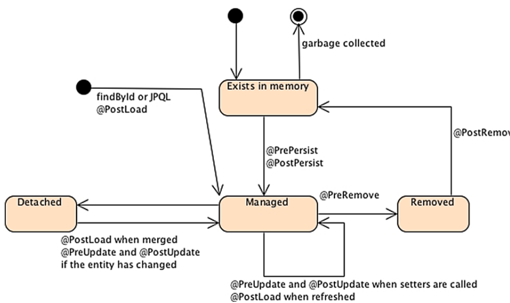
###  **Listeners**
- Entity listeners sono usati per estrarre le logiche di business in una classe separata e condividerle fra le entity
  - Un POJO nel quale puoi definire uno o più metodi life-cycle callback
  - Classe deve avere il costruttore no-arg
  - Se invocato sul metodo deve avere accesso allo stato della entity e deve avere il tipo del parametro compatibile con l'entity
  - @EntityListeners
    - Quando ce ne sono più di uno il persistence provider li itera uno ad uno
  - Un metodo può lanciare solo unchecked (runtime) exception
  - I listeners definiti nella superclasse vengono invocati prima di quelli nella classe figlio

## Enterprise JavaBeans
### **Understanding Enterprise JavaBean**
- Sono componenti server-side che incapsulano la logica di business  e si occupa delle transazioni e della sicurezza
  
### **EJB Container**
- Ambiente runtime che fornisce
### **Type of EJBs**
- Un session bean può essere di vari tipi
  - **Stateless**: Non contiene nessuna conversazione di stato fra i metodi e un istanza può essere usata per qualsiasi client
    - Usato per task che si concludono con una singola chiamata di un metodo
  - **Staful**: Contengono uno stato di conversazione, deve essere mantenuto fra i metodi per un singolo utente
  - **Singleton**: Un bean singolo condiviso fra client e sopporta accesso concorrente
    - Il container deve assicurarsi che una sola istanza esista per una intera applicazione
  - **Message-driven beans**:  Sono usati per essere integrati con sistemi esterni ricevendo messaggi asincroni usando JMS
  - Gli EJB possono essere usati come endpoint per servizi web
### **Services Given by the Container**
  - **Remote client communication**: EJB client può invocare metodi remoti attraverso protocolli standard
  - **Dependency injection**: Il container può fare diverse inject in un EJB
  - **State management**: Per stateful session bean, il container gestisce il loro stato in modo trasparente
  - **Pooling**: Per bean stateless e MDBs, il container crea un pool di istanze che possono essere condivisi da client multipli
  - **Component life cycle**: Il container è responsabile della gestione del ciclo di vita di ogni componente
  - **Messaging**: Il container permette al MDBs di ascoltare la destinazione e consuma i messaggi senza troppi JMS plumbing
  - **Transaction management**: Con un declarative trasaction management, EJB può usare annotazioni per informare il container sulla policy di transazione che bisogna usare
  - **Security**: Classi o accessi livello metodi possono essere specificati da EJBs per rinforzare le autorizzazioni user e role
  - **Concurrency support**: Tranne per i Singleton, quando qualche dichiarazione di concorrenza è necessario, tutti gli altri tipo di EJB sono di natura thread-safe
  - **Interceptors**: Gli interessi trasversali possono essere messi negli interceptors, che possono essere invocati automaticamente dal container
  - **Asynchronous method invocation**: possibilità di avere chiamate asincrone senza conivolgere i messaggi
  - Quando un EJB è deployato , EJB container si occupa delle features
  - EJB sono considerati Managed Beans
    - Quando il client invoca un EJB, lavora con un proxy su una istanza
  - EJB container interagisce con gli altri container
### **EJB Lite**
- Definisce un sottoinsieme delle API EJB
  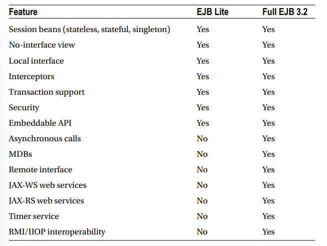
- La classe non ha bisogno di implementare una interfaccia, basta usare l'annotazione per trasformare una classe Java in una componente transazionale e sicura attraversi @Stateless
### Anatomia di un EJB
  - **Classe bean**: Contiene i metodi di business implementati e può implementare zero o molte interfacce di business
    - Deve essere annotato o con @Stateless, o con @Stateful o con @Singleton
  - **Business Interfaces**: Contengono le dichiarazioni dei metodi di business che sono visibili al client e implementati dalla classe bean
    - Un session bean può avere local interface, remote interface o nessuna interfaccia
  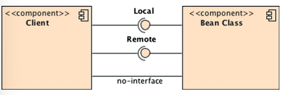
### Bean Class
- Classe annotata con @Stateless, o con @Stateful o con @Singleton o con equivalente XML nel deployment descriptor
- Deve implementare i metodi dell'interfaccia
- Deve essere definita pubblic e non final o abstract
- Non deve definire il metodo finalize()
- Metodi di business non devono iniziare con ejb e non possono essere final o static
- Gli argomenti e i metodi di ritorno devono essere tupi RMI legali
### Remote, Local, and No-Interface Views
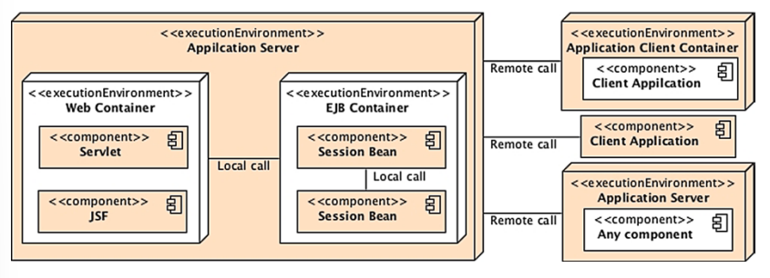
- **Business Interface**: Definisce una serie di metodi che devono essere disponibili per client application
  - **@Remote**: Denota una business interface remote
    - Parametri dei metodi sono passati per valore e necessitano di essere serializzabili come parte del protocollo RMI
  - **@Local**: Denota una business interface locale
    - Parametri dei metodi sono passati per riferimento dal client al bean
  - Non puoi segnare la stessa interfaccia con con più di una annotazione
  - Senza interfaccia è una variante della local view che espone tutti i metodi di business publici senza usare business interface separate
### Web Service Interface
  - Stateless bean posso essere invocati da remoto come SOAO web services oppure RESTful web services
    - SOAP -> @WebService
    - RESTful -> @Path
### Portable JNDI Name
- Specifica il codice che può essere portabile
```java
java:<scope>[/<app-name>]/<module-name>/<bean-name>[!<fully-qualified-interface-name>]
```
- **< Scope >**: Serie di namespaces standard che mappano i vari scopi dell'applicazione Java EE
  - **global**: Permette ai componenti in esecuzione al di fuori dell'applicazione Java EE di accedere ad un namespace specificicato
  - **app**: Permette ai componenti in esecuzione all' interno dell'applicazione Java EE di accedere ad un namespace specificicato
  - **module**: Permette ai componenti in esecuzione all' interno dell'applicazione Java EE di accedere ad un namespace specificicato da un modulo
  - **comp**: Namespace privato e specifico di un componente e non accessibile da altri componenti
- **< app-name >**: Richiesto se il session bean è inpacchettato con un ear o war file
- **< module-name >**: Nome del modulo nel quale il session bean è inpacchettato
  - Di default da riferimento all'archivio base senza estensioni
- **< bean-name >**: Nome del session bean
- **< fully-qualified-interface-name >**: Nome completo di ogni interfaccia di business definita
  - Per una view no-interface il nome può essere il nome completo della classe bean
### Stateless Bean
- Task completate in una singola chiamata di un metodo
- **Service Stateless**
  - Indipendenti
  - Autosufficienti
  - Non richiedono informazioni o stato da una richiesta ad un altra
- Possono essere raggruppati e condivisi fra diversi client
- Per ogni stateless EJB il container tiene un certo numero di istanze in memoria e li condivide fra i client
  - Ogni istanza è equivalente alle altre
- Quando il client invoca un metodo su uno stateless bean, il container pernde una istanza dal raggruppamento e la assegna al client
  - Quando la richiesta finisce, l'instanza ritorna al raggruppamento per essere riusata

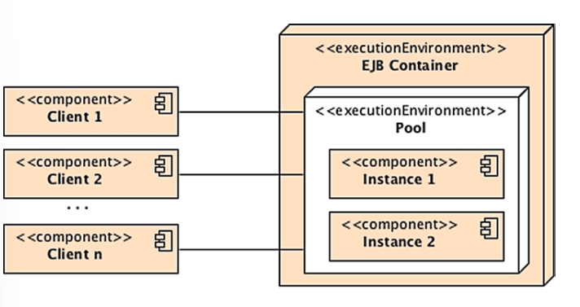
- Vive nel container e per questo può usare i servizi del container fra cui l'injection
- Spesso hanno una serie di metodi di business correlati
- Possono supportare un gran numero di client, minimizzando le risorse richieste

### Stateful Beans
- Preservano lo stato di conversazione
- Usati per task che richiedono una serie di passi, in cui ogni passo ha bisogno dello stato del precedente
- Quando il client invoca un bean stateful nel server, l'EJB container deve fornire la stessa istanza per ogni successiva invocazione del metodo
- Non possono essere riusati da altri client
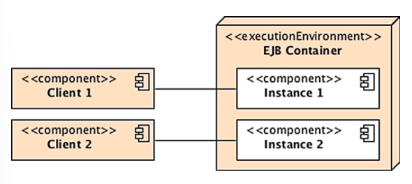
- **Passivation and activation**: Il container per evitare un grande ingombro della memoria temporaneamente rimuovi gli stateful bean dalla memoria prima della prossima richiesta che li riporta in memoria nuovamente
  - **Passivation**: Processo di rimozione di una istanza dalla memoria e salvarla nella locazione persistente al fine di liberare memoria e rilasciare risorse
  - **Activation**: Processo al fine di ripristinare uno stato e applicarlo ad una istanza
  - Gestiti in automatico dal container
- Assicurasi che il bean venga rimosso in modo da ridurre il consumo di memoria
  - **@StatefulTimeout**: Assegna un vlore di timeout che indica la durata nella quale il bean deve rimanere in idle prima che venga rimosso dal container
### Singleton
- Un session bean che può essere istanziato una sola volta per applicazione
- Fornisce un punto globale di accesso
- Va sincronizzato
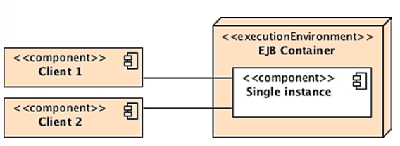
- **Cluster**: Gruppo di container che lavorano insieme
  - Ogni container ha la sua istanza del singleton
#### Startup Inizialization
- Per evitare latenza dovuta alla prima chiamata di un bean, puoi chiedere al container di inizializzare un bean all'avvio attraverso @Startup
#### Chaining Singletons
- Quando hai una serie di bean puoi esplicitare l'ordine di inizializzazione
- **@DependsOn**: Contiene una o più stringhe
  - Ognuna specifica il nome del singleton bean target
#### Concurrency
- Concorrenza di accesso al bean singleton controllata tramite @ConcurrencyManagement in due modi
  - **Container-managed concurrency(CMC)**: Il container controlla l'accesso concorrente all'istanza del bean basandosi sui metadati
  - **Bean-managed concurrency(BMC)**: Il container permette il pieno controllo concorrente e demanda la responsibilità di sincronizzazione al bean
  - CMC è usata di default
### Packaging
- EJB necessitano di essere impacchettati prima di essere deployare in container runtime
  - Una volta impacchettati questi artefatti in un file jar, puoi deployare direttamente nel container
- 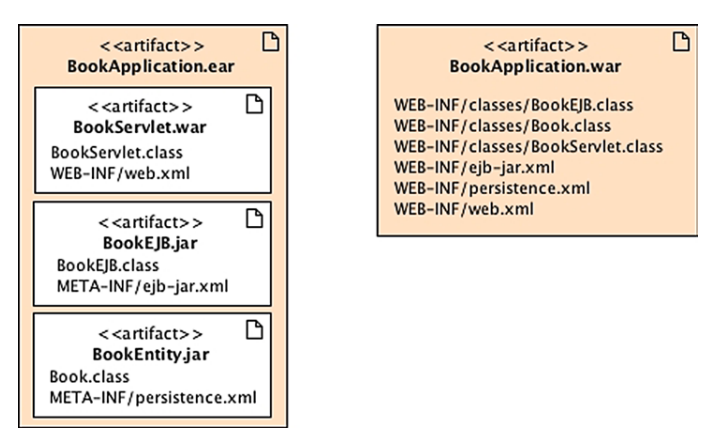
- EJB Lite possono essere direttamente impacchettati nel web module (war file)
- Se hai bisogno di usare una piena specifica EJB devi impacchettare tutto nel jar
### Deploying an EJB
- I session bean sono componenti container-managed
- Il container gestisce ogni sorta di servizi permettendoti di concentrarti sul business code
  - Il lato negativo è che devi sempre eseguire il tuo EJB nel container
- **Embeddable API**: Permette a un client di istanziare un EJB container che viene runnata con la sua JVM
  - EJBContainer contiene una factory method per creare una istanza del container
    - createEJBContainer()
### Invoking Enterprise Java Beans
- Per invocare un metodo su un session bean, un client non può direttamente istanziare un bean
  - Necessita di un riferimento a un bean
  - Può essere ottenuto via dependency injection oppure lookup JNDI
    - Dependency injection permette a un container di automaticamento inject una riferimento a un EJB in tempo di deploy
#### Invoking with Injection
- Java EE usa differenti annotazioni
  - Risorse -> @Resource
  - Entity Manager -> @PersistenceContext
  - Web Services -> @WebServiceRef
- Dependecy injection è solo possibile con un ambiente gestito
- Se il session bean implementa una serie di interfacce, il client deve specificare a quale si vuole riferire
#### Invoking with CDI
- Per invocare un metodo su un EJB richiede annotazione @EJB per ottenere un un riferimento injectato al client
#### Invoking with JNDI
- I session bean possono essere ricercati usando JNDI
```java
    Context ctx = new InitialContext();
    ItemRemote itemEJB = (ItemRemote) ctx.lookup("java:global/cdbookstore/ItemEJB!org.agoncal.book.javaee7.ItemRemote");
```
## Callbacks and Authorization
### Session Beans Life Cycle
- Il client ottiene un riferimento ad un session bean attraverso dependency injection o lookup JNDI
- Il container crea l'istanza e poi la distrugge, quindi responsabile di gestire il ciclo di vita del bean
#### Stateless and Singleton
- Non mantengono lo stato della conversazione con un client dedicato
- Entrambi permettono accesso da tutti i client
  - Stateless lo fa per istanza
  - Singleton provvedono accesso concorrente ad una singola istanza
- Stesso ciclo di vita
  1. Il ciclo di vita di uno stateless o di un singleton session bean inizia quando un client richiede un riferimento un bean
      - In caso di un singleton, può iniziare quando il container è bootstrapped attraverso @Startup
      - Il container crea una nuova istanza del session bean
  2. Se la nuova istanza creata usando una dependency injection attraverso annotazione o deployment descriptor
      - Il container fa inject di tutte le risorse necessarie
  3. Se l'istanza ha un metodo annotato con @PostContruct, il container lo invoca
  4. L'istanza del bean processa la chiamata invocata dal client e sta in ready mode per processare future chiamate
      - Stateless bean rimane in ready mode fino a quando il container non libera lo spazio nel pool
      - Singleton rimane in ready mode fino a quando il container non viene spento
  5. Il container non necessita più l'istanza
      - Invoca il metodo annotato con @PreDestroy e termina il ciclo di vita dell'istanza del bean

  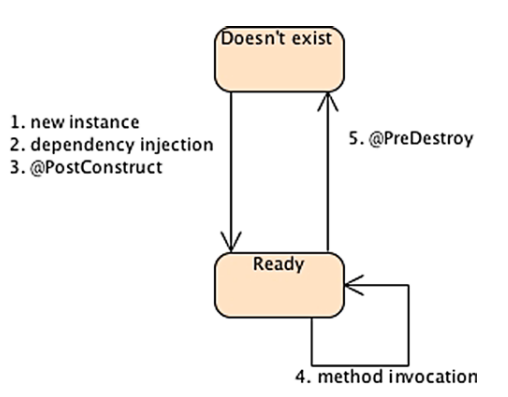
- Quando un client fa il deploy di un bean stateless, il container crea una serie di istanze e le aggiunge al pool
  - Quando il client chiama un metodo su un bean stateless, il container seleziona una istanza dal pool, delega l'invocazione del metodo all'istanze e lo ritorna al pool
    - Quando il container non ha più bisogno dell'istanza la distrugge
- Per un singleton bean, la creazione dipende se è stato istanziato con @Startup o no, oppure dipende da un altro singleton che è stato creato in precedenza @DependsOn
  - Se si crea il singleton a tempo di deploy
  - Altrimenti viene creata una istanza quando il client invoca un metodo di business
  - Istanza distrutta quando il server viene spento
#### Stateful
- Mantengono lo stato di conversazione con il client
- Il container genera un istanza e l'assegna solo ad un client
  - Ogni richiesta fatta dal client viene passata sempre la stessa istanza
- **Passivation**: Il container serializza una istanza del bean su un supporto di archiviazione permanente
- **Activation**: Processo nel quale l'istanza del bean è necessario nuovamente al client, inverso della passivation
  - Container deserializza il bean dallo spazio di archiviazione permanente e lo riattiva in memoria
    - Attributi del bean devono essere serializzabili
- Ciclo di vita
  1. Il ciclo di vita inizia quando il client richiede un riferimento ad un bean
      - Il container crea una nuova istanza del session bean e la salva in memoria
  2. Se la nuova istanza creata fa uso di dipendency injection o deployment descriptor, il container fa inject di tutte le risorse necessarie
  3. Se l'istanza ha un metodo annotato con @PostConstruct lo invoca
  4. Il bean esegue le chiamate e rimane in memoria, aspettando successive richieste dal client
  5. Se il client rimane in idle per un periodo di tempo, il container invoca, se esiste, il metodo annotato con @PrePassivate e passiva il bean nello spazio di archiviazione permanente
  6. Se il client invoca un bean passivato, il container attiva il bean e invoca, se esiste, il metodo annotato con @PostActivate
  7. Se il client non invoca l'istanza del bean passivato per il periodo di timeout della sessione l'istanza del bean viene distrutta
  8. Alternativamente al punto 7, se il client chiama un metodo annotato con @Remove, il container invoca, se esiste, il metodo annotato con @PreDestroy e termina il ciclo di vita dell'istanza del bean 

  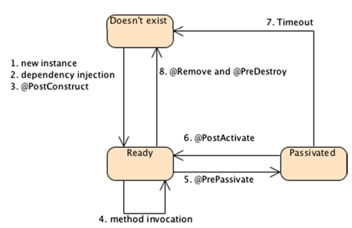
- @Stateful(passivationCapable=false) -> disattivare defaul activation/passivation
#### Callbacks
- Il cambio di uno stato ad un altro per quanto riguarda i cambiamenti dei bean può essere intercettato dal container al fine di invocare metodi con una determinata annotazione
  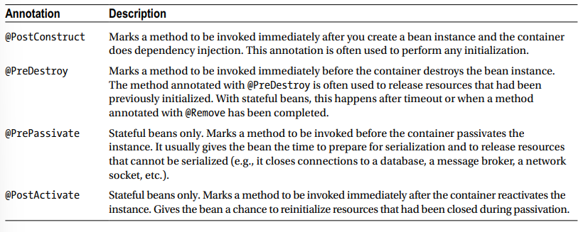
- **Il metodo callback**
  - Non deve avere nessun parametro e deve essere void
  - Non deve lanciare checked exception, ma solo runtime exception
    - Lancio di un eccezione a runtime annulla l'intera transazione
  - Il metodo non deve essere static o final
  - Può avere annotazioni multiple, ma solo una per ogni tipo
  - Può accedere alle voci di un ambiente del bean
- Tipicamente utilizzate per allocare o rilasciare risorse
- Il container mantiene lo stato della conversazione, che può richiedere onerose risorse come connessioni col database
  - Connessioni col database condivise fra le chiamate e rilasciate quando il bean è in idle
- Dopo aver creato una istanza di uno stateful bean, il container fa inject del riferimento di un datasource di default
  - Il container chiama il metodo annotato con @PostConstruct che crea una connessione col database
    - Se il container passiva l'istanza chiama il metodo annotato con @PrePassivate al fine di chiudere la connessione col database
### Authorization
- Gestiti dal web tier il principale e i suoi ruoli sono passati al EJB tier che controlla se l'utente autenticato è autorizzato ad accedere ad un metodo in base al suo ruolo
- Con dichiarative autorizzazioni accesso controllato dal EJB container
- Con programmate autorizzazioni accesso è controllato nel codice usando JAAS API
#### Declarative Authorization
- Definite usando annotazioni o xml deployment descriptor
- Comporta
  - Dichiarazione di ruoli
  - Assegna permessi ad un metodo
  - Cambia temporaneamente la sicurezza di una identity
  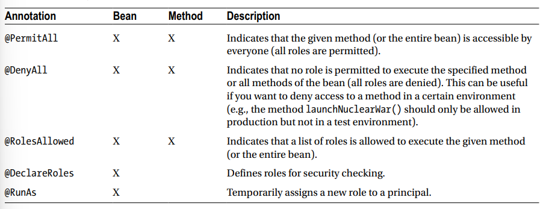
#### Programmatic Authorization
- Maniera selettiva per permettere o bloccare accessi ad un ruolo o al principale
- SessionContext definisce due metodi relativi alla sicurezza
  - **isCallerInRole()**: Ritorna un booleano e testa se il caller ha dato un security role
  - **getCallerPrincipal()**: Ritorna il java.security.Principal che identifica il caller

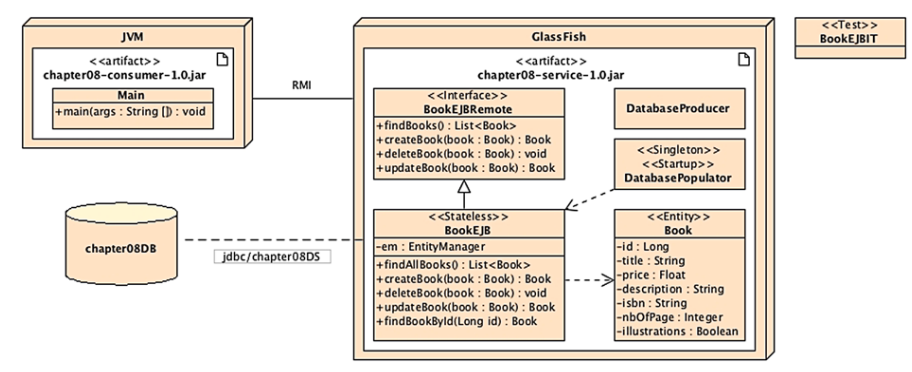
## Transactions
### Understanding Transaction
- Le transazioni sono usate per assicurarsi che i dati vengano tenuti in uno stato consistente
  - Operazioni logiche che devono essere performate in modo atomico, chiamate **unit of work**
  - Devono essere eseguite sia in modo sequenziale che parallelo
  - Ogni operazione deve avere successo al fine di garantire il successo della transazione
  - Devono garantire affidabilità, robustezza e rispettare le proprietà ACID
#### ACID
  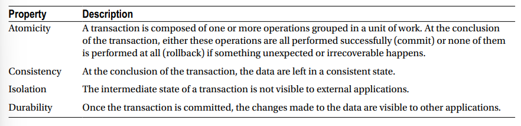
#### Read Conditions
- Descrivono cosa può accadere quando duo o più operazioni operano sullo stesso dato nello stesso tempo
  - **Dirty reads**: Un transazione legge un cambiamento non commitato fatto da una transazione precedente
  - **Repeatable reads**: I dati letti sono gli stessi se letti di nuovo nella stessa transazione
  - **Phantom reads**: Nuovi record sono aggiunti al database e sono visibili da transazioni iniziate prima dell'inserimento
    - Le query includeranno i record aggiunti dalle altre transazioni dopo che la loro transazione è iniziata
#### Transaction Isolation Levels
- Tecniche usate per controllare come le transazioni accedono ai dati in maniera concorrente
  - **Read uncommitted**: Transazione può leggere un dato non committato
    - Dirty, nonrepeatable e phantom read
  - **Read committed**: Transazione non può leggere dati non committati
    - Nonrepeatable e phantom read
  - **Repeatable read**: Transazione non può cambiare il dato letto da una differente transazione
    - Phantom read
  - **Serializable**: Transazione ha lettura esclusiva
    - Altre trasazioni non possono leggere o modificare gli stessi dati
#### JTA Local Transaction
- Transazione usando una singola risorsa
- **Transaction manager**: Gestisce le operazioni transazionali
  - Crea le transazioni per l'applicazione, informa il gestore delle risorse che sta partecipando ad una transazione e conduce il commit o il rollback sul gestore delle risorse
  - **Resource manager**: Responsabile di gestire le risorse e registrarle nel transaction manager
  - **Resource**: Archivio persistente dal quale puoi leggere o scrivere
#### Distributed Transaction and XA
- Transazione usando multiple risorse
  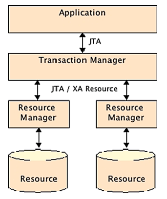
- Per avere una transazione affidabile fra le varie risorse, il transaction manager deve usare un XA resource manager interface
  - Meccanismo two-phase commit per assicurasi che tutto le risorse sono committate o rollback particolari transazioni in modo simulataneo
  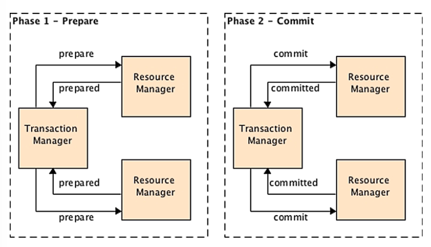
- JTS implementa la specifica Object Management Group (OMG) Object Transaction Service (OTS) che permette al transaction manager di partecipare ad una transazione distribuita attraverso il protocollo Internet Inter-ORB Protocol (IIOP)
  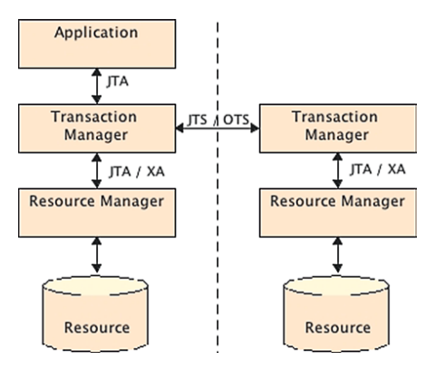
### Transaction Support in EJBs
- EJB container è un transactional manager che supporta JTA
- Di default EJB model è stato progettato per gestire le transazioni
  - Questo comportamento è chiamato container-managed transaction (CMT)
#### Container-Managed Transaction
- EJB container fornisce la gestione delle transazioni al session bean e al MDBs, settando anche i confini delle transazioni
  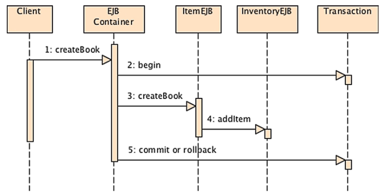
- Puoi cambiare il comportamento attraverso i meta dati
  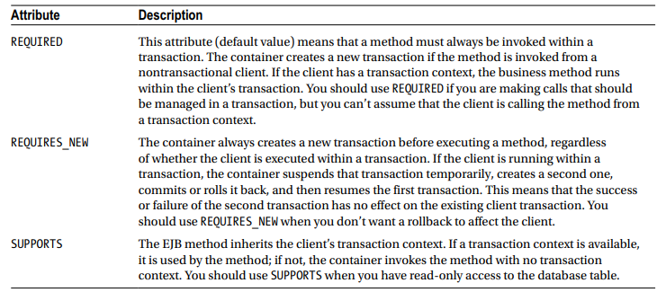
  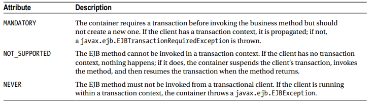

## Messaging
- Message-oriented middleware (MOM) è un software che consente lo scambio di messaggi asincroni fra sistema eterogenei
  - Il produttore e il consumatore non devono essere disponibili nello stesso tempo per comunicare
    - Usano un buffer intermedio
### Understanding Messaging
- Quando un messaggio è inviato, il software che memorizza il messaggio e lo spedisce viene chiamato provider
  - Colui che invia i messaggi è chiamato producer, e la destinazione dove il messaggio è memorizzato è chiamato destination
    - La componente che riceve è chiamata consumer
  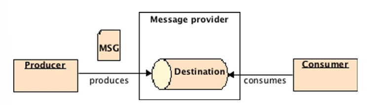

- In Java EE, la API che gestisce questi concetti è chiamato Java Message Service (JMS)
- Quando vengono eseguiti in un EJB container, Message-Driven Beans (MDBs) possono essere usati per ricevere messaggi in un modo gestito da un container
  - **Provider**: JMS è solo un API, quindi necessita un'implementazione sottostante per instradare messaggi, ovvero il provider
    - Il provider gestisce il buffering e la consegna dei messaggi
  - **Clients**: Un client è una qualsiasi applicazione Java o componente che produce o consuma un messaggio da/verso il provider
  - **Messages**: Oggetti che il client invia o riceve dal provider
  - **Administered objects**: Un broker di messaggi deve fornire oggetti administered al client tramite ricerca JNDI o injection
    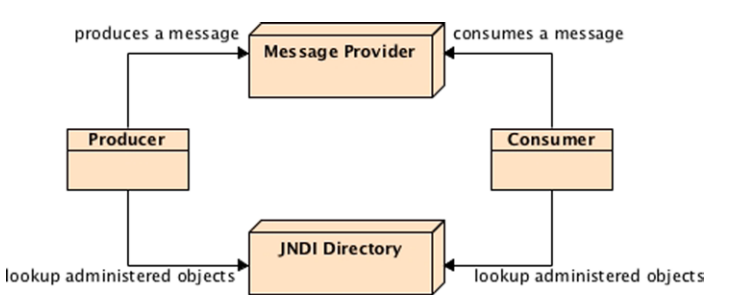
- Il messagin provider consente comunicazione asincrona fornendo una destinazione dove i messaggi possono essere trattenuti fino a quando loro devono essere mandate al client
#### The point-to-point (P2P) model
- In questo modello, la destinazione utilizzata per trattenere i messaggi è chiamata queue
    - Un client mette un messaggio nella coda e un altro client riceve il messaggio
      - Quando il messaggio è acknowledged, il message provider rimuove il messaggio dalla coda
- Un messaggio viaggia da un singolo producer ad un singolo consumer
  - Il sender può produrre più di un messaggio e li manda alla coda e il receiver può consumarli quando vuole
  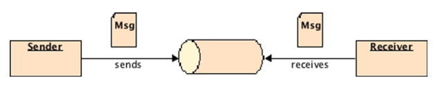
- La coda può avere più di un consumatore, ma quando un messaggio dalla coda nessun altro consumer può riceverlo
  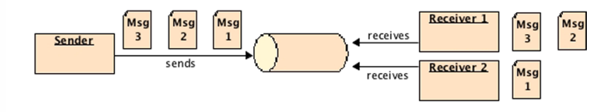
#### The publish-subscribe (pub-sub) model
- La destinazione è chiamata topic
    - Quando usi una messaggistica publish/subscribe, un client pubblica un messaggio su un topic e tutti gli iscritti a quel topic ricevono il messaggio
- Un singolo messaggio è mandato da un singolo producer a una serie di potenziali consumer
  - I consumers sono chiamati subscribers perchè prima neccessitano di fare la subscribe di un topic
  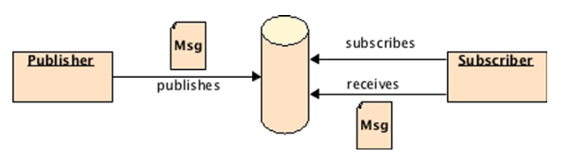
- Presenta timing dependency fra publisher e subscribers
- Multipli subscribers possono consumare lo stesso messaggio
  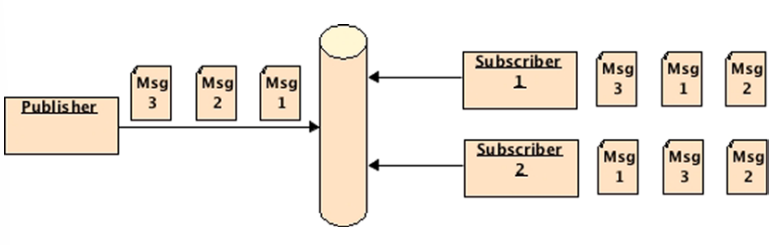
#### Administered Objects
- Configurati in modo amministrativamente
- Il messagge provider permette a questi oggetti di essere configurati e li rende disponibile nel namespace JNDI
  - Come JDBC datasources, administered objects sono creati una sola volta
  - **Connection factories**: Usato dal client per creare una connessione alla destinazione
  - **Destinations**: Punti di distribuzioni di messaggi che ricevono, trattengono e distribuiscono messaggi
    - Destinazioni possono essere code (P2P) o topic (pub-sub)
#### Message-Driven Beans
- Gli MDBs sono consumer di messaggi asincroni che sono eseguiti all'interno del EJB container
- Sono stateless, permettendo al container di avere numerose istanze, eseguite concorrentemente, per processare messaggi ricevuti da vari producers
- MDBs ascoltano la destinazione e quando arriva un messaggio, lo consumano e lo processano
### Java Messaging Service API
- Fornisce alle applicazioni la capacità di creare, mandare, ricevere e leggere messaggi asincroni
- Fornisce una serie di interfaccie e classi che permettono ai programmi di comunicare con altri message provider

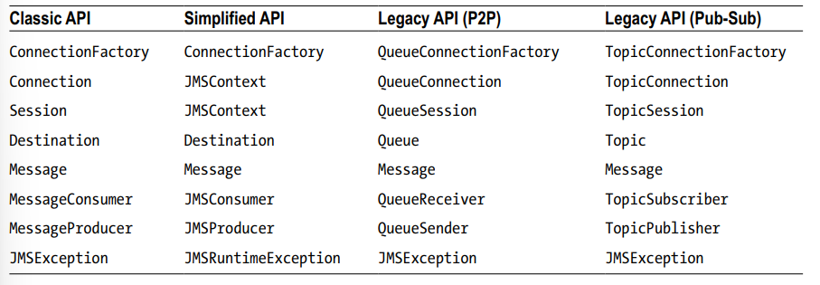

#### Classic API
- Permette comunicazione asincrona fra i client fornendo una connessione al provider e una sessione dove i messaggi possono essere creati, mandati o ricevuti
- I messaggi possono contenere testo o altri tipi di oggetti

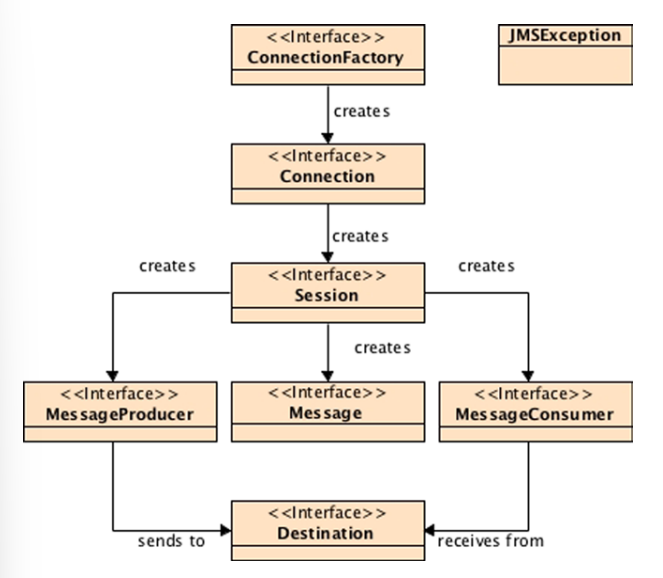

#### Connection Factory
- Oggetti amministrati che permettono ad un'applicazione di connettersi al provider creando un oggetto **Connection** in maniera programmatica
- javax.jms.ConnectionFactory è un interfaccia che incapsula i parametri di configurazione che devono essere definiti dall'amministratore
- Per usare oggetti amministrati, il client ha bisogno di fare un lookup JNDI

```java
    Context ctx = new InitialContext();
    ConnectionFactory ConnectionFactory =(ConnectionFactory) ctx.lookup("jms/javaee7/ConnectionFactory");
```

- ConnectionFactory Interface
```java
    public interface ConnectionFactory {
    Connection createConnection() throws JMSException;
    Connection createConnection(String userName, String password) throws JMSException;
    JMSContext createContext();
    JMSContext createContext(String userName, String password);
    JMSContext createContext(String userName, String password, int sessionMode);
    JMSContext createContext(int sessionMode);
}
```

#### Destination
- Un oggetto amministrato che contiene specifiche informazioni di configurazione del provider come l'indirizzo di destinazione
- Nascosta al client JMS attraverso l'interfaccia javax.jms.Destination

```java
    Context ctx = new InitialContext();
    Destination queue = (Destination) ctx.lookup("jms/javaee7/Queue");

```
#### Connection
- javax.jms.Connection che viene creato attraverso createConnection() del connection factory, incapsula una connessione a un provider JMS
- Thread-safe e progettate per essere condivisibili

```java
    Connection connection = connectionFactory.createConnection();
```

- Prima che un ricever consuma i messaggi devi chiamare il metodo coonection.start()

- Se devi fermare temporaneamente la ricezione dei messaggi senza chiudere una connessione devi chiamare il metodo connection.stop()

- Per chiudere una connessione, che chiude anche le sessioni e i suoi producers e consumers bisogna utilizzare il metodo connection.close()

#### Session
- Puoi creare una session attraverso il metodo createSession()
- Un sessione fornisce un context transazionale nel quale una serie di messaggi che possono essere mandati o ricevuti sono raggruppati in unità di lavoro atomiche

```java
    Session session = connection.createSession(true, Session.AUTO_ACKNOWLEDGE);
```
- Primo parametro specifica se la sessione è transazionale
  - true indica che la richiesta di invio dei messaggi non viene realizzato fino al commit della sessione oppure la sessione è chiusa
  - false indica che il messaggio viene inviato appena il metodo send() viene invocato
- Il secondo parametro indica che la sessione fa i automatico acknowledges dei messaggi quando sono ricevuti con successo 

- Una sessione (javax.jms.Session) fornisce un single-thread context per mandare e ricevere un messaggio

#### Messages
- Oggetti che incapsulano informazioni e si dividono in tre parti
  - **Header**: Contiene informazioni standard per identificare e instradare il messaggio
    - Coppie nome-valore predefinite
    - Ogni campo ha associato dei metodi getter e setter definiti nell'interfaccia javax.jms.Message

    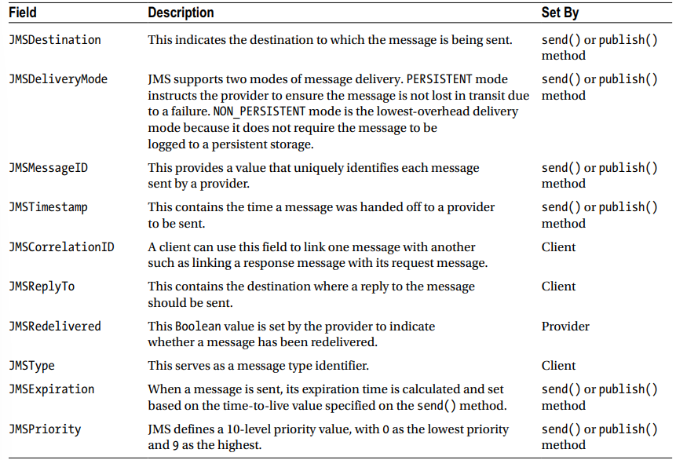

  - **Properties**: Coppie nome-valore che l'applicazione può impostare o leggere
    - Permettono di filtrare i messaggi in base a dei valori delle proprietà
    - Simili agli header, ma creati dall'applicazione in modo esplicito, al fine di permettere di aggiungere header aggiuntivi
  - **Body**: Contiene il messaggio e può avere una serie di formati (text, byte, object. ecc...)
    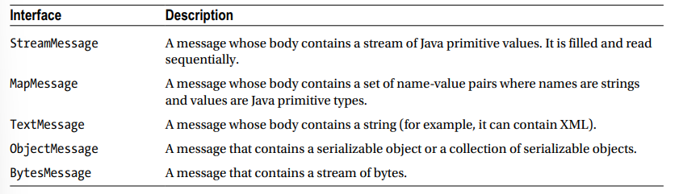

    - Estendere l'interfaccia javax.jms.Message permette di creare il tuo formato di messaggio
    - Quando un messaggio viene ricevuto, il suo body è read-only

#### Simplified API
- Tre nuove interfacce che dipendono dal ConnectionFactory e le altre classsiche API ma lasciano il codice boilerplate
- Grazie alla nuova eccezione JMSRuntimeException il codice per mandare e ricevere messaggi è più facile
  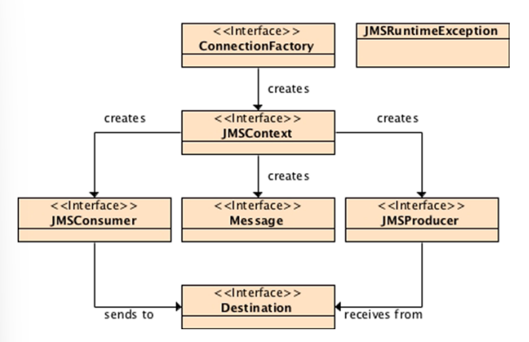

##### JMSContext
- Attiva una connessione a un JMS provider e un single-thread context per mandare e ricevere messaggi
- Interfaccia principale e unisce Session e Connection
- JMSContext può essere creato dall'applicazione con una serie di chiamate createContext su una ConnectionFactory e poi chiuso
  - Oppure, può essere injectato se l'applicazione è in esecuzione su un container
  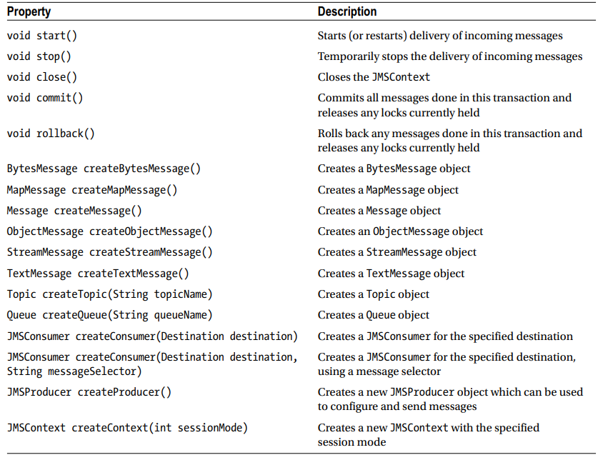

- I messaggi possono essere mandati sia in maniera sincrona che asincrona
##### JMSProducer
- Oggetto creato da un JMSContext che è usato per mandare messaggi a una coda o a un topic
- Usato per mandare messaggio per conto del JMSContext
- Un istanza di un JMSProducer viene creata chiamando createProducer su un JMSContext

  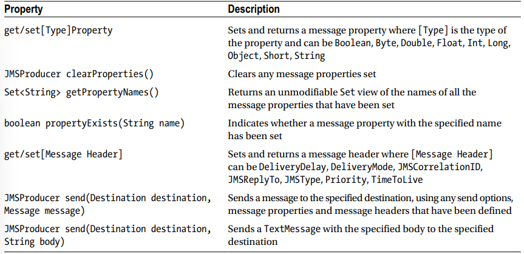

##### JMSConsumer
- Oggetto creato da un JMSContext che è usato per ricevere messaggi mandati a una coda o un topic
- Viene creato usando uno dei metodi di createConsumer passando una coda o un topic
- Un client può ricevere messaggi sincroni e asincroni
- Per i messaggi asincroni, il client può registrare un oggetto MessageListeners con un JMSConsumer
  - Quando il messaggio arriva, il provider lo spedisce grazie alla chiamata del metodo onMessage del MessageListener
  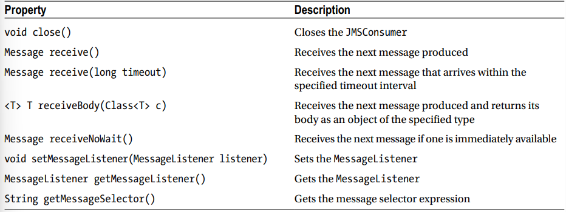
### Writing Message Producers
#### Producing a Message outside a Container
- Ottieni una connection factory e una coda usando lookup JNDI
- Crea un oggetto JMSContext usando una connection factory
- Crea un javax.jms.JMSProducer usando l'oggetto JMSContext
- Inzia il messaggio usando la coda attraverso il metodo JMSProducer.send()
  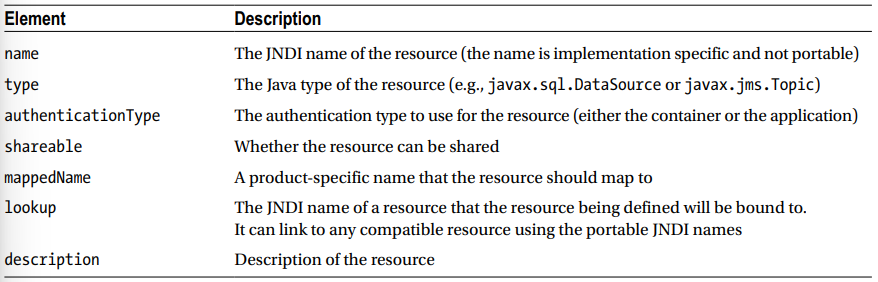
#### Producing a Message inside a Container
@Resource può essere usata per iniettare una riferimento a quella risorsa da parte del container

#### Producing a Message inside a Container with CDI
- javax.jms.JMSConnectionFactory può essere usata per specificare il nome del lookup JNDI della ConnectionFctory usata per creare il JMSContext
  - Se omessa usa quella di default
### Writing Message Consumers
- Il client può consumare il messaggio in due modi
   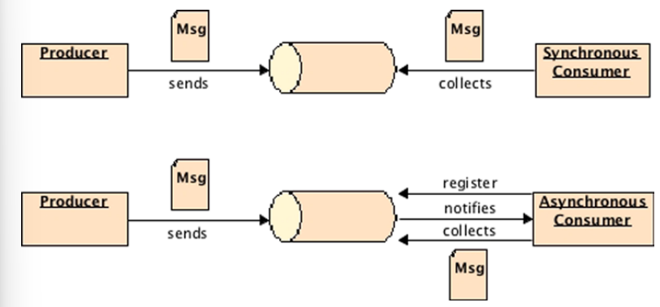

#### Synchronous Delivery
- Un consumer sincrono deve avviare un JMSContext, aspettare fino all'arrivo di un nuovo messaggio, e richiedere il messaggio arrivato usando uno dei metodi receive()
  - Ottieni una connection factory e un topic usando un lookup JNDI
  - Crea un JMSContext usando la connection factory
  - Crea un javax.jms.JMSConsumer attraverso l'oggetto JMSContext
  - Esegue un ciclo e chiama il metodo receive() sull'oggetto consumer
    - Il metodo receive() si blocca se la query è vuota e aspetta l'arrivo di un messaggio
#### Asynchronous Delivery
- Basato sulla gestione di eventi
- Un client può registrare un oggetto che implementa l'interfaccia MessageListener
  - Un message listener è un oggetto che agisce come un gestore di eventi asincrono per i messaggi
- Quando un messaggio arriva, il provider lo spedisce chiamndo il metodo del listener onMessage()
  - In questo modo non c'è bisogno di un loop indefinito per ricevere un messaggio
- Step che descrivono il processo usato per creare un listener di messaggi asincroni
  - La classe implementa l'interfaccia javax.jms.MessageListener, che definisce il solo metodo onMessage()
  - Ottieni una connection factory e un topic usando il lookup JNDI o injection
  - Crea un javax.jms.JMSConsumer usando l'oggetto JMSContext
  - Chiama il setMessageListener(), passando l'istanza dell'interfaccia MessageListener
  - Implementa il metodo onMessage() e processa il messaggio ricevuto
    - Ogni volta che un messaggio arriva, il provider invoca il metodo, passando il messaggio

### Reliability Mechanisms
- JMS definisce una serie di livelli di affidabilità per assicurarsi che il messaggio sia spedito, anche se il provider crasha o è in caricamento o se la destinazione è piena di messaggi da eliminare
#### Filtering Messages
- Header e properties permettono di eseguire la selezione
- I producers impostano uno o una serie di valori property o campi header, e il consumer specifica il criteria di selezione usando una espressione di selezione
  - Solo i messaggi che rispettano il selettore vengono consegnati
- Message selector assegna il ruolo di filtraggio dei messaggi al JMS provider
#### Setting Message Time-to-Live
- Inserire un time-to-live permette al provider di rimuovere un messaggio dalla destinazione quando diventa obsoleto, usando JMSProducer API o JMSExpirationù
  - JMSProducer ha un metodo setTimetoLive()
#### Specifying Message Persistence
- **Persistence Delivery**: Assicura che il messaggio è consegnato a solo un consumer
  - Più affidabile, ma alti costi in performance
- **Nonpersistent Delivery**: Un messaggio venga consegnato al massimo una volta
#### Controlling Acknowledgment
- Una fase di acknowledgment può essere inizializzata sia dal JMS provider che dal client
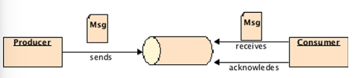

- In una sessione transazionale, acknowledgment avviene in automatico quando una transazione viene committata
  - Se un transazione viene annullata, tutti i messaggi consumati vengono riconsegnati
- In una sessione non transazionale, acknowledgment deve essere specificato
  - **AUTO_ACKNOWLEDGE**: La sessione automaticamente riconosce la ricezione di un messaggio
  - **CLIENT_ACKNOWLEDGE**: Un client riconosce un messaggio attraverso la chiamata Message.acknowledge()
  - **DUPS_OK_ACKNOWLEDGE**: Indica alla sessione di riconoscere in modo differito la consegna dei messaggi
    - Può portare ad una duplicazione dei messaggi se il JMS provider fallisce
      - Se un messaggio è stato riconsegnato, il provider imposta il valore del campo del header del JMSRedelivered a true

#### Creating Durable Consumers
- JMS API fornisce un modo per tenere i messaggi nel topic fino a quando tutti i consumer subscribed non li ricevono
  - Permette al consumer di poter essere offline alcune volte e quando si riconnette riceve il messaggio
- Ongi durable consumer ha un ID unico

#### Setting Priorities
- Puoi usare un livello di priorità per istruire a spedire i messaggi urgenti prima
  - JMS definisce un valore di priorità che va da 0 a 9
  - Puoi specificarlo attraverso setPriority() del JMSProducer

### Writing Message-Driven Beans
- Un MDBs è un consumer asincrono che viene invocato dal container come risultato dell'arrivo di un messaggio
- Non hanno stato e vengono eseguiti nel container EJBB
  - Il container ascolta la destinazione e delega le chiamate all'arrivo del messaggio
- Il container gestisce i messaggi in arrivo fra le multiple istanze del MDBs che non hanno uno speciale codice multithreading
- Quando un nuovo messaggio raggiunge la destinazione, un istanza MDB è recuperato dal pool per gestire il messaggio
- Un MDB implementa l'interfaccia MessageListener e il metodo onMessage()

#### Anatomy of an MDB
- Implementano interfaccia javax.jms.MessageListener
- Necessitano un full stack Java EE
- Classe deve essere annotato con javax.ejb.MessageDriven o con un XML equivalente nel deployment descriptor
- La classe deve implementare, direttamente o indirettamente, l'interfaccia MessageListener
- La classe deve essere pubblica, e non deve essere final o abstract
- La classe deve avere un costruttore no-arg che il container userà per creare l'istanza del MDB
- La classe non deve definire il metodo finalize()

- Se vuoi modificare la configurazione JMS puoi usare @MessageDriven e @ActivationConfigProperty

#### @MessageDriven
- Serve per riconoscere che la classe è un MDB

#### @ActivactionConfigProperty
- Le properties possono essere impostate con @ActivactionConfigProperty
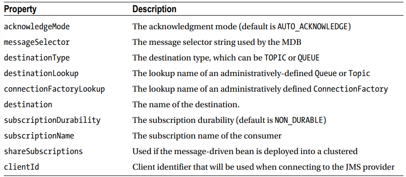

### Dependency Injection
- MDBs possono usare dependency injection per ottenere il riferimento di una risorsa come un JDBC datasource, EJBs, o altri oggetti

### MDB Context
- L'interfaccia MessageDrivenContext fornisce accesso al contesto di runtime che il container fornisce per un istanza MDB
  - Il container passa il MesageDrivenContext all'istanza, che rimane associata per il ciclo di vita al MDB, dando al MDB la possibilità di annullare una transazione, ottenere l'utente principale, ecc...
  - Estende javax.ejb.EJBContext
  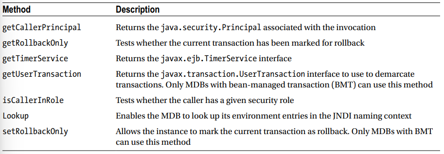

### Life Cycle and Callback Annotations
- Ciclo di vita uguale a uno stateless bean
  - Il container crea un istanza e inietta tutte le risorse se presenti
    - Il container chiama il metodo @PostConstruct se presente e MDB è pronto a consumare messaggi in arrivo
      - @PreDestroy chiamato quando il container è rimosso dal poll o distrutto 
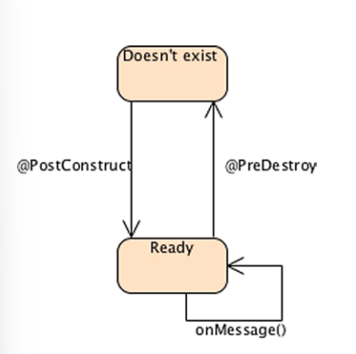

### MDB as a Consumer
- MDB possono essere consumer sincroni, ma questa cosa non è consigliata, dato che se il container inizia a prendere varie istanze e vanno tutte in un loop infinito, il pool potrebbe diventare vuoto, stessa cosa se inizia a generare causando problemi di memoria
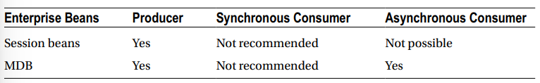

### MDB as a Producer
- Gli MDBs possono essere usati come producer di messaggi, attraverso JMS API

### Transaction
- I messaggi non sono rilasciati al consumer fino a quando la transazione non viene committata
- Il container inizia la transazione prima di onMessage() e la committa quando il metodo ritorna
- Gli MDBs non possono essere eseguiti nel context transazionale del client
  - MDBs ascolatano una destinazione e consumano il messaggio, non hanno un client
  - Non vi è context passato dal il client al MDB
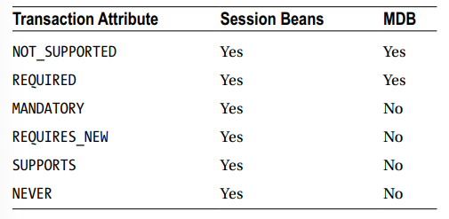

- Nei CMTs, MDBs possono usare @javax.ejb.TransactionAttribute sui metodi di business con due attributi
  - **REQUIRED**: Il container passa il contesto della transazione con l'invocazione
    - Il container tenta di completare il commit della transazione qjuando il metodo del message listener è completato
  - **NOT_SUPPORTED**: Se MDB invoca altri enterprise beans, il container non passa il contesto transazionale con l'invocazione

### Handling Excpetions
- JMSException è un eccezione checked
- JMSRunTimeException è un eccezione unchecked
- **Application exception**: Eccezione checked che estendono Exception e non causano il rollback del container
- **System exception**: Eccezioni unchecked che estendono RuntimeException e causano rollback del container
- Se il rollback è necessario la chiamata a setRollBackOnly() deve essere esplicitata

### Putting It All Together
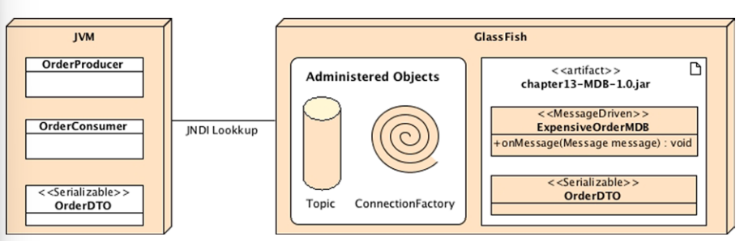

## appunti
appunti 31/10
capitolo 8 Session Beans Life Cycle
Authorization fino a putting it all together

capitolo 9 transaction
introduzione
transaction support in EJBs fino a 301

capitolo 13
persistenza messaggi garantita dal broker

skip controlling acknowledgment

## appunti esame
creao java bean module remote
modulo api da distribuire sui client

interfaccia remota serve sia sul server che sul client
crei un altro modulo in cui metti le interfacce remote

aggiungere glassfish/lib/gf-client. jar nella cartella di glassfish
ejb deve essere stateless

non va fatto inject entity manager se non ho il producer, quindi va fatto @persistentcontext

entity costruttore vuoto

client rmi -> interfaccia remota

la stringa per il lookup deve essere quella con remote
non serve scriverla per forza basta scrivere che uso la stringa con remote -> stringa corrispondente all'interfaccia remota

bean.xml con discovery mode all